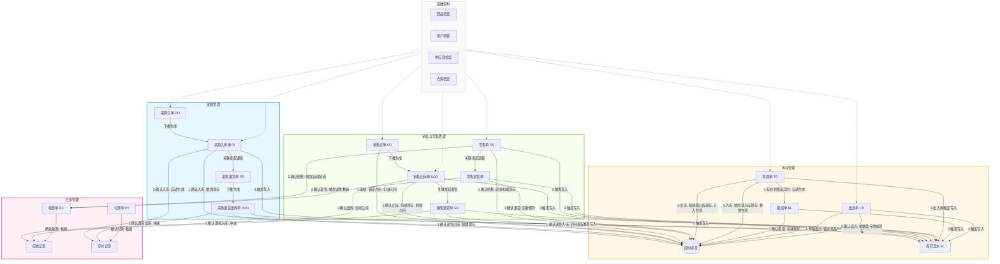

# 04-主要功能模块和清单

本文件定义了强盛科技进销存系统的模块架构地图。基于一期核心业务闭环的目标，细化了各模块的核心功能点，明确划定了一期（In Scope）与二期（Out Scope）边界，并梳理了模块间的数据依赖关系。

---

## 一、八大功能模块清单与一期/二期分界

### 1. 基础资料模块
统一管理全系统共用的业务对象。

*   **商品档案**
    *   **一期 (In Scope)**：
        *   新增、编辑、启用、停用、搜索商品。
        *   基础字段支持：商品编码、商品名称、条码、分类、规格、单位、默认批发价、默认零售价、参考采购价。
        *   支持按编码或名称进行快捷联想搜索。
    *   **二期 (Out Scope)**：商品多计量单位转换、条码自动生成。
*   **客户档案**
    *   **一期 (In Scope)**：
        *   新增、编辑、启用、停用、搜索客户。
        *   基础字段支持：客户编码、客户名称、联系人、联系方式、价格级别（关联批发价）、结算方式、信用额度（用于预警提示）、账期。
    *   **二期 (Out Scope)**：客户信用自动停开单强控、客户分群运营分析。
*   **供应商档案**
    *   **一期 (In Scope)**：
        *   新增、编辑、启用、停用、搜索供应商。
        *   基础字段支持：供应商编码、供应商名称、联系人、联系方式、结算方式、账期。
    *   **二期 (Out Scope)**：供应商评级管理（明确不做）、供应商准入资质审核。
*   **仓库档案**
    *   **一期 (In Scope)**：
        *   新增、编辑、启用、停用、搜索仓库。
        *   基础字段支持：仓库编码、仓库名称、类型、负责人、地址。
    *   **二期 (Out Scope)**：货位/货架管理、多级子仓位。

### 2. 采购管理模块
管“进”——从下单到入库到退货的闭环链路。

*   **采购订单 (PO)**
    *   **一期 (In Scope)**：
        *   新增、编辑、查看、审核、取消、手动关闭。
        *   单据核心字段：单号（PO前缀）、供应商、采购员、商品明细、采购数量、采购单价、未入库数量（计算只读）。
        *   支持下推生成采购入库单。
    *   **二期 (Out Scope)**：复杂多级审批流、自动补货建议（根据销售和库存情况自动计算并生成采购订单草稿）。
*   **采购入库单 (PI)**
    *   **一期 (In Scope)**：
        *   新增（必须引用采购订单 PO 创建）、编辑、查看、确认、作废。
        *   支持实收数量录入；确认时系统自动生成入库数量，实时更新现存库存，并生成财务应付记录。
        *   支持“超收拦截”校验，当实收数量 > 采购订单未入库数量时进行阻断。
        *   商品信息快照化存入单据，防止商品档案修改影响历史单据。
    *   **二期 (Out Scope)**：采购入库上架策略引导。
*   **采购退货单 (PR)**
    *   **一期 (In Scope)**：
        *   新增（关联采购入库单 PI 创建）、查看、确认。
        *   用于向供应商申请退货，核对退货商品及数量。
    *   **二期 (Out Scope)**：无单退货（不引用采购入库单直接退货）。
*   **采购退货出库单 (PRO)**
    *   **一期 (In Scope)**：
        *   新增（基于采购退货单 PR 生成）、查看、确认出库。
        *   确认后扣减仓库现存库存，同时自动扣减对应供应商的应付账款。
    *   **二期 (Out Scope)**：自动生成快递单、跨地区退货跟踪。

### 3. 销售管理模块
管“销”——面向代理商批发业务的销售链路。

*   **销售订单 (SO)**
    *   **一期 (In Scope)**：
        *   新增、编辑、查看、审核、取消。
        *   根据客户档案绑定的价格级别，自动带出商品默认批发价。
        *   支持可用库存（现存 - 占用）足额校验，不足时强行拦截。
        *   审核通过后，系统自动生成“占用库存”，可用库存减少。
        *   支持客户超额欠款（应收账款总额 + 本单金额 > 信用额度）黄色视觉预警。
    *   **二期 (Out Scope)**：信用额度自动强控拦截（限制保存/审核）、复杂多级审批流。
*   **销售出库单 (SOO)**
    *   **一期 (In Scope)**：
        *   新增（必须引用销售订单 SO 创建）、查看、确认出库。
        *   确认出库时，系统扣减仓库现存库存并释放对应的占用库存，自动生成应收账款记录。
    *   **二期 (Out Scope)**：多仓协同拣货路径优化。
*   **销售退货单 (SR)**
    *   **一期 (In Scope)**：
        *   新增（关联销售出库单 SOO 创建）、查看、确认退货入库。
        *   核对退货数量（不能大于已出库数量）。确认退货后，回补现存库存，自动冲减客户应收账款。
    *   **二期 (Out Scope)**：无单销售退货、退货原因智能分类分析。

### 4. 零售管理模块
面向华强北门店（展示档口）的快速收银及成交。

*   **零售单 (RS)**
    *   **一期 (In Scope)**：
        *   收银工作台：支持快速扫描条码或联想选择商品，自动带出商品默认零售价。
        *   结算确认：支持快速折让和抹零。结账后直接生成零售单（RS）和已核销的收款登记，实时扣减档口仓库现存。
    *   **二期 (Out Scope)**：移动端收银小程序、人脸支付、会员积分抵现。
*   **折让与抹零权限**
    *   **一期 (In Scope)**：
        *   收银员和店长分级抹零权限设定；超额时阻断，需店长刷卡或账号授权。
    *   **二期 (Out Scope)**：动态活动折扣券核销。
*   **小票打印**
    *   **一期 (In Scope)**：结账后自动驱动外接打印机打印零售小票。
    *   **二期 (Out Scope)**：电子发票开具。
*   **零售退货**
    *   **一期 (In Scope)**：
        *   凭零售单小票办理退货，确认退货入库后，原路退回货款并回补档口现存库存。
    *   **二期 (Out Scope)**：跨门店零售退货。

### 5. 库存管理模块
提供统一的库存底账以及实物动作管理。

*   **即时库存查询**
    *   **一期 (In Scope)**：
        *   实时查看各个仓库中商品的“现存”、“占用”、“可用”库存数量。
    *   **二期 (Out Scope)**：安全库存预警与智能补货提醒、库龄分析。
*   **库存流水 (FL)**
    *   **一期 (In Scope)**：
        *   由系统在采购入库、销售出库、零售收银、调拨、盘点、报损确认时自动生成，只读，记录库存变动的历史快照。
    *   **二期 (Out Scope)**：库存成本历史流水（如移动加权平均法成本明细）。
*   **调拨单 (TR)**
    *   **一期 (In Scope)**：
        *   新增、编辑（草稿态）、查看、确认调出、确认调入。
        *   用于门店与后仓之间的货物调拨。
        *   支持到货差异记录，系统根据差异数量自动生成关联的报损单（BL）记录在途损耗，调入仓库仅按实收增加库存。
    *   **二期 (Out Scope)**：调拨在途物流实时轨迹跟踪。
*   **报损单 (BL)**
    *   **一期 (In Scope)**：
        *   新增、查看、确认。
        *   记录坏货、短少、调拨损耗；确认后直接扣减对应仓库的现存库存。
    *   **二期 (Out Scope)**：报损审批流、残值回收管理。
*   **盘点单 (CK)**
    *   **一期 (In Scope)**：
        *   新增、查看、录入实盘数量、系统计算盈亏数量并审核确认。
        *   支持盘点期间对应仓库商品的“轻度锁定”，禁止其他出入库操作。
        *   确认审核后，系统自动调增（盘盈）或调减（盘亏）现存，生成盘点流水记录。
    *   **二期 (Out Scope)**：盲盘模式、盘点PDA移动终端。

### 6. 往来管理模块
管“钱”——提供基础的收付款记账与往来对账。

*   **应收查询**
    *   **一期 (In Scope)**：
        *   实时查看各客户的应收账款余额，提供客户维度的未结清欠款汇总与明细。
    *   **二期 (Out Scope)**：超期欠款自动催收提醒。
*   **收款登记 (RC)**
    *   **一期 (In Scope)**：
        *   新增、查看、确认收款单（RC）。
        *   关联销售出库单（SOO）或客户档案，录入收款金额进行欠款核销。
    *   **二期 (Out Scope)**：私人微信/支付宝转账自动关联认款（明确不做）、银企直联对账。
*   **应付查询**
    *   **一期 (In Scope)**：
        *   实时查看供应商的应付账款余额，提供未结清应付账款的汇总与明细。
    *   **二期 (Out Scope)**：付款周期临期提醒。
*   **付款登记 (PY)**
    *   **一期 (In Scope)**：
        *   新增、查看、确认付款单（PY）。
        *   关联采购入库单（PI）或供应商档案，录入付款金额进行核销。
    *   **二期 (Out Scope)**：网银批量代付。

### 7. 查询统计模块
管“看”——提供基础经营报表。

*   **销售汇总查询**
    *   **一期 (In Scope)**：按客户、商品维度统计销售数量、含税金额及折让。
    *   **二期 (Out Scope)**：毛利分析、销售环比/同比趋势分析。
*   **库存余额查询**
    *   **一期 (In Scope)**：统计期末各仓库、商品的现存数量与账面金额（按参考价汇总）。
    *   **二期 (Out Scope)**：库存周转率计算、库存滞销分析。
*   **客户往来明细**
    *   **一期 (In Scope)**：按客户查询应收产生（销售出库）与收款核销（收款单）的往来流水账。
    *   **二期 (Out Scope)**：客户信用账账期对账单自动生成。
*   **供应商往来明细**
    *   **一期 (In Scope)**：按供应商查询应付产生（采购入库）与付款核销（付款单）的往来流水账。
    *   **二期 (Out Scope)**：往来账期对账单自动生成。

### 8. 系统设置模块
系统运行的基础保障。

*   **用户权限设置**
    *   **一期 (In Scope)**：
        *   账号管理：支持用户新增、编辑、停用/启用。
        *   角色授权：内置管理员、采购员、销售员、仓管员、收银员等角色，按角色授权页面访问和按钮操作权限（如收银员抹零上限）。
    *   **二期 (Out Scope)**：自定义复杂角色菜单与按钮级配置、部门级数据权限隔离。
*   **单据编号规则**
    *   **一期 (In Scope)**：自动生成固定规则的单据号（如 `PO20260523-0001`）。
    *   **二期 (Out Scope)**：自定义单据编号前缀与长度格式。
*   **期初数据初始化**
    *   **一期 (In Scope)**：支持系统上线时的期初库存数量、期初应收、期初应付手动录入。
    *   **二期 (Out Scope)**：期初数据一键 Excel 批量导入。
*   **打印模板配置**
    *   **一期 (In Scope)**：提供标准小票打印、批发销售送货单打印模板的样式预览与参数配置。
    *   **二期 (Out Scope)**：自定义拖拽式打印设计器。
*   **操作日志**
    *   **一期 (In Scope)**：记录用户登录、以及针对主数据和单据的“新增”、“编辑”、“审核”、“停用/启用”等关键操作日志。
    *   **二期 (Out Scope)**：数据字段变动前后的差异化对比审计日志。

---

## 二、模块间数据依赖关系图

以下展现了各业务模块与单据、基础资料之间的数据流动与依赖关系：

---

## 三、关键数据回写与状态计算公式

为保证模块间数据流转的一致性，系统在执行层单据确认或往来收付时，必须遵循以下数据回写公式：

### 1. 采购数量口径与公式
*   **入库数量 (PI)** $\le$ **实收数量 (PI)** $\le$ **未入库数量 (PO)**
*   **累计入库数量 (PO)** = $\sum$ 关联所有已确认采购入库单的 **入库数量**
*   **未入库数量 (PO)** = **采购数量 (PO)** - **累计入库数量 (PO)**
*   *状态判定*：
    *   若 **累计入库数量** = 0 $\rightarrow$ PO 状态为“已审核”（待入库）
    *   若 0 < **累计入库数量** < **采购数量** $\rightarrow$ PO 状态为“部分入库”
    *   若 **累计入库数量** $\ge$ **采购数量** $\rightarrow$ PO 自动置为“已完成”（或手动“关闭”置为“已完成”，此时 **未入库数量** 强制置为 0）

### 2. 销售数量口径与公式
*   **累计出库数量 (SO)** = $\sum$ 关联所有已确认销售出库单的 **出库数量**
*   *状态判定*：
    *   若 **累计出库数量** = 0 $\rightarrow$ SO 状态为“已审核”（待出库）
    *   若 0 < **累计出库数量** < **销售数量** $\rightarrow$ SO 状态为“部分出库”
    *   若 **累计出库数量** $\ge$ **销售数量** $\rightarrow$ SO 自动置为“已完成”

### 3. 库存三口径公式
*   **可用库存** = **现存** - **占用**
*   *采购入库 PI 确认* $\rightarrow$ 对应仓库商品 **现存** 增加；**可用库存** 相应增加（占用不变）。
*   *销售订单 SO 审核* $\rightarrow$ 对应仓库商品 **占用** 增加；**可用库存** 相应减少（现存不变）。
*   *销售出库 SOO 确认* $\rightarrow$ 对应仓库商品 **现存** 减少，同时释放对应 **占用** 减少；**可用库存** 保持不变。
*   *零售结账 RS 确认* $\rightarrow$ 对应仓库商品 **现存** 减少；**可用库存** 相应减少（占用不变）。

### 4. 往来账核销公式
*   **应收账款余额 (客户)** = $\sum$ 已确认销售出库金额 - $\sum$ 已确认销售退货金额 - $\sum$ 已确认收款金额 (RC)
*   **应付账款余额 (供应商)** = $\sum$ 已确认采购入库金额 - $\sum$ 已确认采购退货出库金额 - $\sum$ 已确认付款金额 (PY)
