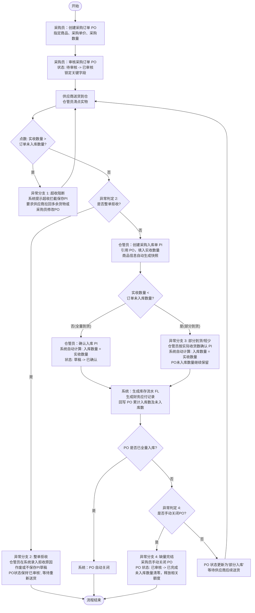
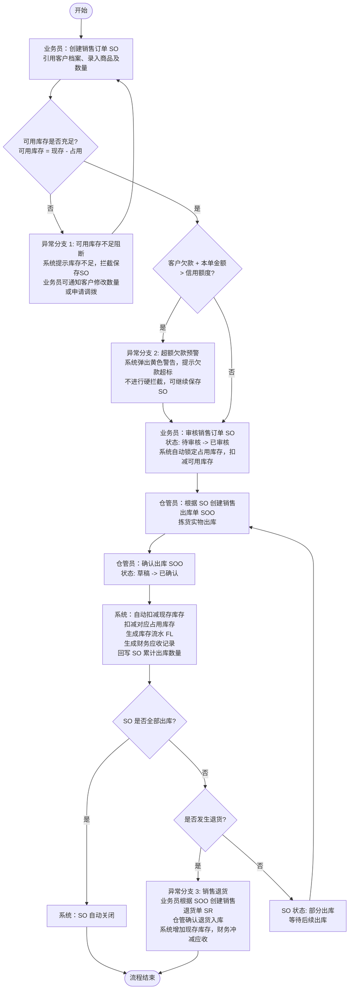
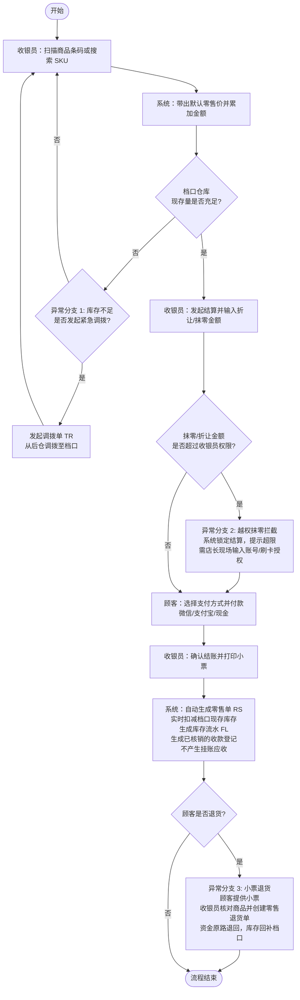
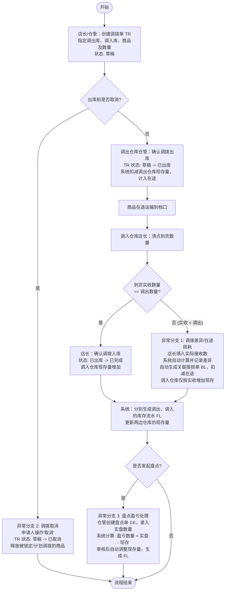

# 06-核心业务场景与流程

本文件详细描述强盛科技一期系统的四大核心业务场景。流程图使用 Mermaid 语法绘制，涵盖正常路径与关键异常分支；规则部分使用表格形式列出关键的校验、计算与业务约束。

---

## 一、采购到货入库场景（本次演示重点）

### 1.1 场景概述与痛点
* **参与角色**：采购员（业务部）、供应商（外部）、仓管员（仓储部）、财务。
* **业务痛点**：
  * 到货数量和订单不符时，容易将“采购数量”、“实收数量”、“入库数量”混淆。
  - 缺乏对超收、短少（部分到货）、整单拒收等异常情况的系统流程支撑，人工记账混乱。
  - 采购价格变动时没有留痕；入库确认后，应付账款的形成容易与实物收货脱节。
* **主要方案**：采用两层单据架构，采购订单（PO）记录意图，采购入库单（PI）执行入库。入库时将“采购数量”、“实收数量”、“入库数量”三口径分离。PI 确认后系统实时更新“现存”库存，自动形成财务应付记录，并根据实收数量更新 PO 的累计入库量。

### 1.2 业务主流程与异常分支（Mermaid Flowchart）
包含正常路径和四个关键异常分支：**超收阻断**、**整单拒收**、**部分到货（短少）**、**缺量完结（手动关闭）**。

### 1.3 关键业务规则

| 规则 ID | 规则名称 | 规则定义与计算逻辑 | 触发时机与控制方式 | 备注 |
| :--- | :--- | :--- | :--- | :--- |
| **BR-PO-01** | 三口径数量分离 | 采购数量（计划量）、实收数量（到货清点量）、入库数量（记账入库量）必须分开记录。满足公式：入库数量 ≤ 实收数量 ≤ 采购订单的未入库数量。 | 仓管员创建与确认采购入库单（PI）时由系统自动校验与计算。 | 采购订单上的“未入库数量”是系统自动计算的只读字段。 |
| **BR-PO-02** | 超收强控拦截 | 采购入库单（PI）明细行的“实收数量”绝对不能大于对应采购订单（PO）行的“未入库数量”（未入库数量 = 采购数量 - 累计入库数量），超出则系统报错并阻断保存/确认。 | 保存或确认采购入库单（PI）时触发校验。 | 一期不做超量容差百分比，多出1件也予以阻断。 |
| **BR-PO-03** | 单据价格与主数据快照 | 采购入库单（PI）在创建时，必须从商品档案中获取商品名称、规格、单位、采购单价等并作为“快照”存入单据，后续商品档案修改不影响已有单据。PO/PI 在审核或确认后关键字段锁定，不可再编辑。 | PI 引用 PO 生成时触发快照；单据确认/审核动作触发锁定。 | 保证单据历史数据的真实可追溯。 |
| **BR-PO-04** | 关闭与作废分离 | “关闭”用于 PO 部分到货且后续不再送货时的手动缺量完结，关闭后未入库数清零，PO 状态为“已完成”；“作废”用于未发生执行时的订单作废，PO 状态为“已作废”。执行层单据确认后不能作废或红冲。 | 采购员手动操作 PO 时；仓库确认 PI 后。 | 区分：关闭 -> 已完成，作废 -> 已作废。 |

---

## 二、代理商接单与批发销售场景

### 2.1 场景概述与痛点
* **参与角色**：业务员（业务部）、代理商（外部客户）、仓管员（仓储部）、财务。
* **业务痛点**：
  * 可用库存不准，销售开单后仓库发不出货，导致客户流失或纠纷。
  * 客户欠款情况不透明，无法有效防范坏账和超额挂账风险。
  * 同一客户由于不同业务员报价，导致价格混乱。
* **主要方案**：采用两层单据架构，销售订单（SO）记录合同意图，销售出库单（SOO）执行出库。SO 审核后锁定“占用库存”，扣减“可用库存”；发货后扣减“现存”并释放“占用”。价格受客户等级控制。

### 2.2 业务主流程与异常分支（Mermaid Flowchart）
包含正常路径和三个关键异常分支：**可用库存不足阻断**、**超额欠款预警**、**销售退货**。

### 2.3 关键业务规则

| 规则 ID | 规则名称 | 规则定义与计算逻辑 | 触发时机与控制方式 | 备注 |
| :--- | :--- | :--- | :--- | :--- |
| **BR-SO-01** | 库存三口径联动 | 必须遵循：可用库存 = 现存库存 - 占用库存。SO 审核时产生占用，SOO 确认时扣减现存且释放占用，可用库存保持不变。 | 销售订单（SO）审核与销售出库单（SOO）确认时触发。 | 一期必须严格阻断可用库存为负的订单审核。 |
| **BR-SO-02** | 信用额度黄色预警 | 客户当前欠款（财务应收总额）+ 本次销售订单金额 > 客户档案的信用额度时，系统提示预警。一期不做强拦截，仅作视觉警示。 | 销售订单保存/审核时触发。 | 满足老板“看清往来并给予提醒”的要求。 |
| **BR-SO-03** | 价格体系策略 | 新增 SO 时，商品单价根据客户档案绑定的价格级别（如一级代理价、二级代理价）自动带出默认批发价，允许业务员在权限范围内手动修改。 | 录入商品 SKU 后自动带出。 | 成交价快照保存至单据明细。 |
| **BR-SO-04** | 销售退货关联 | 销售退货必须关联原销售出库单（SOO）发起，退货数量不能大于已出库数量。退货确认后实时回补现存库存，并按原成交价扣减客户应收。 | 创建销售退货单（SR）并审核时触发。 | 避免客户虚假退货或超量退货。 |

---

## 三、门店零售收银场景

### 3.1 场景概述与痛点
* **参与角色**：收银员（门店档口）、店长、顾客、财务。
* **业务痛点**：
  * 零售开单和收款效率要求极高，无法走批发的“订单-出库”重流程。
  * 现场议价、抹零常见，但缺乏权限控制。
  * 档口和后仓的库存若不联通，容易账实不符。
* **主要方案**：采用轻量“收银页”模式，一键扫描/选择、自动计价、权限内抹零、付款确认。成交即减现存库存（无占用环节），实时记账。

### 3.2 业务主流程与异常分支（Mermaid Flowchart）
包含正常路径和三个关键异常分支：**越权抹零/折让拦截**、**前店展示库存不足处理**、**零售退货**。

### 3.3 关键业务规则

| 规则 ID | 规则名称 | 规则定义与计算逻辑 | 触发时机与控制方式 | 备注 |
| :--- | :--- | :--- | :--- | :--- |
| **BR-RS-01** | 实时扣减免占用 | 零售单（RS）不设“待审核”状态，结账确认即为“已确认”，实时扣减所在门店仓库的现存库存，生成 FL。不产生“占用”库存。 | 零售收银结账确认瞬间触发。 | 满足零售快速成交的效率要求。 |
| **BR-RS-02** | 抹零与折让强控 | 系统设置收银员单笔抹零上限（如5元）及最低折扣（如9.5折）。超出此范围的折让，系统必须弹出店长授权框，未授权无法提交。 | 结算输入折让金额时触发。 | 规范现场议价行为，防止资金流失。 |
| **BR-RS-03** | 即时对账核销 | 零售收款不计入应收挂账，系统自动按照实际付款金额（现金、微信、支付宝等）生成“收款登记”并即时核销。 | 零售结账确认时自动触发。 | 零售交易默认为“现款现货”。 |
| **BR-RS-04** | 小票退货规则 | 零售退货必须提供收银单号，系统核对商品及数量（退货量 ≤ 原销售量）。退款金额按实际成交价退回。确认退货后，档口库存实时回补。 | 零售退货处理时触发。 | 防止无票恶意退货。 |

---

## 四、库存管理场景（调拨与盘点）

### 4.1 场景概述与痛点
* **参与角色**：门店店长（申请/接收方）、后仓仓管员（发送方）。
* **业务痛点**：
  * 前店后仓调拨不规范，调拨在途商品容易丢失且责任不清。
  * 盘点时无视业务发生，导致账面数与实物数差异无法科学调整和留痕。
* **主要方案**：调拨采用“出库-入库”两阶段流程，记录调拨在途与在途损耗。盘点采用“实盘比对”方案，自动生成盘盈盘亏并由流水记录。

### 4.2 业务主流程与异常分支（Mermaid Flowchart）
包含正常路径和三个关键异常分支：**调拨入库数量差异（在途损耗）**、**调拨单取消**、**盘点盈亏处理**。

### 4.3 关键业务规则

| 规则 ID | 规则名称 | 规则定义与计算逻辑 | 触发时机与控制方式 | 备注 |
| :--- | :--- | :--- | :--- | :--- |
| **BR-ST-01** | 调拨两阶段控制 | 调拨必须经历“调拨出库确认”（扣减调出库现存，计入在途）与“调拨入库确认”（增加调入库现存，清算在途）两个动作，不准一步到位。 | 仓管员与店长执行出/入库操作时触发。 | 满足“前店后仓”异地运输的协同监控要求。 |
| **BR-ST-02** | 在途损耗责任制 | 调拨入库时实收数量若小于调出数量，系统自动生成关联报损单（BL）记录损耗，报损原因标记为“调拨损耗”。调入仓库仅按实收数量增加库存。 | 调拨入库确认时，检测到实收与调出有差自动触发。 | 一期差异只做记录并自动生成报损，不予阻断。 |
| **BR-ST-03** | 盘点锁定机制 | 盘点单在“草稿”状态下，被盘点仓库对应的商品明细应处于“轻度锁定”状态，即禁止发生其它出入库、调拨等库存变动，以防止账实交叉混乱。 | 盘点单创建保存为草稿时触发。 | 保证盘点数据的准确性。 |
| **BR-ST-04** | 盈亏自动调整与流水 | 盘点单确认/审核后，系统自动计算盈亏并更新库存现存。同时，每一笔盘盈或盘亏必须强制生成库存流水（FL），记入系统底账。 | 盘点单（CK）确认/审核时触发。 | 盘盈方向为“盘盈入库”，盘亏方向为“盘亏出库”。 |
