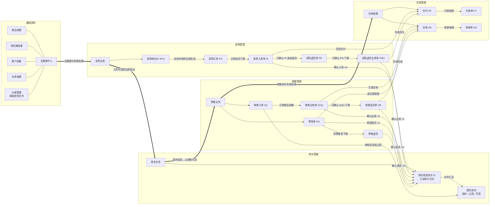
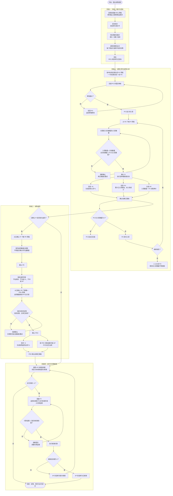

# Forge ERP 产品结构与核心交互流程

> 梳理范围：`prd-docs/` 下 54 份 PRD 文件，以及 `front-prototype/src/pages/` 中的采购询比价、销售、零售、库存和往来页面。其中基础资料、采购订单、采购入库、采购退货及库存查询以 PRD 为主口径；询比价、销售、零售和往来管理以当前前端原型的页面、类型和联动实现补充。

## 1. 产品结构图

### 关键说明

1. **基础资料是所有业务单据的共同地基**：商品、供应商、客户和仓库被新单据引用；商品名称、条码、规格和单位在单据中以快照保存。主数据不删除，只能停用，历史单据不受档案后续变更影响。
2. **采购链分为意图层与执行层**：RFQ 定标后可按中标供应商生成一张或多张 PO；PO 通过审核后可分批下推 PI。PR 只锁定退货申请，PRO 才执行实际退货出库。
3. **执行单据在“确认”动作后才动账**：PI 确认后增加现存、生成 FL 和 AP；PRO 确认后减少现存、生成 FL 并冲减 AP。PR 确认时不变更库存、不生成 FL、不冲减应付。
4. **库存流水是即时库存的审计来源**：已确认入库流水记正数，已确认出库流水记负数；`available = on_hand - occupied`，即时库存页同屏展示现存、占用和可用。
5. **销售和零售共享库存与往来能力**：SO 审核后形成占用，SOO 确认后扣减现存、释放占用并生成 AR；SR 确认后回补库存并冲减 AR。零售在前端作为独立菜单，本图按销售渠道归入销售管理。

## 2. 采购链核心交互流程

### 关键说明

1. **RFQ 与 PO 的转换**：RFQ 经过发布、供应商报价、横向比价和逐行定标后，系统按中标供应商分组生成 PO 草稿。同一 RFQ 可因多个中标供应商生成多张 PO。
2. **PO 有审核流，PI 没有审核流**：PO 经“草稿 → 待审核 → 待入库 / 部分入库 → 已完成”；PI 是执行层，由草稿直接确认生效，不引入待审核、已审核状态。
3. **采购三数量必须分开**：PO 采购数量、PI 实收数量、PI 入库数量是三个独立口径；确认 PI 时强制校验 `入库数量 <= 实收数量 <= PO 未入库数量`。
4. **PR 与 PRO 的生效时点不同**：PR 是退货意图和数量锁定，确认 PR 不动账；PRO 是执行单，确认 PRO 才扣减现存、生成 FL 并冲减 AP。一期一张 PR 只对应一张有效 PRO，不支持分批退货出库。
5. **应付核销是金额闭环**：PI 确认按入库数量和 PO 含税单价生成 AP，PRO 确认以负向金额冲减 AP；PY 付款金额不得超过未核销余额，核销状态按余额变化为未核销、部分核销或已核销。

## 3. 核心单据与联动摘要

| 单据 / 记录 | 业务定位 | 来源 | 关键动作 | 主要下游影响 |
| :--- | :--- | :--- | :--- | :--- |
| RFQ 采购询价 | 采购前置决策 | 采购员创建 | 发布、比价、定标 | 按中标供应商生成 PO 草稿 |
| PO 采购订单 | 采购意图层 | 手工创建或 RFQ 定标 | 提交审核、审核、关闭 | 下推多张 PI，由 PI 回写入库进度 |
| PI 采购入库单 | 采购执行层 | 已审核或部分入库 PO | 确认入库 | 现存增加、生成 FL、回写 PO、生成 AP |
| PR 采购退货单 | 退货申请层 | 已确认 PI | 确认退货 | 锁定可退数量并允许下推 PRO，不动账 |
| PRO 采购退货出库单 | 退货执行层 | 已确认 PR | 确认出库 | 现存减少、生成 FL、冲减 AP |
| FL 库存收发流水 | 只读审计日志 | 已确认执行单据 | 系统自动生成 | 汇总即时库存，支持来源单据追溯 |
| SO / SOO | 销售意图与出库执行 | 销售员创建 SO，SO 下推 SOO | SO 审核、SOO 确认出库 | 占用库存；出库后生成 FL 和 AR |
| SR / 零售退货 | 销售退回执行 | 已确认 SOO 或原 RS | 确认退货 | 回补现存、生成 FL，SR 冲减 AR |
| AP / PY | 供应商应付与付款 | PI 与 PRO | 新建 PY、核销付款 | 更新供应商应付余额和核销状态 |
| AR / RC | 客户应收与收款 | SOO、SR 与零售成交 | 新建 RC、核销收款 | 更新客户应收余额和核销状态 |

## 4. 口径边界

- `prd-docs/` 目前没有采购询比价、销售、零售和往来管理的完整 PRD 套件，本文对这些模块的状态、动作和联动以前端原型现有实现为准。
- 采购链中 PO、PI、PR、PRO 的业务规则以各模块的主 PRD、字段清单和业务规则规格为准；本文只表达跨模块结构和关键交互，不替代字段 SSOT 或校验规格。
