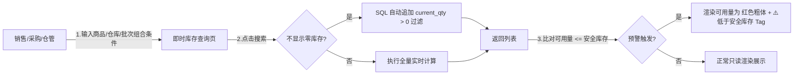

# 即时库存查询_业务流程推演

> **覆盖场景**：按仓库+商品筛选 / 按商品批次筛选 / 不显示零库存过滤 / 低于安全库存触发红标预警 / 无库存空状态场景
> **不展开范围**：采购和销售的具体单据保存与确认逻辑（本文仅限即时库存页面查账交互）
> **参考文档**：《即时库存查询主PRD》《即时库存查询字段清单》《即时库存查询_业务规则规格》
> **版本**：V1.0 | 2026-07-04

---

## 一、业务查询流程概述

### 1.1 业务特点说明
*   ✅ **实时计算展现**：本页面即时库存数据是由底层期初库存及 FL 流水表在用户发起搜索瞬间实时 SQL 聚合计算而来，非跑批快照。
*   ✅ **三口径共屏**：同屏直观展示现存量（实物数）、占用量（被SO锁定未发货数）、可用量（还能承诺销售的余额）。
*   ✅ **零库存一键过滤**：前台提供快速 Switch 开关，勾选后自动在过滤逻辑中排除现存 $\le$ 0 的记录。
*   ⚠️ **安全水位警示**：当可用量 $\le$ 预设安全库存时，前端界面数值呈红色加粗显示并附加警告标识。

### 1.2 本场景在全局中的位置

> **关键里程碑**：
> - 🏁 **里程碑 1**：成功执行实时计算，返回对应仓库商品的现存、占用、可用三口径数值。
> - 🏁 **里程碑 2**：开启“不显示零库存”过滤，页面成功剔除无货 SKU 行。
> - 🏁 **里程碑 3**：低于安全水位的商品行触发红色预警标识，方便采购决策。

---

## 二、详细步骤推演

本推演设定测试数据集商品 `SKU001`（华强北特种接插件）和 `SKU002`（贴片电容）在 `WH001`（民房一号仓）中的库存数据。其中 `SKU001` 启用了批次管理。

### 步骤 ①：按仓库与商品查询（含批次独立展示）

**操作**：仓管员在查询区选择“民房一号仓 WH001”和“商品 SKU001”，点击“搜索”按钮。

**后端计算逻辑**：
1.  系统在 `inventory_flow` 表中查找所有已确认的关于 `WH001` 下 `SKU001` 的流水，并按批次号进行 Group By 聚合累加现存量：
    $$ 现存量_{批次} = 期初_{批次} + \sum 入库_{批次} - \sum 出库_{批次} $$
2.  系统在 `sales_order` 表中查找所有针对该仓该商品未完成的订单占用量，分摊至各批次。
3.  系统计算可用量：
    $$ 可用量 = 现存量 - 占用量 $$

**列表展示结果**：

| 商品编码 | 商品名称 | 仓库 | 批次号 | 现存量 | 占用量 | 可用量 | 安全库存量 | 最近变动时间 | 预警标识 |
| :--- | :--- | :--- | :--- | :---: | :---: | :---: | :---: | :--- | :--- |
| SKU001 | 华强北特种接插件 | WH001 民房一号仓 | **20260704-A1** | **6** | 0 | **6** | 5 | 2026-07-04 14:30:15 | — |
| SKU001 | 华强北特种接插件 | WH001 民房一号仓 | **20260701-A1** | **15** | 5 | **10** | 5 | 2026-07-02 10:15:00 | — |

**关键点**：
- ✅ **批次独立拆行**：同一商品 `SKU001` 在同一仓库下，由于存在两个批次，列表将其分行独立展示并汇总各自的现存、占用、可用量。

---

### 步骤 ②：低于安全库存触发红标预警

**操作**：采购员在查询区选择“民房一号仓 WH001”和“商品 SKU002”（未启用批次，其安全库存设定为 100 件），点击“搜索”。

**后端计算结果**：
- 现存量 = 50，占用量 = 0 $\rightarrow$ 可用量 = 50 件。
- 系统比对可用量（50） $\le$ 安全库存（100），触发预警。

**列表展示结果**：

| 商品编码 | 商品名称 | 仓库 | 批次号 | 现存量 | 占用量 | 可用量 (渲染样式) | 安全库存量 | 最近变动时间 | 预警标识 |
| :--- | :--- | :--- | :--- | :---: | :---: | :---: | :---: | :--- | :--- |
| SKU002 | 贴片电容 | WH001 民房一号仓 | - | 50 | 0 | **50** | 100 | 2026-07-02 09:30:00 | **⚠️低于安全库存** |

**关键点**：
- ✅ **视觉警示**：可用量“50”数值标红加粗，且在最右侧追加黄色警告 Tag，提示采购员补货。

---

### 步骤 ③：不显示零库存过滤

**操作**：假设此时档口仓库 `WH002` 下的商品 `SKU003` 现存量为 0 件。用户开启页面上的“不显示零库存”Switch 开关，点击“搜索”。

**后端计算与过滤**：
1.  系统计算出该仓库下 `SKU003` 的即时现存为 0。
2.  由于 Switch 开关为 `true`，系统在数据库返回前执行 `AND current_qty > 0` 过滤。
3.  列表中该 `SKU003` 记录行被成功剔除隐藏。

---

### 步骤 ④：无库存场景（空状态）

**操作**：用户在查询条件中选择“档口仓库 WH002”，开启“不显示零库存”开关，点击搜索。此时该档口所有商品的现存量均为 0。

**页面渲染**：
- 列表不返回任何行。
- 表格区展示标准的“暂无数据”插图，并在下方显示提示语：「在当前筛选条件下，没有找到对应的即时库存记录」。
- 工具栏的“导出”按钮变为 Disabled 禁用置灰状态。

---

## 三、完整数据状态演变

对于上述筛选推演全周期，前台条件状态与列表展示行数的变动轨迹汇总如下：

| 步骤节点 | 仓库筛选值 | 商品筛选值 | 不显示零库存 | 列表返回行数 | 可用量预警触发行 | 导出按钮状态 |
| :--- | :--- | :--- | :--- | :---: | :--- | :---: |
| 初始状态 | 空（全部） | 空（全部） | `false` | 10 条（分页） | SKU002 | ✅ 启用 |
| 步骤 ① (查批次) | `WH001` | `SKU001` | `false` | 2 条 | 无 | ✅ 启用 |
| 步骤 ② (查预警) | `WH001` | `SKU002` | `false` | 1 条 | SKU002 (标红 + ⚠️Tag) | ✅ 启用 |
| 步骤 ③ (过滤零) | `WH002` | 空（全部） | `true` (开启) | 成功隐藏 0 库存行 | 无 | ✅ 启用 |
| 步骤 ④ (无库存) | `WH002` | 空（全部） | `true` (开启) | 0 条 (空状态) | 无 | ❌ 禁用 |
