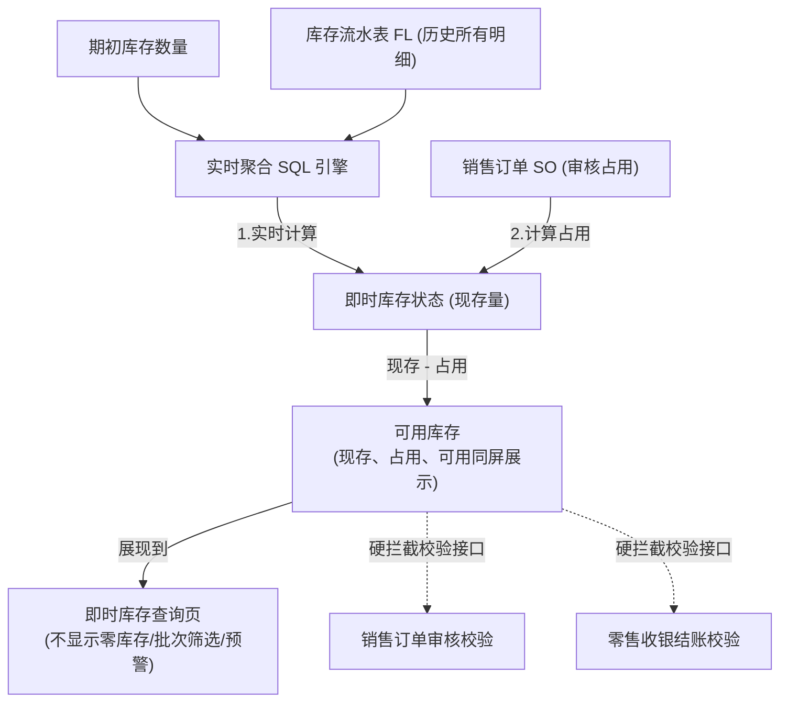

# 即时库存查询主PRD

> **版本**：V1.0 | 2026-07-04
> **读者**：研发工程师、测试工程师、产品复核
> **课件依据**：进销存第2讲 §3.9 即时库存设计；一期范围边界已确认

---

### 1. 业务背景

即时库存（即现时现存量）是进销存系统**最核心的数据支撑**，直接决定了销售订单是否可以承诺交货、零售门店是否可以收银结账、以及采购是否需要发起补货。

没有统一的即时库存查询页面：
- 销售开单时不知道哪些商品还有货、还能卖多少，极易造成可用超发导致客怨和违约
- 档口门店和民房后仓库存各行其是，前店后仓数据脱节，无法科学调拨
- 现存量、占用量、可用量纠缠不清（如已下销售单尚未出库的实物常被误作“可销售数”卖出，造成二次占用冲突）
- 无法发现呆滞积压或安全库存不足（低于警戒线）的商品，决策盲目

即时库存不是固定周期的“定时快照”，而是由系统根据商品期初库存数据，叠加历史所有入库流水（+）并扣减历史所有出库流水（-）在**用户发起查询瞬间实时重新计算的“即时状态”**。本页面提供库存的全局检索、零库存过滤、安全库存对比及数据导出。

---

### 2. 功能范围

**In Scope**：
- 支持多条件组合查询：支持按商品、仓库、商品批次进行检索过滤
- 支持现存库存三口径共屏展示：现存量（实物）、占用量（销售锁库）、可用量（可销售余额）
- 零库存过滤：支持“不显示零库存”开关，一键过滤数量 $\le$ 0 的商品行
- 基础库存预警：支持查看商品定义的安全库存数，并当“可用库存 < 安全库存”时以红色高亮进行视觉预警（一期做轻支持）
- 支持列表数据一键导出为 Excel 明细

**Out of Scope**：
- 自动补货建议生成及安全库存自动计算（一期安全库存从商品档案读取，不进行智能计算，属于二期决策功能）
- 在即时库存页面执行库存调拨、报损或盘点（即时库存是只读查询，库存修改必须在TR/BL/CK等操作单据中进行）
- 批次到期自动预警与近效期硬阻断（一期仅支持批次号查询展示，属于二期批次效期管理模块）

---

### 3. 单据定位

#### 3.1 在系统中的位置

| 项目 | 内容 |
| :--- | :--- |
| 单据层级 | **不属于单据分层——属于系统核心只读查询台账** |
| 核心职责 | 实时向销售、采购、仓库提供“企业当前还剩多少货、被锁了多少、还能卖多少”的 SSOT 数据源 |
| 单据来源 | 系统基于底层期初库存及库存流水 (FL) 表的实时 SQL 聚合计算而来 |
| 下游单据 | 无（本身为查询页。但销售、零售、调拨等单据在保存前需调用其可用库存接口进行硬拦截） |
| 实体关系 | 每个仓库的每个商品 SKU（包含批次维度），在表中表现为**一条即时库存记录** |

#### 3.2 系统链路图（Mermaid）

#### 3.3 实体关系说明

| 关系 | 说明 |
| :--- | :--- |
| 即时库存 : 商品档案 | **N:1**（即时库存从商品档案获取商品名称、规格、安全库存基准值） |
| 即时库存 : 仓库档案 | **N:1**（即时库存按仓库维度进行横向拆分） |
| 即时库存 : 批次信息 | **N:1**（当商品启用批次管理时，库存按“商品+仓库+批次”形成多行） |

---

### 4. 业务场景

| 场景ID | 场景 | 类型 | 说明 |
| :--- | :--- | :--- | :--- |
| S01 | 仓管员按商品与仓库组合查库 | **主流程** | 选择“民房一号仓 WH001”和“商品 SKU001”，点击搜索，返回现存、占用、可用数据，指导实物堆放 |
| S02 | 业务员筛选特定批次商品库存 | **主流程** | 输入批次号 `20260704-A1`，查询此批次商品在各仓库的分布，判断是否可以优先发货 |
| S03 | 采购员过滤零库存查找缺货商品 | **主流程** | 关闭“显示零库存”或勾选“不显示零库存”，列表仅展示现存有货的商品；反之，可找出库存为 0 的缺货商品 |
| S04 | 可用库存低于安全库存触发预警 | **支线** | 商品可用库存为 2，安全库存设定为 10，列表该行的“可用库存”自动红色高亮，提示采购员补货 |
| S05 | 多条件组合检索无匹配数据 | **支线** | 输入冷偏门查询条件，系统表格展示标准的“暂无数据”空状态 |

---

### 5. 状态机

> ⚠️ **不适用**：本模块为**只读库存底账视图**，数据由各业务执行单据确认时由系统数据库引擎自动重算生成，无单据生命周期概念。因此不适用状态机流转。在此保留标题仅为对齐 PRD 目录规范。

---

### 6. 动作能力矩阵

本页面作为只读检索台账，动作权限极度精简：

| 动作 | 全体库存 |
| :--- | :---: |
| 组合过滤 / 重置 | ✅ |
| 导出 Excel | ✅ |
| 新增 / 编辑 / 删除 | ❌ |
| 作废 / 审核 / 调整 | ❌（库存调整必须走盘点单 CK） |

---

### 7. 核心业务规则

#### 7.1 即时库存实时计算规则

| 规则ID | 规则 |
| :--- | :--- |
| **R01** | **实时重算逻辑**：即时库存禁止采用“夜间跑批”或“定时定时快照”数据，必须在用户执行搜索或接口调用瞬间，实时查询数据库并由公式算得最新值，保证前台数据的绝对同步： $$ 现存量 = 期初数量 + \sum 确认的入库流水量 - \sum 确认的出库流水量 $$ |
| **R02** | **库存三口径模型**：现存、占用、可用库存必须同屏展示，且三者始终满足恒等公式： $$ 可用库存 = 现存量 - 占用量 $$ |
| **R03** | 批次级聚合：如果某商品启用了“批次管理”，则即时库存必须以“仓库编码 + 商品编码 + 批次号”作为联合主键进行聚合（即同一商品在同一仓库，不同批次需拆分为独立行展示）。 |

#### 7.2 零库存与预警展示规则

| 规则ID | 规则 |
| :--- | :--- |
| **R11** | **零库存隐藏逻辑**：当用户开启“不显示零库存”开关时，系统必须在查询的 SQL 逻辑中拼接过滤条件：`AND current_qty > 0`。 |
| **R12** | **安全库存预警红标**：系统后台实时比对每一行的 `可用库存` 与该商品的 `安全库存`。当 $可用库存 < 安全库存$ 时，前端页面该行的 `可用库存` 数值必须以**红色粗体**显示，同时行最右侧增加黄色“⚠️低于安全库存”的预警 Tag。 |

---

### 8. 权限设计

#### 8.1 数据可见范围

| 角色 | 可见数据范围 | 说明 |
| :--- | :--- | :--- |
| 仓管员 | 本人管辖仓库范围内的即时库存明细 | 无法跨库查看库存，避免串货和信息越权 |
| 销售/业务员 | 全系统所有仓库的“可用库存”字段，但隐藏“成本金额”等财务数据 | 保证销售知晓可售数，但防范成本泄露 |
| 财务 | 全系统所有仓库的全部库存明细，包含数量和账面总价值 | 拥有完整资产审计权 |
| 管理员 | 全量可见 | 全局权限 |

#### 8.2 操作权限矩阵

| 操作 | 业务员 | 采购员 | 仓管员 | 财务 | 管理员 |
| :--- | :---: | :---: | :---: | :---: | :---: |
| 组合查询 | ✅ | ✅ | ✅ | ✅ | ✅ |
| 导出明细 | ✅ | ✅ | ✅ | ✅ | ✅ |

---

### 9. 边界与异常处理

#### 9.1 负库存控制

| 场景 | 处理方式 |
| :--- | :--- |
| 物理库存为负数（由于期初漏单或入库单延迟确认，系统允许在特定配置下负库存收银或拦截） | 一期严格执行**防负控制**：可用库存严禁为负数。若因系统级故障或盘亏单产生负库存现存，查询列表页应正常展示负数（如 `-2`，高亮警告色），但销售开单接口将该商品的“可用库存”一律按 `0` 反回，拦截销售。 |

#### 9.2 商品停用历史库存展示

| 场景 | 处理方式 |
| :--- | :--- |
| 该商品已在商品档案中被“停用”，但仓库中仍有历史现存实物 | **展示且高亮**：即时库存页面必须继续展示该商品的库存余额（以便仓管进行出库或清理），但商品名称旁应增设灰色“已停用”标签，且销售单引用商品时系统硬性拦截（禁止新销售）。 |

---

### 10. 验收重点

| # | 验收项 | 输入条件 | 预期结果 |
| :--- | :--- | :--- | :--- |
| **V01** | **只读属性验证** | 尝试在该页面点击或调用新建/编辑接口 | 界面无入口，API 返回 403 权限拒绝 |
| **V02** | **三口径联动公式** | 现存 = 20，占用 = 5 | 页面可用库存只读显示为 15，公式无误差 |
| **V03** | **零库存过滤** | 开启“不显示零库存”开关，点击搜索 | 现存量为 0 或负数的商品行从列表中消失 |
| **V04** | **库存预警展示** | 可用库存 2，安全库存 5 | 该行可用库存数值渲染为红色，右侧展示黄字「⚠️低于安全库存」 |
| **V05** | **商品停用展示** | 搜索已被停用的商品，其现存量为 10 | 列表该商品行正常显示，商品名后带有“已停用”灰标 |
| **V06** | **批次独立拆行** | 同一商品 SKU01 在仓库 WH01 下有批次 A（5个）和批次 B（10个） | 列表中展示为两条独立的明细行，批次号分别对齐 |

---

### 11. 修订记录

| 日期 | 变更摘要 |
| :--- | :--- |
| 2026-07-04 | V1.0 初版生成，包含即时计算、三口径共屏和零库存屏蔽设计 |
