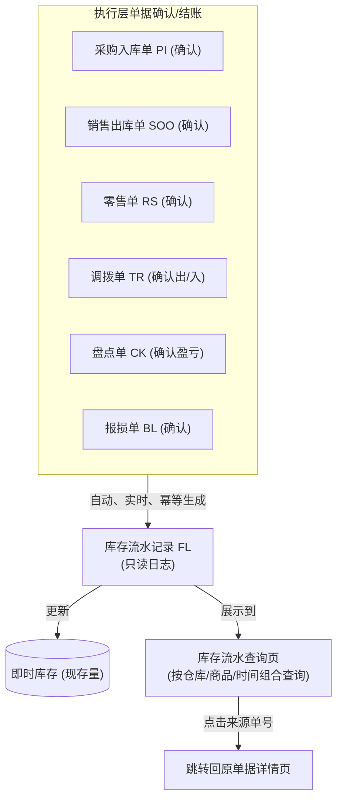

# 库存流水查询主PRD

> **版本**：V1.0 | 2026-07-04
> **读者**：研发工程师、测试工程师、产品复核
> **课件依据**：进销存第2讲 §3.10 库存流水设计；一期范围边界已确认

---

### 1. 业务背景

库存流水（FL）是系统所有库存实物变动（增加或减少）的**终极审计底账**。它解决“企业在什么时间、哪个仓库、针对哪个商品、因为什么业务单据、变动了多少数量、变动后的现存量是多少”的全局追溯问题。

没有统一的库存流水查询页面：
- 仓库现存数据变动时无法对账，不知道库存增加或减少是哪个具体业务动作引起的
- 发生短少、漏发或账实不符时，无法追溯历史变动的时间线
- 财务和管理人员无法按商品、仓库、时间范围及单据类型对历史库存事务进行汇总和审计
- 系统的现存库存变化成了“黑盒”，数据失去公信力

库存流水由系统在采购入库、销售出库、零售结账、调拨出入库、盘点确认及报损确认等业务动作发生时**自动、实时、幂等地写入**，记录为只读日志。本页面提供统一的流水检索与导出功能，不提供任何数据的新增、编辑、删除或状态干预。

---

### 2. 功能范围

**In Scope**：
- 支持多条件组合查询：支持按商品、仓库、单据类型（采购入库/销售出库/零售单/调拨单/盘点单/报损单等）、时间范围、变动方向进行精确与模糊检索
- 支持列表数据一键导出为 Excel 格式明细
- 流水变动的双向展示：入库记为正数（+），出库记为负数（-），直观反映库存吞吐
- 流水关联来源单号，支持直接点击单号下钻跳转到对应执行层单据的详情页，实现全链路追溯
- 对不同仓管员和业务角色实施仓库级和权限级的数据范围隔离

**Out of Scope**：
- 手工新增或修改库存流水（库存流水由系统动作触发自动生成，严禁手工篡改）
- 库存成本明细流水查询（一期仅包含数量口径，成本及金额流水属于二期财务成本计价模块）
- 自动生成盘点建议或补货预警（属于库存决策模块，一期仅做查询）

---

### 3. 单据定位

#### 3.1 在系统中的位置

| 项目 | 内容 |
| :--- | :--- |
| 单据层级 | **不属于单据分层——属于系统审计日志与查询台账** |
| 核心职责 | 提供全系统商品现存库存变化的“黑盒审计”，提供跨模块、跨仓库、跨时间的库存变动追溯 |
| 单据来源 | 系统自动生成（由 PI、SOO、RS、TR、CK、BL 等执行层单据确认动作触发） |
| 下游单据 | 无（本功能为查询页，不触发任何下游单据） |
| 实体关系 | 每一笔执行层明细商品的库存变动，对应生成**一条库存流水记录**（1:1） |

#### 3.2 系统链路图（Mermaid）

#### 3.3 实体关系说明

| 关系 | 说明 |
| :--- | :--- |
| 库存流水 : 来源单据 | **1:1**（每条库存流水记录唯一绑定一个来源执行单据行商品，以供追溯） |
| 库存流水 : 商品档案 | **N:1**（流水关联具体商品 SKU） |
| 库存流水 : 仓库档案 | **N:1**（流水关联发生实物变动的仓库） |

---

### 4. 业务场景

| 场景ID | 场景 | 类型 | 说明 |
| :--- | :--- | :--- | :--- |
| S01 | 仓管员按商品 SKU 和仓库查询库存流向 | **主流程** | 仓管员选择“民房一号仓”，搜索商品“华强北特种接插件”，查询其在该仓的所有出入库流水，核对账实 |
| S02 | 财务人员按单据类型和日期范围对账 | **主流程** | 财务选择“采购入库”类型，日期筛选“本月”，搜索所有入库流水，核对当月供应商应付款规模 |
| S03 | 业务员通过流水号追溯来源单据 | **主流程** | 列表中点击某条出库流水的来源单号 `SOO20260704-0001`，系统自动在新窗口跳转到销售出库单详情页 |
| S04 | 多条件组合筛选无匹配结果 | **支线** | 用户选择不匹配的仓库与商品组合，点击搜索，列表展示标准“暂无数据”空状态 |
| S05 | 导出当前筛选后的历史流水 | **支线** | 用户筛选特定商品本周的流水，点击工具栏“导出”，系统自动下载对应的 Excel 表格 |

---

### 5. 状态机

> ⚠️ **不适用**：本模块为**只读查询台账**，库存流水由系统自动写入且不可篡改，单据无生命周期流转。因此不适用状态机模型。在此保留标题仅为对齐 PRD 目录规范。

---

### action6 动作能力矩阵

本页面作为只读检索台账，动作权限极度精简：

| 动作 | 全体流水 |
| :--- | :---: |
| 搜索 / 重置 | ✅ |
| 查看 (跳转来源单) | ✅ |
| 导出 Excel | ✅ |
| 新增 / 编辑 / 删除 | ❌ |
| 作废 / 审核 / 确认 | ❌ |

---

### 7. 核心业务规则

#### 7.1 生成与写入规则

| 规则ID | 规则 |
| :--- | :--- |
| **R01** | 库存流水（FL）只能由系统在执行层单据确认生效时自动生成，禁止通过任何前端 API 或手动录入直接创建。 |
| **R02** | 流水变动方向：入库业务（如采购入库、盘盈、调拨入库）的变动数量必须记录为正数（+）；出库业务（如销售出库、零售单结账、报损、盘亏、调拨出库）的变动数量必须记录为负数（-）。 |
| **R03** | **追溯唯一性**：每一条流水记录必须在 `来源单号` 字段中持久化记录对应的执行层业务单号（如 PI / SOO / RS 等），且支持列表链接下钻。 |
| **R04** | 变动后现存：每一条流水在写入时，必须同时持久化记录该仓库该商品在变动发生后的最新现存量数值（快照现存），作为历史对账的依据。 |

#### 7.2 查询与展示规则

| 规则ID | 规则 |
| :--- | :--- |
| **R11** | **变动类型归类**：系统根据来源单据类型自动映射展示“变动类型”： - `PI` $\rightarrow$ 采购入库 - `PRO` $\rightarrow$ 采购退货出库 - `SOO` $\rightarrow$ 销售出库 - `SR` $\rightarrow$ 销售退货入库 - `RS` $\rightarrow$ 零售单成交 - `TR_OUT` $\rightarrow$ 调拨出库 - `TR_IN` $\rightarrow$ 调拨入库 - `BL` $\rightarrow$ 报损出库 - `CK_IN` $\rightarrow$ 盘盈入库 - `CK_OUT` $\rightarrow$ 盘亏出库 |
| **R12** | 默认排序：列表展示默认按照 `最后修改时间`（即写入时间）进行降序（DESC）排列，即最新的库存变化展示在最上方。 |

---

### 8. 权限设计

#### 8.1 数据可见范围

| 角色 | 可见数据范围 | 说明 |
| :--- | :--- | :--- |
| 仓管员 | 自己所辖仓库范围内的所有库存流水 | 无法查看非管辖仓库的流水明细 |
| 采购员 | 全系统所有“采购入库”与“采购退货出库”类型的流水 | 仅查看自己关联的采购变动 |
| 财务 | 全系统所有库存流水 | 拥有全局审计与对账权限，全量可见 |
| 管理员 | 全系统所有库存流水 | 全量可见 |

#### 8.2 操作权限矩阵

| 操作 | 业务员 | 采购员 | 仓管员 | 财务 | 管理员 |
| :--- | :---: | :---: | :---: | :---: | :---: |
| 组合搜索 | ✅ | ✅ | ✅ | ✅ | ✅ |
| 点击跳转 | ✅ | ✅ | ✅ | ✅ | ✅ |
| 导出 | ❌ | ✅ | ✅ | ✅ | ✅ |

---

### 9. 边界与异常处理

#### 9.1 零数据与超期查询

| 场景 | 处理方式 |
| :--- | :--- |
| 查询无结果 | 表格展示标准“暂无数据”空状态，导出按钮置灰不可点击。 |
| 时间范围跨度过大 | 系统一期默认限制日期区间筛选的最大跨度为 **365 天**（1 年），超出则输入框提示报错并阻断搜索，以防造成数据库全表扫描导致系统崩溃。 |

#### 9.2 级联跳转异常

| 场景 | 处理方式 |
| :--- | :--- |
| 来源单据在系统中被物理删除（如草稿 PI 被删后残留流水，但PI草稿不产生流水） | **容错设计**：库存流水仅在单据确认（非草稿态）时生成，已确认单据不允许物理删除，因此来源单据必存在。若发生系统级破坏导致原单丢失，点击跳转时系统提示「来源单据不存在或已被清理」。 |

---

### 10. 验收重点

| # | 验收项 | 输入条件 | 预期结果 |
| :--- | :--- | :--- | :--- |
| **V01** | **只读属性验证** | 尝试在页面上寻找“新建”、“编辑”、“删除”或“作废”按钮 | 页面无此类按钮，API 亦无对应写接口 |
| **V02** | **变动方向显示** | 采购入库 10 件，销售出库 5 件确认后，查询该商品流水 | 入库显示为 `+10`，出库显示为 `-5` |
| **V03** | **时间区间强限** | 日期筛选选择 2025-01-01 至 2026-07-04（跨度超过365天） | 系统报错提示「查询时间跨度不可超过 365 天」，阻断查询 |
| **V04** | **来源追溯跳转** | 点击列表中流水 `FL20260704-00000001` 的来源单号 `PI20260704-0001` | 新窗口自动打开该入库单详情页 |
| **V05** | **空状态及导出** | 搜索无数据条件 | 列表显示“暂无数据”，工具条的“导出”按钮变为 Disabled 禁用状态 |
| **V06** | **仓库权限隔离** | 仓库A的仓管员登录，查询库存流水 | 仓库筛选下拉框仅出现仓库A，列表数据只展示仓库A的流水记录 |

---

### 11. 修订记录

| 日期 | 变更摘要 |
| :--- | :--- |
| 2026-07-04 | V1.0 初版生成，基于进销存一期查询台账标准规范设计 |
