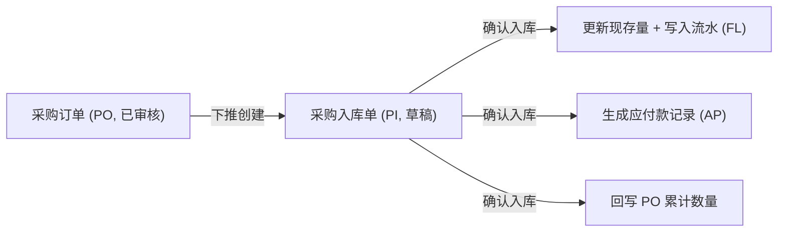
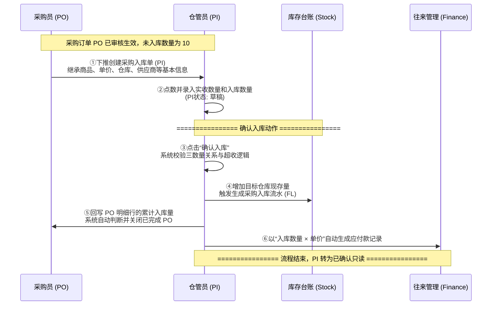

# 采购入库单_业务流程推演

> **覆盖场景**：采购订单下推入库 $\rightarrow$ 实收与入库分离记录 $\rightarrow$ 全量入库完成自动关单
> **不展开范围**：采购退货单（PR）和采购退货出库单（PRO）的逆向流程（另文推演）
> **参考文档**：《采购入库单主PRD》《采购入库单字段清单》《采购入库单_业务规则规格》
> **版本**：V1.0 | 2026-07-04

---

## 一、业务流程概述

### 1.1 业务特点说明
*   ✅ **下推创建**：采购入库单（PI）必须从已审核的采购订单（PO）下推引用生成，不可无来源手工创建。
*   ✅ **三数量分离**：本流程明确区分采购数量（计划量）、实收数量（到货清点量）和入库数量（验收入库量）。
*   ✅ **自动回写与级联**：确认入库后，系统自动计算并累加回写采购订单明细行的累计已入库量，自动更新其未入库量；触发仓库现存库存增加，并自动生成财务应付款记录。
*   ⚠️ **单向终态约束**：PI一旦“确认入库”，状态转为“已确认”，此时单据被锁死，无法修改、无法作废或反向撤销。

### 1.2 本场景在全局中的位置



### 1.3 完整流程图



> **关键里程碑**：
> - 🏁 **里程碑 1**：成功下推生成 PI 草稿，继承 PO 原始数据快照。
> - 🏁 **里程碑 2**：点数录入无误，确认入库被系统校验通过。
> - 🏁 **里程碑 3**：库存现存更新完成，PO 累计入库数回写完成，财务应付自动生成。

---

## 二、详细步骤推演

本推演用具体商品进行模拟：采购商品为 `SKU001`（华强北特种接插件），订单计划采购数量为 10 个，含税单价 50 元。供应商为 `S001`（深圳强盛电子），入库仓库为 `WH001`（民房一号仓）。

### 步骤 ①：下推创建采购入库单

**操作**：仓管员在系统选择已审核的采购订单 `PO20260704-0001`，点击“下推创建入库单”。

**采购入库单 PI 创建（草稿态）**：

| 字段 | 值 | 说明 |
| :--- | :--- | :--- |
| 单据编号 | **PI20260704-0001** | 系统自动生成（前缀PI） |
| 来源采购单号 | **PO20260704-0001** | 下推继承，只读 |
| 供应商 | S001 深圳强盛电子 | 继承自 PO，只读 |
| 入库仓库 | WH001 民房一号仓 | 继承自 PO，只读 |
| 入库日期 | **2026-07-04** | 自动默认当天 |
| 入库状态 | **草稿 (DRAFT)** | 初始状态 |

**商品明细**：

| 商品编码 | 商品名称 | 采购单价 | 订单数量 | 未入库数量 | 实收数量 | 入库数量 | 金额（含税） |
| :--- | :--- | :--- | :--- | :--- | :--- | :--- | :--- |
| SKU001 | 华强北特种接插件 | 50.00 | 10 | **10** | **0** | **0** | **0.00** |

**关键点**：
- ✅ **字段继承**：单据级及明细行的商品基本信息、未入库数量、单价完全继承自 PO，界面锁定不可修改。
- ⚠️ **初始数量**：明细中 `实收数量` 和 `入库数量` 默认回填为 0，等待仓库人员盘点填写。

---

### 步骤 ②：点数与录入数量

**操作**：供应商货送达。仓管员清点实物，发现实际送达 8 个（其中 2 个表面有破损，决定退回不入库，实际合格入库 6 个）。仓管员在 PI 草稿编辑明细行，录入实收数量 8，入库数量 6。

**商品明细变化**：

| 商品编码 | 字段 | 变更前 | 变更后 | 说明 |
| :--- | :--- | :--- | :--- | :--- |
| SKU001 | 实收数量 | 0 | **8** | 人工点数录入 |
| SKU001 | 入库数量 | 0 | **6** | 验货合格数录入 |
| SKU001 | 金额（含税） | 0.00 | **300.00** | 系统自动计算：`6 × 50.00 = 300.00` |
| SKU001 | 行备注 | 空 | **到货8个，2个严重磨损拒收** | 手动填入破损说明 |

**关键点**：
- ✅ **金额实时重算**：当输入入库数量后，明细行的“金额（含税）”根据公式：`金额 = 入库数量 × 采购单价` 实时重新计算并只读展示。

---

### 步骤 ③：确认入库（前置校验）

**操作**：仓管员在页面点击“确认入库”按钮。系统自动发起校验。

**校验逻辑（伪代码）**：
```
FOR EACH 商品行 DO
    // 1. 实收和入库数合法性校验
    IF 入库数量 <= 0 OR 实收数量 <= 0 THEN
        ERROR "数量必须是大于0的正整数"
    END IF
    
    // 2. 入库数与实收数关系校验
    IF 入库数量 > 实收数量 THEN
        ERROR "入库数量不能大于实收数量"
    END IF
    
    // 3. 超收强控校验
    IF 实收数量 > 订单未入库数量 THEN
        ERROR "实收数量超出采购订单尚未入库的余额"
    END IF
END FOR
```

**关键点**：
- ✅ **规则闭环**：因为实收 8 $\le$ 未入库 10，且入库 6 $\le$ 实收 8，校验全部通过。

---

### 步骤 ④：确认入库（数据持久化与回写）

**操作**：校验通过，系统更新数据库，单据状态变更为“已确认”，并执行级联影响。

**采购入库单状态变化**：

| 字段 | 变更前 | 变更后 | 说明 |
| :--- | :--- | :--- | :--- |
| 入库状态 | 草稿 (DRAFT) | **已确认 (CONFIRMED)** | 数据正式生效，单据锁定只读 |
| 确认人 | 空 | **仓管员_张三** | 记录确认人 |
| 确认时间 | 空 | **2026-07-04 14:30:15** | 记录确认生效时间 |

**库存台账与流水影响**：

| 仓库 | 商品 | 变动前现存 | 变动后现存 | 库存流水 FL 变动 |
| :--- | :--- | :--- | :--- | :--- |
| WH001 | SKU001 | 15 | **21** | **生成 FL0001**：数量 +6，类型=采购入库，单号=PI20260704-0001 |

**回写采购订单 PO**：

| 单据层级 | 商品编码 | 字段 | 变更前 | 变更后 | 说明 |
| :--- | :--- | :--- | :--- | :--- | :--- |
| 商品行 | SKU001 | 累计已入库数量 | 0 | **6** | 累加本次 PI 入库数 |
| 商品行 | SKU001 | 未入库数量 | 10 | **4** | 未入库数减少 6，保留 4 待送货 |
| **单据头** | — | 单据状态 | 已审核 | **部分入库** | 0 < 累计 6 < 采购 10，状态更新 |

**生成财务应付款**：

| 应付流水号 | 关联供应商 | 关联入库单 | 应付金额（含税） | 核销状态 |
| :--- | :--- | :--- | :--- | :--- |
| AP20260704-001 | S001 深圳强盛电子 | PI20260704-0001 | **300.00** | 未核销 |

---

## 三、完整状态变化汇总表

### 3.1 采购入库单 PI 状态演变

| 步骤 | 单据状态 | 实收数量 | 入库数量 | 确认人 | 触发动作 |
| :--- | :--- | :--- | :--- | :--- | :--- |
| ① 下推创建 | 草稿 | 0 | 0 | 空 | 采购订单下推 |
| ② 录入数量 | 草稿 | **8** | **6** | 空 | 仓管员手工输入 |
| ④ 确认入库 | **已确认** | 8 | 6 | **仓管员_张三** | 点击“确认入库”按钮 |

### 3.2 采购订单 PO 状态演变

| 步骤 | 单据状态 | 累计已入库量 | 未入库数量 | 触发动作 |
| :--- | :--- | :--- | :--- | :--- |
| 初始状态 | 已审核 | 0 | 10 | 采购单已通过审核 |
| ④ PI确认入库 | **部分入库** | **6** | **4** | 下游入库单 PI 确认回写 |

---

## 四、数据一致性校验公式

本推演流程确认入库后，数据各口径必须完全吻合以下一致性公式：

1.  **实收与入库差异校验**：
    $$
    破损拒收数量（2件） = 实收数量（8件） - 入库数量（6件）
    $$
2.  **PO 数量级联校验**：
    $$
    未入库数量（4件） = 采购数量（10件） - 累计已入库数量（6件）
    $$
3.  **库存增加校验**：
    $$
    变更后现存（21个） = 变更前现存（15个） + 本次入库数量（6件）
    $$
4.  **财务应付金额校验**：
    $$
    应付账款增加金额（300.00元） = 本次入库数量（6件） \times 采购单价（50.00元）
    $$
    所有数据勾稽无误，数据闭环完成。
