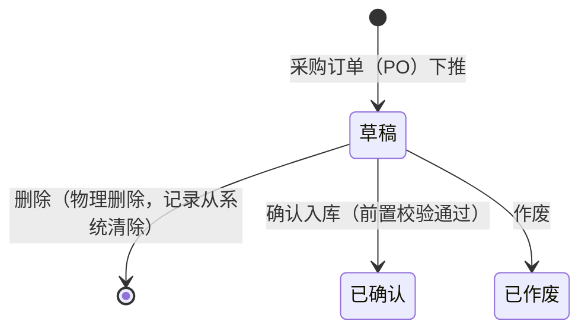

# 采购入库单_业务规则规格

> **版本**：V1.0 | 2026-07-04
> **前置文档**：《采购入库单主PRD》《采购入库单字段清单》

---

## 一、状态机设计

采购入库单作为**第2层业务执行层单据**，不设独立的待审核与已审核多级审批流。状态设计遵循执行层极简原则。

### 1.1 状态定义

| 状态 | 枚举值 | 含义 | 是否终态 | 进入条件 | 离开条件 |
| :--- | :--- | :--- | :---: | :--- | :--- |
| 草稿 | `DRAFT` | 单据已下推创建，仓管点数校验中，可编辑、删除或作废 | 否 | 采购订单下推创建成功 | 确认入库、物理删除 或 手动作废 |
| 已确认 | `CONFIRMED` | 仓管确认点数且入库成功，库存及账款正式生效 | **是** | 确认入库操作成功，前置校验全部通过 | —（不可反审核，纠错走退货流） |
| 已作废 | `VOIDED` | 采购到货计划取消或下推错误，由仓管废弃的草稿单 | **是** | 在草稿状态执行作废操作并二次确认 | —（不可恢复） |

### 1.2 状态流转图

### 1.3 状态流转表

| 当前状态 | 动作 | 前置条件 | 结果状态 | 二次确认 | 后置影响 | 失败处理 |
| :--- | :--- | :--- | :--- | :--- | :--- | :--- |
| (无) | 下推创建 | 1. 对应采购订单 PO 状态为“已审核”或“部分入库” 2. PO 存在未入库行（未入库数 > 0） | 草稿 | 无 | 1. 自动带出 PO 头部和明细快照 2. 记录创建人、创建时间 | Toast：「下推失败，采购订单无未入库数量」 |
| 草稿 | 确认入库 | 1. 必填字段已填（实收/入库数） 2. 满足三数量约束：`入库数量 ≤ 实收数量 ≤ 订单未入库数量` 3. 入库仓库和供应商状态为“启用” | 已确认 | 「确认入库后实物将正式计入库存并形成应付，确认继续？」 | 1. 单据字段锁定为只读 2. 对应仓库商品现存量增加（触发写入只读库存流水 FL） 3. 累加回写对应 PO 商品行累计入库数，更新未入库数，自动判定 PO 状态（若未入库数全部归零，PO置为已完成） 4. 生成财务应付款明细记录 | Toast：「确认失败，{具体阻断校验失败信息}（见第2节）」 |
| 草稿 | 删除 | 无限制 | 物理消失 | 「删除后不可恢复，确认删除该草稿入库单？」 | 彻底移除数据库中该条 PI 记录，不占用单号，不回写 PO | — |
| 草稿 | 作废 | 无限制 | 已作废 | 「作废后该入库单将永久失效，确认作废？」 | 单据转为已作废（只读状态），仍可保留单号查询，不回写 PO，不影响库存 | — |

### 1.4 动作能力矩阵

| 动作 | 草稿 | 已确认 | 已作废 |
| :--- | :---: | :---: | :---: |
| 查看 | ✅ | ✅ | ✅ |
| 编辑行备注/入库备注 | ✅ | ❌ | ❌ |
| 编辑实收数量/入库数量 | ✅ | ❌ | ❌ |
| 确认入库 | ✅ | ❌ | ❌ |
| 作废 | ✅ | ❌ | ❌ |
| 删除（物理） | ✅ | ❌ | ❌ |
| 下推采购退货单 (PR) | ❌ | ✅（条件） | ❌ |
| 导出 | ✅ | ✅ | ✅ |

---

## 二、校验规则规格

为确保入库行为的严密性，系统在草稿态 PI “确认入库”时必须执行以下规则检验，任何一项未通过均应阻断提交：

### 2.1 基础必填与数值格式校验

| 规则ID | 触发动作 | 规则逻辑定义 | 校验失败提示 (Toast/报错) |
| :--- | :--- | :--- | :--- |
| **VAL01** | 确认入库 | 实收数量和入库数量必须填写，必须为正整数（> 0）。 | 「商品 {商品名称} 的实收/入库数量格式不正确，必须为大于0的整数」 |
| **VAL02** | 确认入库 | 本单明细行数不能为0，至少必须包含 1 行商品。 | 「明细行不能为空，请至少保留一行明细」 |
| **VAL03** | 确认入库 | 入库日期必须填写，且日期不得晚于当前系统日期。 | 「入库日期不合法，不能选择未来的日期」 |

### 2.2 数量口径约束校验（核心强控）

| 规则ID | 触发动作 | 规则逻辑定义 | 校验失败提示 |
| :--- | :--- | :--- | :--- |
| **VAL11** | 确认入库 | **入库数量 $\le$ 实收数量**。对于每一行明细，合格正式入库的数量决不能大于实际收到的实物清点数量。 | 「商品 {商品名称} 确认失败：入库数量不能大于实际到货的实收数量」 |
| **VAL12** | 确认入库 | **超收拦截**：每一行的 `实收数量` 和 `入库数量` 必须 $\le$ 对应采购订单行的 `未入库数量`。超出 1 件也予以阻断（一期不做容差）。 | 「商品 {商品名称} 确认失败：到货数量超过了采购订单尚未入库的余额 ({未入库数}件)」 |
| **VAL13** | 确认入库 | **前置状态检查**：确认时，对应的采购订单（PO）不能是“已完成”、“已作废”或“已取消”状态。 | 「确认失败，关联的采购订单当前已被关闭或作废」 |

### 2.3 主数据状态校验

| 规则ID | 触发动作 | 规则逻辑定义 | 校验失败提示 |
| :--- | :--- | :--- | :--- |
| **VAL21** | 确认入库 | 检查当前入库单引用的“供应商”在供应商档案中是否为“启用”状态，若已被停用则阻断。 | 「确认失败，供应商 {供应商名称} 已被系统停用，无法办理入库」 |
| **VAL22** | 确认入库 | 检查当前引用的“入库仓库”在仓库档案中是否为“启用”状态，若已被停用则阻断。 | 「确认失败，入库仓库 {仓库名称} 已被系统停用，无法办理入库」 |

---

## 三、权限规则规格

### 3.1 菜单与操作权限

*   **仓管员**：拥有采购入库单的“下推创建”、“编辑草稿”、“删除草稿”、“手动作废草稿”以及核心的“确认入库”操作权限。
*   **采购员**：拥有采购入库单的“查看”和“导出”权限，主要用于跟进到货进度；无权对入库单进行编辑、确认或作废。
*   **财务**：拥有已确认采购入库单的“查看”和“导出”权限，用于对应付账款进行核账；无权操作任何入库单的修改。
*   **管理员**：全量拥有查看、新建、编辑、删除、作废和确认入库的权限。

### 3.2 数据隔离权限（仓库级控制）

*   **规则 P_DATA_01**：非管理员角色（仓管员）在查看采购入库单列表和详情页时，系统必须自动根据其绑定的“仓库管辖范围”进行数据过滤，仅能查看自己管辖仓库的入库单。
*   **规则 P_DATA_02**：采购员只能查看自己本人负责的采购订单下推出来的采购入库单。
*   **规则 P_DATA_03**：财务可见全部已确认的采购入库单，不可见草稿单据。

---

## 四、特殊操作对比表（物理删除 vs 作废）

针对采购入库单处于“草稿”状态时的废弃操作，系统提供两种不同的处理方式以配合不同的业务需求：

| 维度 | 删除（物理删除） | 作废（手动作废） |
| :--- | :--- | :--- |
| **含义** | 彻底清除录入错误的废单，不留痕 | 记录该到货计划因特殊原因终止，需要留痕 |
| **适用状态** | 仅草稿状态 | 仅草稿状态 |
| **单据状态变化** | 单据记录物理消失 | $\rightarrow$ 已作废（终态） |
| **单号占用** | 该单号不占用，可重新在新增中被递增使用 | 单据号被永久占用，不可重复使用，保留在列表供历史追溯 |
| **库存及订单影响** | 无任何影响 | 无任何影响 |
| **弹窗文案** | 「删除后不可恢复，确认删除该草稿入库单？」 | 「作废后该入库单将永久失效，确认作废？」 |
