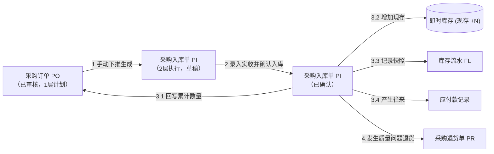
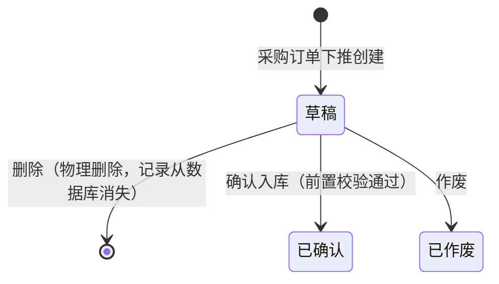

# 采购入库单主PRD

> **版本**：V1.0 | 2026-07-04
> **读者**：研发工程师、测试工程师、产品复核
> **课件依据**：进销存第2讲 §3.10.1–§3.10.2 及状态机简化设计约束；一期范围边界已确认

---

### 1. 业务背景

采购入库单是采购链路的**核心业务执行层单据**，解决“供应商实际送了多少货、仓库实际收了多少货、货入哪个仓、何时触发生态中库存和账款变化”的实际落地执行问题。

没有统一且规范的采购入库单：
- 实物到仓后，仓管员仅凭口头或纸张点数，极易产生短少、坏货或超收且无法留痕
- 实收数量与入库数量混淆，导致库存底账不准，进而影响销售开单和履约
- 应付账款的产生缺乏系统性依据，财务在结算付款时无法根据实收记录与采购订单对账，极易引发坏账或多付款
- 采购订单的未入库到货进度无法跟踪，无法对供应商的交付能力进行评估

采购入库单基于采购订单下推创建，确认入库后，单据关键字段即被锁定，实时扣减采购订单的未入库数量、回写增加对应仓库的现存库存、自动触发往来管理形成财务应付款记录。已确认的采购入库单无法作废，其纠错和退货逆向操作必须依赖采购退货单。

---

### 2. 功能范围

**In Scope**：
- 支持基于已审核且存在未入库数量的采购订单（PO）下推创建采购入库单（PI）
- 支持草稿状态下对实收数量、入库数量、行备注等字段的编辑和草稿物理删除/作废
- 支持“采购数量、实收数量、入库数量”三数量口径分离管理
- 确认入库（PI确认）时：
  - 自动更新对应仓库商品的“现存库存”（增加现存），同步生成库存流水（FL）
  - 自动回写采购订单的“累计已入库数量”，更新“未入库数量”并自动判断 PO 状态
  - 自动将数据推送至往来管理，按本次入库金额生成财务应付记录
- 强控校验：实收数量与入库数量不能大于采购订单的未入库数量（即不支持超收）
- 商品档案数据在引用时“快照化”存储在入库明细中

**Out of Scope**：
- 无单入库（一期不支持，采购入库单必须基于采购订单 PO 创建）
- 采购上架引导策略及多货位精细化管理（属于二期高级WMS模块）
- 扫码枪/PDA 快速扫码点数入库（一期仅支持PC端手动录入实收和入库数）
- 自动支付流水认款及发票核销结算（属于财务核销模块，一期仅生成应付款记录）

---

### 3. 单据定位

#### 3.1 在系统中的位置

| 项目 | 内容 |
| :--- | :--- |
| 单据层级 | **第2层——业务执行层（实际发生）** |
| 核心职责 | 记录“实际收到并验收入库了哪个供应商送来的什么商品、有多少实收、多少正式入库、入到哪个仓” |
| 单据来源 | 由采购订单（PO）审核通过后手动下推创建 |
| 下游单据 | 采购退货单（PR，已确认状态下可被引用下推）、付款单（PY，财务结算核销） |
| 实体关系 | 一张采购订单可下推生成**多张采购入库单**（1:N），每次确认对应的入库数量 |

#### 3.2 系统链路图（Mermaid）

#### 3.3 实体关系说明

| 关系 | 说明 |
| :--- | :--- |
| 采购入库单 : 采购订单 | **N:1**（一张采购入库单必须且仅能引用一张采购订单，支持分批多次入库） |
| 采购入库单 : 供应商 | **N:1**（一张采购入库单的供应商必须继承自其关联的采购订单，不可修改） |
| 采购入库单 : 入库仓库 | **N:1**（本单商品实际进入的仓库，继承自采购订单，草稿态不可修改） |
| 采购退货单 : 采购入库单 | **N:1**（退货单必须关联采购入库单发起，用于对已入库实物冲减，退货量不超过已入库量） |

---

### 4. 业务场景

| 场景ID | 场景 | 类型 | 说明 |
| :--- | :--- | :--- | :--- |
| S01 | 采购订单一次性全量收货并确认入库 | **主流程** | 引用 PO 创建 PI 草稿 $\rightarrow$ 验货数量相符，实收 = 入库 = 采购数 $\rightarrow$ 确认入库 $\rightarrow$ PI已确认，PO自动关闭 |
| S02 | 采购订单分批多次收货入库 | **主流程** | 多次下推创建入库单，每次到货点数，按实入量确认为PI，回写PO累计数，直至PO未入库数为0后自动关闭 |
| S03 | 部分到货（短少）且未入库数保留 | **主流程** | 供应商仅送达部分货物，仓管员按实收/实入确认，PI确认后，PO状态变为“部分入库”，剩余数量等待下次送货 |
| S04 | 到货损坏拒收，仅入库合格品 | **主流程** | 到货8件，其中2件损坏被当场拒收。仓管填入实收8件，入库6件，PI确认。剩余未入库数恢复/保留。 |
| S05 | 草稿态单据物理删除 | **支线** | 创建 PI 错漏，在草稿状态直接点击“删除”，单据从系统彻底移除，PO未入库计数不受影响 |
| S06 | 草稿态单据作废 | **支线** | 单据在草稿状态由仓管作废，单据变更为“已作废”状态，不再生效，不影响PO和库存 |
| S07 | 确认入库后尝试作废/修改 | **异常** | 仓管员企图对“已确认”的 PI 进行修改或作废，系统直接隐藏或屏蔽操作按钮，必须通过退货流程冲销 |
| S08 | 入库数量超收被拦截阻断 | **异常** | 仓管点数实收数大于采购订单行的未入库数量，点击“确认入库”时被系统强行拦截，提示超收并拒绝保存 |
| S09 | 到货严重破损或规格不符整单拒收 | **异常** | 供应商到货全部不合格或发错货，仓管整单拒收。仓管在系统录入拒收原因作废 PI 草稿（留痕）。PO 状态保持已审核，未入库数不受影响，等待重新发货。 |

---

### 5. 状态机

> **来源**：进销存核心规范，执行层单据不设复杂的“待审核/已审核”审批流，仅保留基础的状态。

#### 5.1 单据状态

| 状态 | 含义 | 是否终态 |
| :--- | :--- | :---: |
| 草稿 | `DRAFT` | 单据已创建，尚未点数确认，可编辑实收数或删除/作废 | 否 |
| 已确认 | `CONFIRMED` | 仓管员确认点数和入库，实物正式计入库存，应付账款形成 | **是** |
| 已作废 | `VOIDED` | 尚未确认前由用户手动废弃的入库单，不可重新恢复 | **是** |

#### 5.2 状态机图

#### 5.3 状态流转表

| 当前状态 | 动作 | 前置条件 | 结果状态 | 二次确认 | 后置影响 | 失败处理 |
| :--- | :--- | :--- | :--- | :--- | :--- | :--- |
| 草稿 | 确认入库 | 1. 必填项已填（实收/入库数） 2. 实收数量 > 0，入库数量 > 0 3. 入库数量 $\le$ 实收数量 $\le$ 采购订单未入库数量 | 已确认 | 「确认入库后实物将正式计入库存并形成应付，确认继续？」 | 1. 锁定全部字段只读 2. 增加仓库商品现存量 3. 生成库存流水 FL 4. 回写 PO 累计已入库和未入库数量 5. 生成财务应付款明细记录 | Toast：「入库失败，{失败原因}（如超收/数量不合法）」 |
| 草稿 | 删除 | 无限制 | 物理消失 | 「删除后不可恢复，确认删除该草稿？」 | 彻底移除该草稿记录，PO未入库占额不变 | — |
| 草稿 | 作废 | 无限制 | 已作废 | 「作废后该入库单将失效，确认作废？」 | 单据置为已作废（只读），不再生效，PO未入库占额不变 | — |

#### 5.4 动作能力矩阵

| 动作 | 草稿 | 已确认 | 已作废 |
| :--- | :---: | :---: | :---: |
| 查看 | ✅ | ✅ | ✅ |
| 编辑 | ✅ | ❌ | ❌ |
| 删除（物理） | ✅ | ❌ | ❌ |
| 作废 | ✅ | ❌ | ❌ |
| 确认入库 | ✅ | ❌ | ❌ |
| 下推采购退货单 | ❌ | ✅ | ❌ |
| 导出 | ✅ | ✅ | ✅ |

---

### 6. 核心业务规则

#### 6.1 创建与下推规则

| 规则ID | 规则 |
| :--- | :--- |
| **R01** | 采购入库单必须由已审核（`PENDING_STOCK_IN` 或 `PARTIAL_STOCK_IN`）的采购订单下推创建，严禁手工无来源新建。 |
| **R02** | 采购入库单创建时，必须继承对应采购订单的“供应商”、“入库仓库”和“商品明细”，不可修改。 |
| **R03** | 同一张采购订单支持多次下推生成多张采购入库单（1:N），但若该订单下存在草稿状态的 PI，再次下推时应提示并引导用户处理已有草稿。 |

#### 6.2 审核与字段锁定规则

| 规则ID | 规则 |
| :--- | :--- |
| **R11** | 采购入库单不设置独立的“待审核/已审核”阶段，仓管员点击“确认入库”即等同于审核生效。 |
| **R12** | 单据一旦置为“已确认”或“已作废”状态，全单字段锁定，禁止任何编辑、删除、作废或状态反转操作。 |

#### 6.3 执行入库与回写规则

| 规则ID | 规则 |
| :--- | :--- |
| **R21** | **超收拦截**：单据确认时，系统强控校验：本行 `实收数量` 和 `入库数量` 必须 $\le$ 采购订单对应行的 `未入库数量`（未入库数量 = 采购数量 - 累计已入库数量）。超出则强行阻断确认。 |
| **R22** | **库存扣减与流水**：确认入库后，入库仓库对应的商品“现存”库存实时增加（增加量为本次 PI 的 `入库数量`），同步自动生成类型为“采购入库”的只读库存流水（FL）。 |
| **R23** | **往来应付生成**：确认入库后，系统根据入库明细自动以 `入库数量 × 采购单价` 实时计算生成财务应付款明细记录，挂接到供应商往来中。 |
| **R24** | **采购订单累计回写**：确认入库后，将本次 PI 的 `入库数量` 累加至对应 PO 行的 `累计已入库数量`。系统根据最新的 PO 未入库状态自动判定 PO 是否全量完成并自动关闭。 |

#### 6.4 数量关系与退货规则

| 规则ID | 规则 |
| :--- | :--- |
| **R31** | **三口径数量关系**：入库数量（验收入库） $\le$ 实收数量（到仓实际清点数，含坏件） $\le$ 采购订单未入库数量。 |
| **R32** | **破损短少处理**：当实收数量 > 入库数量时（即到货中有部分破损拒收），仓管员正常记录实收数，并将合格的入库数填入“入库数量”。系统自动将破损部分（实收数量 - 入库数量）从订单未入库数中释放（即破损部分不计入累计入库，PO未入库数将包含这部分，支持再次送货）。 |
| **R33** | **逆向退货规则**：已确认的采购入库单如果发生事后质量问题退货，不允许在入库单上做负数修改，必须通过采购退货单（PR）和采购退货出库单（PRO）执行出库冲销。 |

---

### 7. 权限设计

#### 7.1 数据可见范围

| 角色 | 可见数据范围 | 说明 |
| :--- | :--- | :--- |
| 仓管 | 所负责入库仓库管辖内的所有采购入库单 | 限制仓库权限，防跨库篡改 |
| 采购员 | 本人创建的采购订单所对应的所有采购入库单 | 用于业务进度跟进 |
| 财务 | 全系统所有已确认状态的采购入库单 | 用于核对应付记账与结算对账 |
| 管理员 | 全量可见，无组织与仓库限制 | 最高系统权限 |

#### 7.2 操作权限矩阵

| 操作 | 业务员 | 采购员 | 仓管 | 财务 | 管理员 |
| :--- | :---: | :---: | :---: | :---: | :---: |
| 查看 | ✅ | ✅ | ✅ | ✅ | ✅ |
| 新增（下推） | ❌ | ✅ | ✅ | ❌ | ✅ |
| 编辑（草稿） | ❌ | ❌ | ✅ | ❌ | ✅ |
| 删除（草稿） | ❌ | ❌ | ✅ | ❌ | ✅ |
| 作废（草稿） | ❌ | ❌ | ✅ | ❌ | ✅ |
| 确认入库 | ❌ | ❌ | ✅ | ❌ | ✅ |
| 导出 | ✅ | ✅ | ✅ | ✅ | ✅ |

---

### 8. 边界与异常处理

#### 8.1 并发控制

| 场景 | 处理方式 |
| :--- | :--- |
| 两个仓管员同时针对同一采购订单下推入库单 | 乐观锁控制。若一仓管员已确认入库导致PO未入库数量不足，另一仓管员确认时提示「订单未入库数量不足，请刷新后重试」并强行拦截。 |
| 对草稿态单据同时修改 | 后提交者提示「单据已被他人更新，请刷新重试」，拒绝覆盖。 |

#### 8.2 数量边界约束

| 场景 | 规则 |
| :--- | :--- |
| 实收或入库数量填入负数或零 | 系统前端校验拦截，提示「数量必须是大于0的正整数」。 |
| 实收数量小于入库数量 | 系统拦截，提示「入库数量不得大于实际收到货物的数量」。 |
| 本次入库商品不在 PO 明细中 | 强控拦截。PI 明细必须严格来源于 PO 明细，禁止手动添加明细中不存在的 SKU。 |

---

### 9. 验收重点

| # | 验收项 | 输入条件 | 预期结果 |
| :--- | :--- | :--- | :--- |
| **V01** | **下推来源校验** | 尝试直接创建无来源 PO 的采购入库单 | 操作入口不存在，新建表单无法选择 PO 之外的明细 |
| **V02** | **超收强控拦截** | 填入入库数量 12 件，而 PO 未入库数量仅有 10 件 | 确认入库被阻断，界面标红提示「入库数量超过未入库上限」 |
| **V03** | **实收与入库校验** | 录入实收数量 8 件，入库数量 9 件 | 保存/确认被系统阻断，提示「入库数不能大于实收数」 |
| **V04** | **确认入库后锁定** | PI状态已变更为“已确认”，尝试点击“编辑”或“作废” | 页面不展示编辑与作废按钮，单据呈只读状态 |
| **V05** | **库存流水FL触发** | 入库单商品 SKU01 确认入库数量 6 件 | 对应仓库 SKU01 现存库存增加 6 件，生成一条“采购入库”类型流水，包含 PI 单号 |
| **V06** | **财务应付级联** | 采购单价 10.00 元，入库数量 6 件，PI 确认入库 | 财务应收应付模块自动新增 60.00 元的待付款应付记录，供应商挂接正确 |
| **V07** | **PO状态更新回写** | PO 采购数量 10 件，首次入库 6 件确认 | PO 累计已入库更新为 6，未入库数为 4，PO 状态自动变更为“部分入库” |
| **V08** | **PO自动关闭** | PO 未入库数 4 件，二次入库 4 件并确认 | PO 累计已入库变更为 10，未入库数 0，PO 自动进入终态“已完成” |
| **V09** | **草稿物理删除** | 对草稿 PI 点击删除按钮并二次确认 | 单据列表不再出现此单据，数据库物理清除此记录 |

---

### 10. 修订记录

| 日期 | 变更摘要 |
| :--- | :--- |
| 2026-07-04 | V1.0 初版生成，基于进销存一期设计规范及三数量分离约束 |
