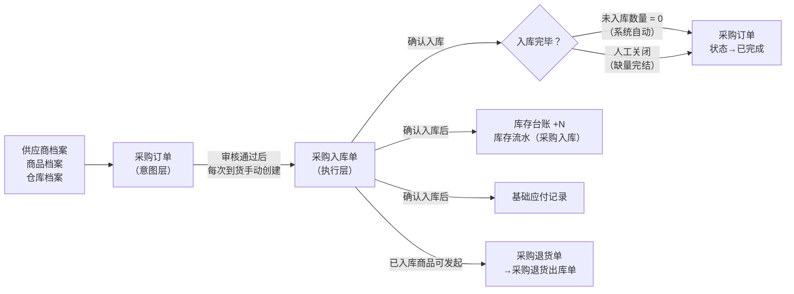
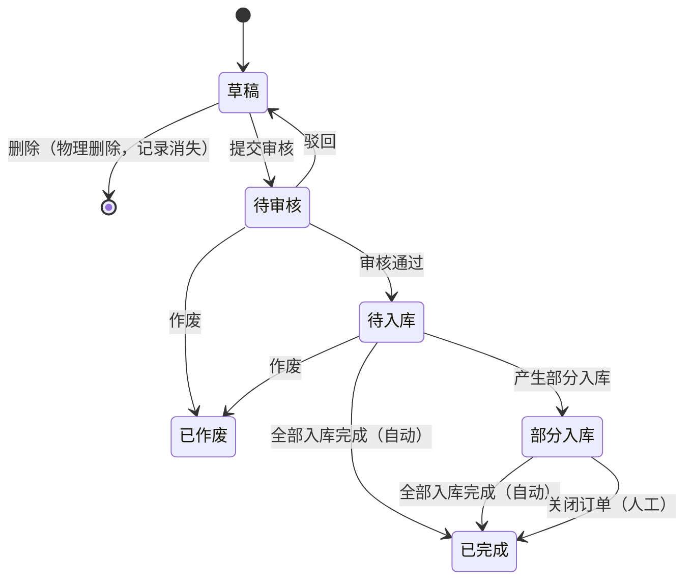

# 采购订单主PRD

> **版本**：V1.1 | 2026-04-19
> **读者**：研发工程师、测试工程师、产品复核
> **课件依据**：进销存第2讲 §3.10.1–§3.10.2；状态机补充决策已用户确认

---

### 1. 业务背景

采购订单是采购链路的**起点控制单据**，解决"原本计划买什么、买多少、向谁买、审核之后才能执行"的问题。

没有统一的采购订单：
- 采购量靠经验判断，不透明，无法事后追溯
- 向哪个供应商买、买什么价格，靠人记，无凭证
- 到底买了多少、还有多少没到货，无法追踪
- 财务无法对应口径核对应付账款

采购订单审核后作为采购执行的"原始凭据"，后续入库和应付都以它为基准挂接。审核前可自由编辑，审核后关键字段锁定，所有变更必须通过单据全量重开或追加单据处理。

---

### 2. 功能范围

**In Scope**：

- 采购订单手动创建、编辑、提交审核、审核/驳回
- 多次入库追踪（一张订单生成多张采购入库单）
- 订单状态流转和数量追踪（累计已入库数量、未入库数量）
- 采购订单缺量完结（人工关闭）
- 采购订单作废（待审核/待入库状态）
- 草稿单据物理删除

**Out of Scope**：

- 采购计划自动生成（安全库存预警、自动补货建议，属于计划模块）
- 供应商协同（催货提醒、在线确认，属于SRM模块）
- 采购价格多级审批（一期简化为管理员一级审核）
- 采购合同管理与价格管控
- 完整发票核销与应付结算（属于应付模块）
- 批量导入创建（一期不支持，后续迭代）

---

### 3. 单据定位

#### 3.1 在系统中的位置

| 项目 | 内容 |
| :--- | :--- |
| 单据层级 | **第1层——业务订单层（意图/计划）** |
| 核心职责 | 记录"采购什么商品、从哪个供应商、计划入哪个仓、多少数量、多少价格" |
| 单据来源 | 手动创建（一期唯一方式） |
| 下游单据 | 采购入库单（审核通过后，采购员/仓管手动创建） |
| 实体关系 | 一张采购订单可对应**多张采购入库单**（1:N），支持分批到货 |

#### 3.2 系统链路图（Mermaid）

#### 3.3 实体关系说明

| 关系 | 说明 |
| :--- | :--- |
| 采购订单 : 采购入库单 | **1:N**（一张订单可多次到货，生成多张入库单） |
| 采购订单 : 供应商 | **N:1**（一张订单只对应一个供应商） |
| 采购订单 : 入库仓库 | **N:1**（一张订单只对应一个仓库） |
| 采购订单明细行 : 采购入库单明细行 | **1:N**（一个商品行可分多次入库） |
| 采购入库单 : 采购退货单 | 已入库单据可**被多张退货单引用**（分批退货） |

---

### 4. 业务场景

| 场景ID | 场景 | 类型 | 说明 |
| :--- | :--- | :--- | :--- |
| S01 | 创建采购订单并一次性全量入库 | **主流程** | 草稿→提交→审核→创建入库单→确认入库（全量）→订单已完成 |
| S02 | 创建采购订单并分批多次入库 | **主流程** | 审核后多次创建入库单，每次到货一张，累计到全量后自动完成 |
| S03 | 部分到货后缺量完结 | **主流程** | 部分入库状态下，供应商无法补货，人工关闭订单（缺量完结）→订单已完成 |
| S04 | 审核驳回后重提 | **支线** | 待审核→驳回→修改数量/供应商/价格→重新提交 |
| S05 | 草稿物理删除 | **支线** | 草稿态直接删除，记录从系统消失（如创建错误不想留痕） |
| S06 | 待审核/待入库作废 | **支线** | 审核通过后因供应商断货等原因需作废，进入已作废状态（仍可查询） |
| S07 | 已完成订单发起退货 | **支线** | 基于已入库的采购入库单创建采购退货单，与采购订单状态无关 |

---

### 5. 状态机

> **来源**：进销存第2讲 §3.10.1–§3.10.2；三处补充决策已用户确认（草稿物理删除、待入库可作废、已完成两条路径）。

#### 5.1 单据状态

| 状态 | 含义 | 是否终态 |
| :--- | :--- | :---: |
| 草稿 | 创建后尚未提交，可自由编辑 | 否 |
| 待审核 | 已提交，等待审核确认 | 否 |
| 待入库 | 审核通过，等待货物首次到仓 | 否 |
| 部分入库 | 已产生至少一次采购入库确认，未全量到货 | 否 |
| 已完成 | 全量入库完成 或 缺量完结（人工关闭） | **是** |
| 已作废 | 单据失效，不可恢复 | **是** |

#### 5.2 状态机图

#### 5.3 状态流转表

> 前置条件须全部满足才允许触发动作；「后置影响」列出除状态变更以外的所有级联影响。

| 当前状态 | 动作 | 前置条件 | 结果状态 | 二次确认 | 后置影响 | 失败处理 |
| :--- | :--- | :--- | :--- | :--- | :--- | :--- |
| 草稿 | 提交审核 | 商品明细不为空；供应商、仓库、每行数量（>0）、单价已填写 | 待审核 | 无 | 无 | Toast：「提交失败，{字段名}不满足条件」 |
| 草稿 | 删除 | 无限制 | 物理消失 | 「删除后不可恢复，确认删除？」 | 记录从系统彻底移除 | — |
| 待审核 | 驳回 | — | 草稿 | 无 | 单据可重新编辑 | — |
| 待审核 | 审核通过 | — | 待入库 | 无 | 头部字段（供应商/仓库/明细数量/价格）锁定不可修改 | — |
| 待审核 | 作废 | 无下游入库单已确认 | 已作废 | 「作废后不可恢复，确认作废？」 | 单据进入只读状态 | — |
| 待入库 | 作废 | 无下游入库单已确认 | 已作废 | 「作废后不可恢复，确认作废？」 | 单据进入只读状态 | — |
| 待入库 | （触发）部分入库 | 关联采购入库单确认入库，但未入库数量 > 0 | 部分入库 | 系统自动 | 累计已入库数量更新；未入库数量更新 | — |
| 待入库 | （触发）全量完成 | 关联采购入库单全部确认，所有行未入库数量 = 0 | 已完成 | 系统自动，无需确认 | 订单进入终态，不可再创建入库单 | — |
| 部分入库 | 关闭订单（缺量完结） | 存在未入库数量 > 0 | 已完成 | 「关闭后剩余数量不再接收，确认关闭？」 | 订单进入终态，不可再创建入库单；未入库量记录保留但不触发任何动作 | — |
| 部分入库 | （触发）全量完成 | 所有行未入库数量 = 0 | 已完成 | 系统自动，无需确认 | 同上 | — |

---

### 6. 动作能力矩阵

> ✅ = 允许；❌ = 不允许（不展示入口）；✅（条件）= 允许但有前置条件（见§7规则）

| 动作 | 草稿 | 待审核 | 待入库 | 部分入库 | 已完成 | 已作废 |
| :--- | :----: | :----: | :----: | :----: | :----: | :----: |
| 编辑 | ✅ | ❌ | ❌ | ❌ | ❌ | ❌ |
| 提交审核 | ✅ | ❌ | ❌ | ❌ | ❌ | ❌ |
| 删除（物理） | ✅ | ❌ | ❌ | ❌ | ❌ | ❌ |
| 驳回 | ❌ | ✅ | ❌ | ❌ | ❌ | ❌ |
| 审核通过 | ❌ | ✅ | ❌ | ❌ | ❌ | ❌ |
| 作废 | ❌ | ✅ | ✅ | ❌ | ❌ | ❌ |
| 创建入库单 | ❌ | ❌ | ✅ | ✅ | ❌ | ❌ |
| 关闭订单（人工） | ❌ | ❌ | ❌ | ✅（条件） | ❌ | ❌ |
| 查看 | ✅ | ✅ | ✅ | ✅ | ✅ | ✅ |
| 导出 | ✅ | ✅ | ✅ | ✅ | ✅ | ✅ |

---

### 7. 核心业务规则

#### 7.1 创建与提交规则

| 规则ID | 规则 |
| :--- | :--- |
| R01 | 采购订单必须选择供应商和入库仓库，至少包含一行商品明细。 |
| R02 | 商品明细至少包含：商品、采购数量（>0）、单价（≥0）。 |
| R03 | 同一张订单内允许同一商品出现在多行（不同批次或特殊处理需要时）。 |
| R04 | 下单日期默认为当天，允许修改为过去日期（补录场景），不允许设置未来日期。 |

#### 7.2 审核与字段锁定规则

| 规则ID | 规则 |
| :--- | :--- |
| R11 | 审核通过后，以下字段锁定不可修改：供应商、入库仓库、商品（每行）、采购数量、单价、税率。 |
| R12 | 审核通过后，以下字段仍允许修改：采购备注、行备注、预计到货日期。 |
| R13 | 驳回后单据回到草稿态，所有字段恢复可编辑，允许重新提交。 |

#### 7.3 入库追踪规则

| 规则ID | 规则 |
| :--- | :--- |
| R21 | 只有「待入库」或「部分入库」状态的采购订单，才可以创建采购入库单。 |
| R22 | 一张采购订单可以多次创建采购入库单（1:N，支持分批到货）。 |
| R23 | 采购入库单确认入库后，回写至采购订单对应明细行「累计已入库数量」（累加逻辑），同步更新「未入库数量」。 |
| R24 | **路径①（自动完成）**：某次确认入库后，所有明细行「未入库数量」均归零，系统自动将采购订单置为「已完成」。 |
| R25 | 默认不支持超收：本次入库数量不得超过对应商品「未入库数量」，超出时阻断提交入库单。 |

#### 7.4 作废规则

| 规则ID | 规则 |
| :--- | :--- |
| R31 | 草稿支持**物理删除**：记录从系统彻底消失，不可恢复，不进入已作废状态。 |
| R32 | 待审核和待入库支持**作废**：作废后单据进入已作废状态，仍可查询，不可撤回。 |
| R33 | 已有采购入库单确认入库后（部分入库或已完成状态），不允许作废采购订单；如需修正须通过采购退货单逆向处理。 |

#### 7.5 关闭规则（缺量完结）

| 规则ID | 规则 |
| :--- | :--- |
| R41 | **路径②（人工关闭）**：「部分入库」状态下，采购员可执行「关闭订单」（缺量完结），表示"剩余数量不再接收"，订单进入「已完成」。 |
| R42 | 关闭后不可撤销；未入库数量字段保留记录值，供历史查询，但不触发任何后续流转。 |
| R43 | 「待入库」状态下没有人工关闭路径（全量尚未开始，无需关闭，作废即可）。 |
| R44 | 执行「关闭订单」时，如存在草稿状态的采购入库单，系统提示「该订单下存在N张草稿入库单，关闭后将无法继续操作，请确认」；用户确认后，这些草稿入库单将被阻断（不可确认入库），需用户手动删除。 |

#### 7.6 作废与关闭的区别

> 进销存课程易混点；AI 生成 Demo 时弹窗文案和按钮文案需按此区分。

| 维度 | 作废 | 关闭（缺量完结） |
| :--- | :--- | :--- |
| **含义** | 撤销未实际发生的业务意图，全部放弃 | 终止剩余流程，封存现状，已执行的保留 |
| **适用状态** | 待审核、待入库（无已确认入库记录） | 部分入库（已有确认入库记录，但存在剩余量） |
| **单据状态变化** | → 已作废（终态，仍可查询） | → 已完成（终态） |
| **对已有入库单的影响** | 无（此时还没有已确认的入库单） | 已确认的入库单不受影响；草稿入库单被阻断 |
| **后续回写** | 不接收 | 不接收（已完成，不接收新入库回写） |

#### 7.7 采购价格处理规则

> 来源：课件 §3.11.1.1；价格是采购链路的高频争议点，必须明确规则。

| 规则ID | 规则 |
| :--- | :--- |
| R51 | 采购订单创建时，系统从商品档案自动带出「默认采购价」作为参考，允许人工调整。 |
| R52 | 实际采购价由采购员录入，不强制与商品档案默认价一致。 |
| R53 | 审核通过后，单价字段锁定，不可直接修改；如需调价，须先驳回回草稿后再修改。 |
| R54 | 价格调整建议留痕（操作日志记录调整前后值、操作人、时间）；一期简化：不强制校验改价权限，但保留日志。 |
| R55 | 采购数量差异与价格差异是两套问题，不得混用同一字段处理：数量走入库差异，价格走驳回重提或另开单据。 |

#### 7.8 数量口径说明

> 采购链路严格区分以下三个数量，**禁止合并为一个字段**：

| 口径 | 存在于 | 含义 |
| :--- | :--- | :--- |
| 采购数量 | 采购订单明细 | 原计划购买数量（审核后锁定） |
| 本次实收数量 | 采购入库单明细 | 本次实际收到货的数量（含质量问题货品） |
| 本次入库数量 | 采购入库单明细 | 本次验货通过正式入库的数量（触发库存更新） |

---

### 8. 权限设计

#### 8.1 数据可见范围

| 角色 | 可见数据范围 | 说明 |
| :--- | :--- | :--- |
| 采购员 | 本人创建的所有采购订单 | 不可见其他采购员的单据 |
| 仓管 | 入库仓库属于本人管辖范围的所有订单 | 只能看跟自己仓相关的单 |
| 管理员 | 全部采购订单，不受组织和人员限制 | 全量可见 |

#### 8.2 操作权限矩阵

| 操作 | 业务员/内勤 | 采购员 | 仓管 | 管理员 |
| :--- | :---: | :---: | :---: | :---: |
| 查看 | ✅ | ✅ | ✅ | ✅ |
| 新增 | ❌ | ✅ | ❌ | ✅ |
| 编辑（草稿） | ❌ | ✅ | ❌ | ✅ |
| 删除（草稿） | ❌ | ✅ | ❌ | ✅ |
| 提交审核 | ❌ | ✅ | ❌ | ✅ |
| 审核/驳回 | ❌ | ❌ | ❌ | ✅ |
| 创建入库单 | ❌ | ✅ | ✅ | ✅ |
| 关闭订单（缺量完结） | ❌ | ✅ | ❌ | ✅ |
| 作废（待审核/待入库） | ❌ | ✅ | ❌ | ✅ |
| 导出 | ✅ | ✅ | ✅ | ✅ |

#### 8.3 审核约束

| 约束 | 说明 |
| :--- | :--- |
| 审核人 ≠ 提交人 | 课程简化版：一期不强制，管理员可自提自审；实际企业建议限定 |

---

### 9. 边界与异常处理

#### 9.1 并发控制

| 场景 | 处理方式 |
| :--- | :--- |
| 两个用户同时编辑同一张草稿单据 | 后提交者提示「当前单据已被他人修改，请刷新后重试」，不覆盖先提交的结果 |
| 两个用户同时对待审核单据执行审核 | 以数据库乐观锁为准，后操作者提示「操作失败，单据状态已变更，请刷新后重试」 |

#### 9.2 幂等操作约束

| 操作 | 幂等规则 |
| :--- | :--- |
| 数量回写 | 采购入库单的回写支持多次累加；同一入库单号重复回写时，以最新值覆盖，不重复累加 |
| 状态自动完成 | 当所有明细行未入库数量归零时，系统只更新一次状态为「已完成」，重复触发不产生副作用 |

#### 9.3 数量边界约束

| 场景 | 规则 |
| :--- | :--- |
| 超收阻断 | 本次入库数量 > 未入库数量时，阻断保存入库单，提示「本次入库数量不能超过未入库数量」 |
| 零数量行 | 不允许提交采购数量为0的明细行，阻断保存，提示「商品数量不可为 0」 |
| SKU 明细行上限 | 单张订单最多允许 50 条明细行；超出时阻断保存，提示「商品明细不可超过 50 行」 |

#### 9.4 单据状态与下游不一致

| 场景 | 处理方式 |
| :--- | :--- |
| 采购订单显示部分入库，但对应入库单已作废 | 已作废的入库单不计入累计已入库数量；系统按有效入库单汇总数据 |
| 执行「关闭订单」时，存在草稿入库单 | **阻断并提示**：「该订单下存在N张草稿入库单，关闭后将无法继续操作，是否确认关闭？」；确认后草稿入库单不可再确认入库，需用户手动删除 |

---

### 10. 验收重点

> 验收标准写「输入条件 → 预期结果」格式，以下为核心风险点，研发自测与测试用例必须覆盖。

| # | 验收项 | 输入条件 | 预期结果 |
| :--- | :--- | :--- | :--- |
| V01 | **状态机正确性** | 对已完成订单点击「创建入库单」 | 操作入口不展示 |
| V02 | **审核锁定** | 审核通过后尝试修改供应商/数量/单价 | 字段不可编辑，无操作入口 |
| V03 | **数量回写-累加** | 分两次确认入库，各10件 | 采购订单累计已入库数量 = 20，未入库数量正确减少 |
| V04 | **路径① 自动完成** | 未入库数量全部归零 | 采购订单自动进入「已完成」，不可再创建入库单 |
| V05 | **路径② 缺量完结** | 部分入库状态下执行「关闭订单」 | 采购订单进入「已完成」，操作不可撤销 |
| V06 | **超收阻断** | 本次入库数量 > 未入库数量 | 入库单保存被阻断，红字提示 |
| V07 | **作废阻断** | 已有入库单确认后尝试作废采购订单 | 作废操作被阻断，提示无法作废 |
| V08 | **物理删除** | 草稿状态执行删除 | 单据从列表彻底消失，搜索找不到 |
| V09 | **并发保护** | A、B 同时对同一待审核单据执行审核 | 只有一个成功，另一个收到「状态已变更」提示 |
| V10 | **SKU行上限** | 添加第51条明细行 | 阻断保存，提示「不可超过50行」 |
| V11 | **关闭时草稿入库单处理** | 部分入库状态下执行「关闭订单」，且存在草稿入库单 | 弹窗提示草稿入库单数量；确认后草稿入库单不可再确认 |

---

### 修订记录

| 日期 | 变更摘要 |
| :--- | :--- |
| 2026-04-19 | V1.0 初版，基于课件 §3.10 |
| 2026-04-19 | V1.1 全量重写：补充单据定位（§3）、业务场景（§4）、完整状态流转表（§5.3）、动作能力矩阵（§6）、数据可见范围（§8.1）、边界异常处理（§9）；验收项升级为「输入条件→预期结果」格式 |
| 2026-04-19 | V1.2 修复4处：①流程图采购退货单改为从入库单引出；②增§7.6作废vs关闭对比表；③增§7.7价格处理规则（课件§3.11.1.1）；④§9.4关闭时草稿入库单改为阻断，新增V11验收项 |

