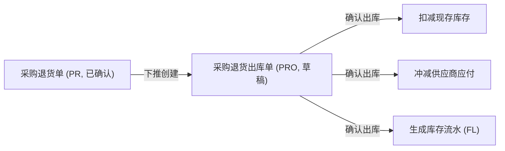
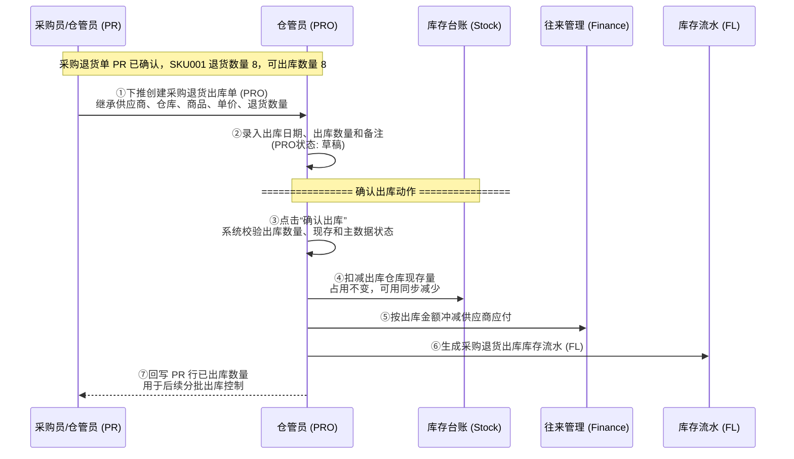

# 采购退货出库单_业务流程推演

> **状态**：已补齐
> **角色**：业务流程推演　|　类型：执行作业单
> **权威层级**：采购退货出库单主PRD > context/ > templates/ > 本文件
> **参照套件**：流程写法参考《采购入库单_业务流程推演》
> **版本**：V1.0 | 2026-07-07

---

## 一、业务流程概述

### 1.1 业务特点说明

* **下推创建**：采购退货出库单（PRO）必须从已确认采购退货单（PR）下推引用生成，不可无来源手工创建。
* **执行层生效**：PRO 确认出库后，才真正扣减仓库现存、冲减供应商应付，并生成库存流水 FL。
* **分批出库**：一张 PR 可生成多张 PRO，系统按 PR 行累计已出库数量控制剩余可出库数量。
* **单向终态约束**：PRO 一旦确认出库，状态转为已确认，全字段只读，不可修改、不可作废或反向撤销。

### 1.2 本场景在全局中的位置



### 1.3 完整流程图



> **关键里程碑**：
> - 里程碑 1：成功下推生成 PRO 草稿，继承 PR 原始数据快照。
> - 里程碑 2：仓管员录入出库数量，确认出库校验通过。
> - 里程碑 3：现存库存扣减、供应商应付冲减、FL 生成完成。

---

## 二、详细步骤推演

本推演用具体商品进行模拟：采购退货单 `PR20260707-0001` 已确认，供应商为 `S001 深圳强盛电子`，出库仓库为 `WH001 民房一号仓`。商品 `SKU001 华强北特种接插件` 的 PR 退货数量为 8 个，含税单价 50 元。确认 PRO 前，WH001 中 SKU001 现存为 21 个、占用为 0、可用为 21，供应商应付余额为 300.00 元。

### 步骤 ①：下推创建采购退货出库单

**操作**：仓管员在已确认 PR `PR20260707-0001` 上点击“下推退货出库”。

**采购退货出库单 PRO 创建（草稿态）**：

| 字段 | 值 | 说明 |
| :--- | :--- | :--- |
| 单据编号 | **PRO20260707-0001** | 系统自动生成（前缀 PRO） |
| 来源退货单号 | **PR20260707-0001** | 下推继承，只读 |
| 来源入库单号 | PI20260704-0001 | 继承自 PR，只读 |
| 供应商 | S001 深圳强盛电子 | 继承自 PR，只读 |
| 出库仓库 | WH001 民房一号仓 | 继承自 PR，只读 |
| 出库日期 | **2026-07-07** | 默认当天 |
| 出库状态 | **草稿 (DRAFT)** | 初始状态 |

**商品明细**：

| 商品编码 | 商品名称 | 单价（含税） | PR退货数量 | 已出库数量 | 可出库数量 | 出库数量 | 金额（含税） |
| :--- | :--- | :---: | :---: | :---: | :---: | :---: | :---: |
| SKU001 | 华强北特种接插件 | 50.00 | 8 | 0 | **8** | **8** | **400.00** |

**关键点**：草稿创建和保存都不扣减库存、不冲减应付、不生成 FL。

---

### 步骤 ②：录入出库数量

**操作**：仓管员现场清点准备退回供应商的实物。本次先退 6 个，剩余 2 个后续再出库，于是在 PRO 草稿中将出库数量改为 6。

**商品明细变化**：

| 商品编码 | 字段 | 变更前 | 变更后 | 说明 |
| :--- | :--- | :---: | :---: | :--- |
| SKU001 | 出库数量 | 8 | **6** | 用户录入本次实际出库数量 |
| SKU001 | 金额（含税） | 400.00 | **300.00** | 系统计算：`6 × 50.00 = 300.00` |
| SKU001 | 行备注 | 空 | **先退6个，剩余2个等待供应商补确认** | 手动填入 |

---

### 步骤 ③：确认出库（前置校验）

**操作**：仓管员点击“确认出库”。系统自动发起校验。

**校验逻辑（伪代码）**：

```text
FOR EACH 商品行 DO
    IF 出库数量 <= 0 THEN
        ERROR "出库数量必须是大于0的正整数"
    END IF

    IF 出库数量 > 可出库数量 THEN
        ERROR "出库数量超过采购退货单剩余可出库数量"
    END IF

    IF 出库数量 > 当前仓库现存 THEN
        ERROR "当前仓库现存不足，无法退货出库"
    END IF
END FOR
```

**关键点**：本例出库 6 ≤ 可出库 8，且出库 6 ≤ 现存 21，校验通过。

---

### 步骤 ④：确认出库（数据持久化与回写）

**操作**：校验通过，系统更新数据库，PRO 状态变更为已确认，并执行级联影响。

**PRO 状态变化**：

| 字段 | 变更前 | 变更后 | 说明 |
| :--- | :--- | :--- | :--- |
| 出库状态 | 草稿 (DRAFT) | **已确认 (CONFIRMED)** | 数据正式生效，单据锁定只读 |
| 确认人 | 空 | **仓管员_张三** | 记录确认人 |
| 确认时间 | 空 | **2026-07-07 16:10:15** | 记录确认生效时间 |

**库存台账与流水影响**：

| 仓库 | 商品 | 变动前现存 | 变动后现存 | 变动前可用 | 变动后可用 | 库存流水 FL 变动 |
| :--- | :--- | :---: | :---: | :---: | :---: | :--- |
| WH001 | SKU001 | 21 | **15** | 21 | **15** | **FL20260707-00000001**：数量 -6，类型=采购退货出库，来源单号=PRO20260707-0001 |

**供应商应付影响**：

| 供应商 | 字段 | 变更前 | 变更后 | 说明 |
| :--- | :--- | :---: | :---: | :--- |
| S001 深圳强盛电子 | 应付余额 | 300.00 | **0.00** | 冲减金额 = `6 × 50.00 = 300.00` |

**回写 PR 出库数量**：

| 单据层级 | 商品编码 | 字段 | 变更前 | 变更后 | 说明 |
| :--- | :--- | :--- | :---: | :---: | :--- |
| PR 商品行 | SKU001 | 已出库数量 | 0 | **6** | 累加本次 PRO 出库数 |
| PR 商品行 | SKU001 | 可出库数量 | 8 | **2** | 剩余 2 可后续分批出库 |

---

## 三、完整状态变化汇总表

### 3.1 采购退货出库单 PRO 状态演变

| 步骤 | 单据状态 | 出库数量 | 确认人 | 触发动作 |
| :--- | :--- | :---: | :--- | :--- |
| ① 下推创建 | 草稿 | 8 | 空 | PR 下推 |
| ② 录入数量 | 草稿 | **6** | 空 | 仓管员手工输入 |
| ④ 确认出库 | **已确认** | 6 | **仓管员_张三** | 点击“确认出库”按钮 |

### 3.2 PR 出库进度演变

| 步骤 | PR 状态 | PR退货数量 | 已出库数量 | 可出库数量 | 触发动作 |
| :--- | :--- | :---: | :---: | :---: | :--- |
| 初始状态 | 已确认 | 8 | 0 | 8 | PR 已确认 |
| PRO确认出库 | 已确认 | 8 | **6** | **2** | 下游 PRO 确认回写 |

---

## 四、数据一致性校验公式

1. **出库金额校验**：`出库金额（300.00元） = 出库数量（6件） × 单价（50.00元）`
2. **库存扣减校验**：`变更后现存（15件） = 变更前现存（21件） - 本次出库数量（6件）`
3. **可用库存校验**：`变更后可用（15件） = 变更后现存（15件） - 占用（0件）`
4. **应付冲减校验**：`变更后应付余额（0.00元） = 变更前应付余额（300.00元） - 冲减金额（300.00元）`
5. **PR 剩余可出库校验**：`剩余可出库数量（2件） = PR退货数量（8件） - 累计已出库数量（6件）`

---

## 五、关键注意事项

| 注意事项 | 说明 |
| :--- | :--- |
| 草稿不动账 | PRO 草稿创建、保存、编辑都不影响库存、应付和 FL。 |
| 确认才生效 | 只有点击确认出库且校验通过后，才扣现存、冲应付、生成 FL。 |
| 不做物流跟踪 | 主 PRD 明确物流跟踪为 Out of Scope，本流程不记录快递单、运输轨迹等字段。 |
| 无单退货出库不支持 | PRO 必须基于已确认 PR 下推创建。 |
