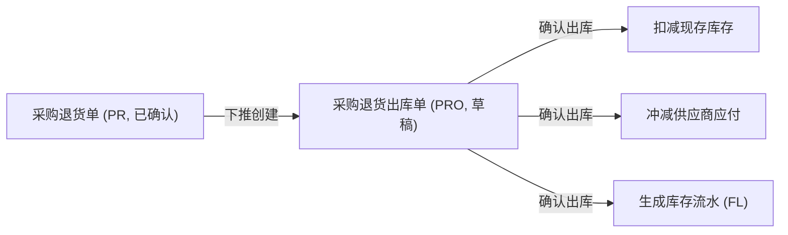
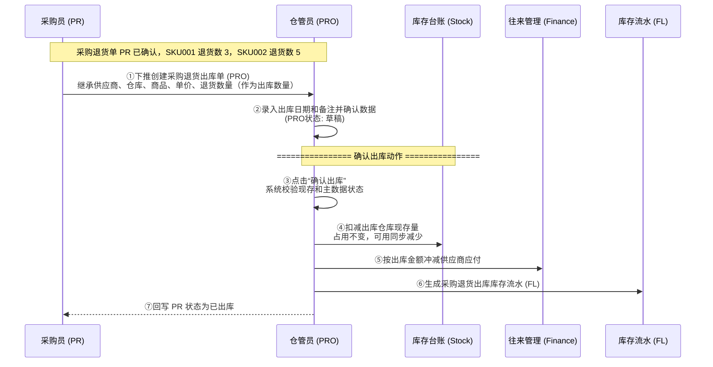

# 采购退货出库单_业务流程推演

> **状态**：已补齐
> **角色**：业务流程推演　|　类型：执行作业单
> **权威层级**：context/ > templates/ > prd-docs
> **参照套件**：流程写法参考《采购入库单_业务流程推演》
> **版本**：V1.1 | 2026-07-07

---

## 一、业务流程概述

### 1.1 业务特点说明

* **下推创建**：采购退货出库单（PRO）必须从已确认采购退货单（PR）下推引用生成，不可无来源手工创建。
* **执行层生效**：PRO 确认出库后，才真正扣减仓库现存、冲减供应商应付，并生成库存流水 FL。
* **严格 1:1**：一张已确认 PR 下推生成唯一一张 PRO，一期不支持分批退货出库，出库数量直接继承自 PR 本次退货数量，且不可修改。
* **单向终态约束**：PRO 一旦确认出库，状态转为已确认，全字段只读，不可修改、不可作废或反向撤销。

### 1.2 本场景在全局中的位置



### 1.3 完整流程图



> **关键里程碑**：
> - 里程碑 1：成功下推生成 PRO 草稿，继承 PR 原始数据，出库数量锁定只读。
> - 里程碑 2：仓管员确认出库日期与备注，确认出库校验通过。
> - 里程碑 3：现存库存扣减、供应商应付冲减、FL 生成完成，PR 状态更新。

---

## 二、详细步骤推演

本推演用具体商品进行模拟：采购退货单 `PR20260707-0001` 已确认，供应商为 `S001 深圳强盛电子`，出库仓库为 `WH001 民房一号仓`。
前置入库单 `PI20260704-0001` 已确认，原入库 SKU001 10 个（含税单价 50 元）、SKU002 20 个（含税单价 12 元），已形成应付余额 740 元。
PR 退货数量为 SKU001 3 个，SKU002 5 个。
确认 PRO 前，WH001 中 SKU001 现存为 25 个、可用为 25；SKU002 现存为 40 个、可用为 40。

### 步骤 ①：下推创建采购退货出库单

**操作**：仓管员在已确认 PR `PR20260707-0001` 上点击“下推退货出库”。

**采购退货出库单 PRO 创建（草稿态）**：

| 字段 | 值 | 说明 |
| :--- | :--- | :--- |
| 单据编号 | **PRO20260707-0001** | 系统自动生成（前缀 PRO） |
| 来源退货单号 | **PR20260707-0001** | 下推继承，只读 |
| 来源入库单号 | PI20260704-0001 | 继承自 PR，只读 |
| 供应商 | S001 深圳强盛电子 | 继承自 PR，只读 |
| 出库仓库 | WH001 民房一号仓 | 继承自 PR，只读 |
| 出库日期 | **2026-07-07** | 默认当天 |
| 出库状态 | **草稿 (DRAFT)** | 初始状态 |

**商品明细**：

| 商品编码 | 商品名称 | 单价（含税） | PR退货数量 | 出库数量 | 金额（含税） | 行备注 |
| :--- | :--- | :---: | :---: | :---: | :---: | :--- |
| SKU001 | 华强北特种接插件 | 50.00 | 3 | **3** | **150.00** | 继承 PR 只读 |
| SKU002 | Type-C 快充尾插 | 12.00 | 5 | **5** | **60.00** | 继承 PR 只读 |

**汇总数据**：
- 出库总数量：8 件
- 出库总金额：210.00 元

**关键点**：一期不支持分批退货出库，出库数量等于 PR 退货数量，只读不可编辑。草稿创建和保存都不扣减库存、不冲减应付、不生成 FL。

---

### 步骤 ②：确认出库日期与备注

**操作**：仓管员清点准备退回供应商的实物，确认实物数量与单据一致，填写出库备注。

**出库单备注变化**：

| 字段 | 变更前 | 变更后 | 说明 |
| :--- | :---: | :---: | :--- |
| 出库备注 | 空 | **商品复检不合格，已办理退货出库实物交接** | 仓管员手动填写 |

---

### 步骤 ③：确认出库（前置校验）

**操作**：仓管员点击“确认出库”。系统自动发起校验。

**校验逻辑（伪代码）**：

```text
FOR EACH 商品行 DO
    IF 出库数量 != PR.本次退货数量 THEN
        ERROR "出库数量不符合退货单数量，一期不支持分批出库"
    END IF

    IF 出库数量 > 当前仓库现存 THEN
        ERROR "当前仓库现存不足，无法退货出库"
    END IF
END FOR
```

**关键点**：本次出库数量 SKU001 (3) 和 SKU002 (5) 均等于 PR 退货数量，且均小于当前仓库现存（25 和 40），校验通过。

---

### 步骤 ④：确认出库（数据持久化与回写）

**操作**：校验通过，系统更新数据库，PRO 状态变更为已确认，并执行级联影响。

**PRO 状态变化**：

| 字段 | 变更前 | 变更后 | 说明 |
| :--- | :--- | :--- | :--- |
| 出库状态 | 草稿 (DRAFT) | **已确认 (CONFIRMED)** | 数据正式生效，单据锁定只读 |
| 确认人 | 空 | **仓管员_张三** | 记录确认人 |
| 确认时间 | 空 | **2026-07-07 16:10:15** | 记录确认生效时间 |

**库存台账与流水影响**：

| 仓库 | 商品 | 变动前现存 | 变动后现存 | 变动前可用 | 变动后可用 | 库存流水 FL 变动 |
| :--- | :--- | :---: | :---: | :---: | :---: | :--- |
| WH001 | SKU001 | 25 | **22** | 25 | **22** | **FL20260707-00000001**：数量 -3，类型=采购退货出库，来源单号=PRO20260707-0001 |
| WH001 | SKU002 | 40 | **35** | 40 | **35** | **FL20260707-00000002**：数量 -5，类型=采购退货出库，来源单号=PRO20260707-0001 |

**供应商应付影响**：

| 供应商 | 字段 | 变更前 | 变更后 | 说明 |
| :--- | :--- | :---: | :---: | :--- |
| S001 深圳强盛电子 | 应付余额 | 740.00 | **530.00** | 冲减金额 = `150.00 + 60.00 = 210.00` |

**回写 PR 状态**：

| 关联单据 | 字段 | 变更前 | 变更后 | 说明 |
| :--- | :--- | :---: | :---: | :--- |
| PR20260707-0001 | 关联出库状态 | 未出库 | **已出库** | 严格 1:1，单据状态更新，不再允许重复下推 |

---

## 三、完整状态变化汇总表

### 3.1 采购退货出库单 PRO 状态演变

| 步骤 | 单据状态 | 出库数量 | 确认人 | 触发动作 |
| :--- | :--- | :---: | :--- | :--- |
| ① 下推创建 | 草稿 | SKU001: 3, SKU002: 5 | 空 | PR 下推 |
| ② 录入备注 | 草稿 | SKU001: 3, SKU002: 5 | 空 | 仓管员编辑备注 |
| ④ 确认出库 | **已确认** | SKU001: 3, SKU002: 5 | **仓管员_张三** | 点击“确认出库”按钮 |

### 3.2 PR 状态演变

| 步骤 | PR 状态 | PR 关联出库状态 | 触发动作 |
| :--- | :--- | :---: | :--- |
| 初始状态 | 已确认 | 未出库 | PR 已确认生效 |
| PRO确认出库 | 已确认 | **已出库** | 下游 PRO 确认出库回写 |

---

## 四、数据一致性校验公式

1. **出库金额校验**：`出库金额（210.00元） = SKU001出库额(3 × 50.00) + SKU002出库额(5 × 12.00)`
2. **库存扣减校验**：
   - SKU001：`变更后现存（22件） = 变更前现存（25件） - 本次出库数量（3件）`
   - SKU002：`变更后现存（35件） = 变更前现存（40件） - 本次出库数量（5件）`
3. **可用库存校验**：`变更后可用 = 变更后现存 - 占用`
4. **应付冲减校验**：`变更后应付余额（530.00元） = 变更前应付余额（740.00元） - 冲减金额（210.00元）`

---

## 五、关键注意事项

| 注意事项 | 说明 |
| :--- | :--- |
| 草稿不动账 | PRO 草稿创建、保存、编辑都不影响库存、应付和 FL。 |
| 确认才生效 | 只有点击确认出库且校验通过后，才扣现存、冲应付、生成 FL。 |
| 不做物流跟踪 | 主 PRD 明确物流跟踪为 Out of Scope，本流程不记录快递单、运输轨迹等字段。 |
| 无单退货出库不支持 | PRO 必须基于已确认 PR 下推创建。 |
| 1:1 严格限制 | 一期不支持分批退货出库。已下推生成 PRO 的 PR 不允许再次下推。 |
