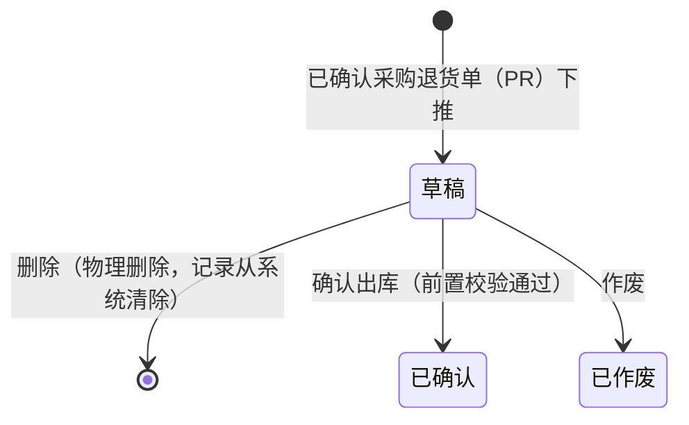

# 采购退货出库单_业务规则规格

> **状态**：已补齐
> **角色**：业务规则规格　|　类型：执行作业单
> **权威层级**：采购退货出库单主PRD > context/ > templates/ > 本文件
> **参照套件**：规则写法参考《采购入库单_业务规则规格》
> **版本**：V1.0 | 2026-07-07

---

## 一、状态机设计

采购退货出库单作为采购退货链路的**执行层单据**，不设独立的待审核与已审核多级审批流。状态设计遵循执行层极简原则：草稿可以编辑、删除或作废；确认出库后库存、应付和库存流水正式生效。

### 1.1 状态定义

| 状态 | 枚举值 | 含义 | 是否终态 | 进入条件 | 离开条件 |
| :--- | :--- | :--- | :---: | :--- | :--- |
| 草稿 | `DRAFT` | 单据由已确认 PR 下推创建，仓管员可录入出库数量和出库日期 | 否 | 已确认 PR 下推创建成功 | 确认出库、物理删除或手动作废 |
| 已确认 | `CONFIRMED` | 仓管员确认退货商品已实际出库，库存和应付已更新 | **是** | 确认出库操作成功，前置校验全部通过 | —（不可反审核；纠错需走后续人工处理，不在本期展开） |
| 已作废 | `VOIDED` | 草稿出库单因下推错误或业务终止而失效 | **是** | 在草稿状态执行作废操作并二次确认 | —（不可恢复） |

### 1.2 状态流转图

### 1.3 状态流转表

| 当前状态 | 动作 | 前置条件 | 结果状态 | 二次确认 | 后置影响 | 失败处理 |
| :--- | :--- | :--- | :--- | :--- | :--- | :--- |
| (无) | 下推创建 | 1. 对应 PR 状态为已确认 2. PR 存在可出库行（可出库数量 > 0） | 草稿 | 无 | 1. 自动带出 PR 头部和明细快照 2. 记录创建人、创建时间 | Toast：「下推失败，采购退货单无可出库数量」 |
| 草稿 | 确认出库 | 1. 必填字段已填（出库日期、出库数量） 2. 出库数量为正整数，且 `出库数量 ≤ 可出库数量` 3. 对应仓库商品现存数量足够扣减 4. 出库仓库和供应商状态为“启用” | 已确认 | 「确认出库后将扣减现存库存、冲减供应商应付并生成库存流水，确认继续？」 | 1. 单据字段锁定为只读 2. 对应仓库商品现存减少，因占用不变，可用同步减少 3. 生成只读库存流水 FL 4. 冲减对应供应商应付余额 5. 累加回写 PR 行已出库数量，供后续分批出库校验 | Toast：「确认失败，{具体阻断校验失败信息}（见第2节）」 |
| 草稿 | 删除 | 无限制 | 物理消失 | 「删除后不可恢复，确认删除该草稿退货出库单？」 | 移除该条 PRO 草稿记录；不回写 PR；不影响库存和应付 | — |
| 草稿 | 作废 | 无限制 | 已作废 | 「作废后该退货出库单将永久失效，确认作废？」 | 单据转为已作废只读状态，保留单号查询；不回写 PR；不影响库存和应付 | — |

### 1.4 动作能力矩阵

| 动作 | 草稿 | 已确认 | 已作废 |
| :--- | :---: | :---: | :---: |
| 查看 | ✅ | ✅ | ✅ |
| 编辑行备注/出库备注 | ✅ | ❌ | ❌ |
| 编辑出库日期/出库数量 | ✅ | ❌ | ❌ |
| 确认出库 | ✅ | ❌ | ❌ |
| 作废 | ✅ | ❌ | ❌ |
| 删除（物理） | ✅ | ❌ | ❌ |
| 导出 | ✅ | ✅ | ✅ |

---

## 二、校验规则规格

为确保退货出库行为的严密性，系统在草稿态 PRO “确认出库”时必须执行以下规则检验，任何一项未通过均应阻断提交。

### 2.1 基础必填与数值格式校验

| 规则ID | 触发动作 | 规则逻辑定义 | 校验失败提示 |
| :--- | :--- | :--- | :--- |
| **VAL01** | 确认出库 | 出库数量必须填写，必须为正整数（> 0）。 | 「商品 {商品名称} 的出库数量格式不正确，必须为大于0的整数」 |
| **VAL02** | 确认出库 | 本单明细行数不能为0，至少必须包含 1 行商品。 | 「明细行不能为空，请至少保留一行明细」 |
| **VAL03** | 确认出库 | 出库日期必须填写，且日期不得晚于当前系统日期。 | 「出库日期不合法，不能选择未来的日期」 |

### 2.2 数量口径约束校验（核心强控）

| 规则ID | 触发动作 | 规则逻辑定义 | 校验失败提示 |
| :--- | :--- | :--- | :--- |
| **VAL11** | 确认出库 | 每一行的 `出库数量` 必须小于等于对应 PR 行的 `可出库数量`。可出库数量 = PR退货数量 - 同一 PR 行已确认 PRO 出库数量。 | 「商品 {商品名称} 确认失败：出库数量超过采购退货单剩余可出库数量 ({可出库数量}件)」 |
| **VAL12** | 确认出库 | 出库数量不得大于当前仓库商品现存数量，避免现存为负。 | 「商品 {商品名称} 确认失败：当前仓库现存不足，无法退货出库」 |
| **VAL13** | 确认出库 | 确认时，对应 PR 不能是草稿或已作废状态，且必须仍可追溯。 | 「确认失败，关联的采购退货单当前不可执行出库」 |

### 2.3 主数据状态校验

| 规则ID | 触发动作 | 规则逻辑定义 | 校验失败提示 |
| :--- | :--- | :--- | :--- |
| **VAL21** | 确认出库 | 检查当前 PRO 引用的“供应商”在供应商档案中是否为“启用”状态，若已停用则阻断。 | 「确认失败，供应商 {供应商名称} 已被系统停用，无法办理退货出库」 |
| **VAL22** | 确认出库 | 检查当前引用的“出库仓库”在仓库档案中是否为“启用”状态，若已停用则阻断。 | 「确认失败，出库仓库 {仓库名称} 已被系统停用，无法办理退货出库」 |

---

## 三、权限规则规格

### 3.1 菜单与操作权限

* **仓管员**：拥有 PRO 的“下推创建”、“编辑草稿”、“删除草稿”、“手动作废草稿”以及核心的“确认出库”操作权限。
* **采购员**：拥有 PRO 的“查看”和“导出”权限，用于跟进退货执行进度；无权确认出库。
* **财务**：拥有已确认 PRO 的“查看”和“导出”权限，用于核对应付冲减；无权修改 PRO。
* **管理员**：全量拥有查看、下推创建、编辑、删除、作废和确认出库权限。

### 3.2 数据隔离权限（仓库级控制）

* **规则 P_DATA_01**：非管理员仓管员仅能查看和操作自己管辖仓库的 PRO。
* **规则 P_DATA_02**：采购员只能查看自己负责采购链路下的 PRO。
* **规则 P_DATA_03**：财务可见全部已确认 PRO，不可见草稿单据。

---

## 四、特殊操作对比表（物理删除 vs 作废）

| 维度 | 删除（物理删除） | 作废（手动作废） |
| :--- | :--- | :--- |
| **含义** | 彻底清除录入错误的草稿出库单，不留痕 | 记录该退货出库计划因特殊原因终止，需要留痕 |
| **适用状态** | 仅草稿状态 | 仅草稿状态 |
| **单据状态变化** | 单据记录物理消失 | → 已作废（终态） |
| **单号占用** | 该单号不占用业务留痕；具体序号回收策略按系统实现 | 单据号被永久占用，不可重复使用，保留在列表供历史追溯 |
| **库存及应付影响** | 无任何影响 | 无任何影响 |
| **对 PR 影响** | 不增加已出库数量 | 不增加已出库数量 |
| **弹窗文案** | 「删除后不可恢复，确认删除该草稿退货出库单？」 | 「作废后该退货出库单将永久失效，确认作废？」 |

---

## 五、不确定性记录

| # | 不确定点 | 当前处理 |
| :--- | :--- | :--- |
| 1 | 主 PRD 写“第3层——退货执行层”，context/05 通用分层写业务单据按订单/执行两层设计。 | 以本单主PRD为定位描述；规则实现仍按执行层极简状态处理。 |
| 2 | 应付冲减记录的单号前缀未在 context/05 定义。 | 本文件只写“应付冲减记录/应付余额变化”，不自创应付记录前缀。 |
