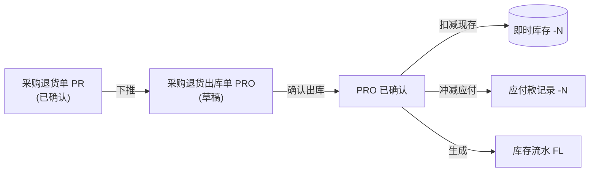

# 采购退货出库单主PRD

> **版本**：V1.0 | 2026-07-05
> **读者**：研发工程师、测试工程师、产品复核

---

### 1. 业务背景

采购退货出库单是采购退货链路的**执行层单据**，解决"仓库实际把退货商品出库发给供应商，扣减库存、冲减应付"的执行问题。基于已确认的采购退货单(PR)下推创建。

---

### 2. 功能范围

**In Scope**：
- 基于已确认的PR下推创建
- 草稿态编辑出库数量、出库日期、行备注
- 草稿态物理删除和作废
- 确认出库时：扣减仓库现存、冲减供应商应付、生成库存流水(FL)

**Out of Scope**：
- 无单退货出库（一期不支持）
- 物流跟踪

---

### 3. 单据定位

| 项目 | 内容 |
| :--- | :--- |
| 单据层级 | **第3层——退货执行层** |
| 核心职责 | 记录"退了多少货、从哪个仓出、什么时候出的" |
| 单据来源 | 已确认的PR下推创建 |
| 实体关系 | 一张PR可生成多张PRO(1:N，分批出库) |

#### 系统链路

---

### 4. 状态机

| 状态 | 含义 | 终态 |
| :--- | :--- | :---: |
| 草稿 DRAFT | 可编辑 | 否 |
| 已确认 CONFIRMED | 出库生效，库存/应付已更新 | **是** |
| 已作废 VOIDED | 失效 | **是** |

状态流转：草稿 → 已确认/已作废（与PI完全一致）

动作矩阵：草稿→查看/编辑/删除/作废/确认出库；已确认→查看；已作废→查看

---

### 5. 核心业务规则

| 规则ID | 规则 |
| :--- | :--- |
| R01 | 必须基于已确认的PR创建 |
| R02 | 供应商/仓库/商品明细继承自PR，不可修改 |
| R03 | 出库数量 ≤ PR退货数量，超出阻断 |
| R04 | 确认出库后：扣减仓库现存、冲减应付、生成FL |
| R05 | 确认后锁定全部字段 |

---

### 修订记录

| 日期 | 变更 |
| :--- | :--- |
| 2026-07-05 | V1.0 初版 |
