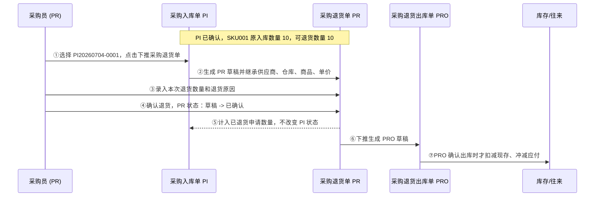

# 采购退货单_业务流程推演

> **状态**：已补齐
> **角色**：业务流程推演　|　类型：业务单据
> **权威层级**：context/ > templates/ > prd-docs
> **参照套件**：流程写法参考《采购入库单_业务流程推演》
> **版本**：V1.0 | 2026-07-07

---

## 一、业务流程概述

### 1.1 业务特点说明

- **来源强约束**：采购退货单（PR）必须从已确认采购入库单（PI）下推创建，不支持无单退货，不支持从 PO 直接发起。
- **发起与执行分离**：PR 只确认退货申请，实际扣减现存和冲减应付由下游采购退货出库单（PRO）确认出库时执行。
- **分批退货**：同一 PI 可被多张 PR 引用，但每个 PI 行的累计已确认 PR 退货数量不得超过原入库数量。
- **确认后锁定**：PR 确认后全部字段只读，不可编辑、删除或作废。

### 1.2 本场景在全局中的位置


### 1.3 完整流程图



---

## 二、详细步骤推演

本推演使用同一批采购入库数据：供应商 `S001 深圳强盛电子`，仓库 `WH001 民房一号仓`，来源入库单 `PI20260704-0001` 已确认。

### 步骤 ①：从已确认 PI 下推创建 PR

**操作**：采购员在采购入库单详情页点击“发起采购退货”，系统生成采购退货单草稿。

**来源 PI 快照**：

| 字段 | 值 | 说明 |
| :--- | :--- | :--- |
| 采购入库单号 | PI20260704-0001 | 已确认 |
| 来源采购单号 | PO20260704-0001 | 追溯用 |
| 供应商 | S001 深圳强盛电子 | 继承到 PR |
| 入库仓库 | WH001 民房一号仓 | 继承为 PR 退货仓库 |
| 入库状态 | 已确认 | 可下推 PR 的前置条件 |

**PI 商品明细**：

| 商品编码 | 商品名称 | 单价（含税） | 原入库数量 | 已退货申请数量 | 可退货数量 |
| :--- | :--- | :---: | :---: | :---: | :---: |
| SKU001 | 华强北特种接插件 | 50.00 | 10 | 0 | 10 |
| SKU002 | Type-C 快充尾插 | 12.00 | 20 | 0 | 20 |

**PR 草稿创建结果**：

| 字段 | 值 | 说明 |
| :--- | :--- | :--- |
| 采购退货单号 | PR20260707-0001 | 系统生成 |
| 来源入库单号 | PI20260704-0001 | 继承 PI |
| 来源采购单号 | PO20260704-0001 | 继承 PI |
| 供应商 | S001 深圳强盛电子 | 只读 |
| 退货仓库 | WH001 民房一号仓 | 只读 |
| 退货日期 | 2026-07-07 | 默认当天 |
| 退货状态 | 草稿 | 初始状态 |

### 步骤 ②：录入退货数量与原因

**操作**：采购员核对坏品，决定退回 SKU001 3 个、SKU002 5 个，并填写退货原因。

| 商品编码 | 字段 | 变更前 | 变更后 | 说明 |
| :--- | :--- | :---: | :---: | :--- |
| SKU001 | 本次退货数量 | 10 | 3 | 用户改小 |
| SKU001 | 退货金额（含税） | 500.00 | 150.00 | `3 × 50.00 = 150.00` |
| SKU002 | 本次退货数量 | 20 | 5 | 用户改小 |
| SKU002 | 退货金额（含税） | 240.00 | 60.00 | `5 × 12.00 = 60.00` |

| 字段 | 变更前 | 变更后 |
| :--- | :--- | :--- |
| 退货原因 | 空 | 到货后复检发现接插件针脚歪斜，尾插外壳刮伤，需退回供应商 |
| 退货总数量 | 30 | 8 |
| 退货总金额 | 740.00 | 210.00 |

### 步骤 ③：确认退货

**操作**：采购员点击“确认退货”。系统重新读取同一 PI 行下所有已确认 PR，校验本次退货是否超出可退货数量。

```text
FOR EACH PR明细行 DO
    已退货申请数量 = SUM(同一PI行下所有已确认PR.本次退货数量)
    可退货数量 = 原入库数量 - 已退货申请数量
    IF 本次退货数量 > 可退货数量 THEN ERROR "可退货数量不足"
END FOR
```

| 字段 | 变更前 | 变更后 | 说明 |
| :--- | :--- | :--- | :--- |
| 退货状态 | 草稿 | 已确认 | PR 生效并锁定 |
| 确认人 | - | 采购员_李四 | 记录动作人 |
| 确认时间 | - | 2026-07-07 10:20:30 | 记录确认时间 |

| 来源 PI 行 | 商品编码 | 原入库数量 | 已确认 PR 累计退货数量 | 剩余可退货数量 |
| :--- | :--- | :---: | :---: | :---: |
| PI20260704-0001-1 | SKU001 | 10 | 3 | 7 |
| PI20260704-0001-2 | SKU002 | 20 | 5 | 15 |

**关键点**：PR 已确认后可下推 PRO；本步骤不扣减 `WH001` 的现存、占用、可用，不生成 FL，不冲减 AP。

### 步骤 ④：下推生成 PRO

**操作**：仓管员或采购员在已确认 PR 详情页点击“下推退货出库”。

| 字段 | 值 | 说明 |
| :--- | :--- | :--- |
| 采购退货出库单号 | PRO20260707-0001 | 系统生成 |
| 来源采购退货单号 | PR20260707-0001 | 继承 PR |
| 来源入库单号 | PI20260704-0001 | 继承 PR |
| 供应商 | S001 深圳强盛电子 | 继承 PR |
| 出库仓库 | WH001 民房一号仓 | 继承 PR 的退货仓库 |
| 状态 | 草稿 | 后续由 PRO 确认出库 |

---

## 三、完整状态变化汇总

| 步骤 | PR 状态 | 退货总数量 | 退货总金额 | 触发动作 |
| :--- | :--- | :---: | :---: | :--- |
| ① 下推创建 | 草稿 | 30 | 740.00 | PI 下推 |
| ② 编辑数量 | 草稿 | 8 | 210.00 | 用户录入 |
| ③ 确认退货 | 已确认 | 8 | 210.00 | 点击确认退货 |
| ④ 下推 PRO | 已确认 | 8 | 210.00 | 创建下游执行单 |

| 步骤 | WH001 SKU001 现存 | WH001 SKU002 现存 | 应付余额影响 | 说明 |
| :--- | :---: | :---: | :--- | :--- |
| 初始 | 25 | 40 | 已由 PI 形成应付 | 基准 |
| PR 草稿 | 25 | 40 | 无变化 | PR 不动库存/应付 |
| PR 已确认 | 25 | 40 | 无变化 | 只锁定退货申请 |
| PRO 草稿 | 25 | 40 | 无变化 | 仍未执行出库 |
| PRO 确认出库 | 22 | 35 | 冲减 210.00 | 由 PRO 文档定义 |

---

## 四、数据一致性校验公式

1. `可退货数量 = 原入库数量 - 同一PI行已确认PR退货数量合计`
2. `SKU001退货金额 = 3 × 50.00 = 150.00`
3. `SKU002退货金额 = 5 × 12.00 = 60.00`
4. `退货总数量 = 3 + 5 = 8`
5. `退货总金额 = 150.00 + 60.00 = 210.00`
6. `PR确认后现存 = PR确认前现存`

---

## 五、异常场景处理

| 异常场景 | 触发时机 | 处理方式 |
| :--- | :--- | :--- |
| 来源 PI 非已确认 | 下推创建 | 阻断，提示仅已确认 PI 可发起退货 |
| 本次退货数量超过可退货数量 | 保存/确认 | 阻断并标红对应行 |
| 两个用户并发确认同一 PI 行退货 | 确认退货 | 后确认者重新计算可退货数量，超出则阻断 |
| 草稿录错 | 草稿态 | 可编辑、删除或作废 |
| 已确认后发现数量填错 | 已确认态 | PR 不可反审核；需结合下游 PRO 取消/纠错流程处理 |
