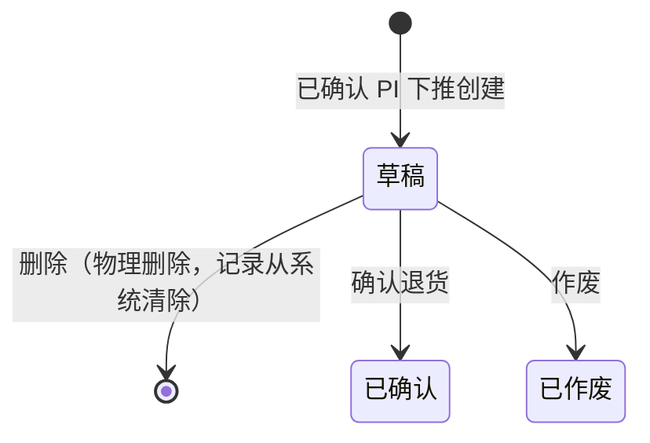

# 采购退货单_业务规则规格

> **状态**：已补齐
> **角色**：业务规则规格　|　类型：业务单据
> **权威层级**：采购退货单主PRD > context/ > templates/ > 本文件
> **参照套件**：规则写法参考《采购入库单_业务规则规格》
> **版本**：V1.0 | 2026-07-07

---

## 一、状态机设计

采购退货单（PR）是采购退货链路的**发起层单据**，用于记录“针对哪张采购入库单、退什么、退多少、为什么退”。PR 确认后只作为采购退货出库单（PRO）的执行依据，**不直接扣减库存，也不直接冲减应付**。

### 1.1 状态定义

| 状态 | 枚举值 | 含义 | 是否终态 | 进入条件 | 离开条件 |
| :--- | :--- | :--- | :---: | :--- | :--- |
| 草稿 | `DRAFT` | 从已确认 PI 下推创建，可编辑退货数量、退货原因、行备注 | 否 | 已确认 PI 下推创建成功 | 确认退货、物理删除或作废 |
| 已确认 | `CONFIRMED` | 退货申请正式生效，可下推生成 PRO | 是 | 草稿态执行确认退货且校验通过 | 无状态离开；只允许下推 PRO 和查看 |
| 已作废 | `VOIDED` | 草稿 PR 失效并保留记录 | 是 | 草稿态执行作废并二次确认 | 不可恢复 |

### 1.2 状态流转图

### 1.3 状态流转表

| 当前状态 | 动作 | 前置条件 | 结果状态 | 二次确认 | 后置影响 | 失败处理 |
| :--- | :--- | :--- | :--- | :--- | :--- | :--- |
| (无) | 下推创建 | 1. 对应 PI 状态必须为已确认 2. PI 至少存在 1 行可退货数量大于 0 3. 来源 PI 未被删除且可查看 | 草稿 | 无 | 1. 继承 PI 头部和明细快照 2. 生成 PR 单号 3. 本次退货数量默认取可退货数量，允许草稿态改小 | Toast：「下推失败，采购入库单无可退货数量」 |
| 草稿 | 保存 | 1. 明细行至少 1 行 2. 退货日期合法 3. 本次退货数量格式合法 | 草稿 | 无 | 保存草稿，不影响 PI、不影响库存、不影响应付 | 字段下方或行内展示具体错误 |
| 草稿 | 确认退货 | 1. 退货原因必填 2. 每行本次退货数量大于 0 3. 每行本次退货数量小于等于确认时重新计算的可退货数量 | 已确认 | 「确认后退货申请将锁定，并可下推采购退货出库单，确认继续？」 | 1. 锁定全部字段 2. 将本张 PR 计入同一 PI 行的已退货申请数量 3. 开放下推 PRO 入口 4. 不扣减现存、不生成库存流水、不冲减应付 | Toast：「确认失败，{具体阻断原因}」 |
| 草稿 | 删除 | 无下游 PRO，且仍为草稿 | 物理消失 | 「删除后不可恢复，确认删除该草稿退货单？」 | 移除 PR 草稿记录；不影响 PI/库存/应付 | - |
| 草稿 | 作废 | 无下游 PRO，且仍为草稿 | 已作废 | 「作废后该退货单将永久失效，确认作废？」 | 单据进入只读状态；保留单号查询；不影响 PI/库存/应付 | - |
| 已确认 | 下推采购退货出库单 | 1. PR 状态为已确认 2. 当前 PR 尚未存在未删除 PRO（一期按一张 PR 对一张 PRO 控制） | 已确认 | 无 | 生成 PRO 草稿，PRO 继承 PR 字段；库存和应付仍不变化，待 PRO 确认出库时生效 | Toast：「下推失败，该退货单已存在采购退货出库单」 |

### 1.4 动作能力矩阵

| 动作 | 草稿 | 已确认 | 已作废 |
| :--- | :---: | :---: | :---: |
| 查看 | 是 | 是 | 是 |
| 编辑 | 是 | 否 | 否 |
| 保存 | 是 | 否 | 否 |
| 删除（物理） | 是 | 否 | 否 |
| 作废 | 是 | 否 | 否 |
| 确认退货 | 是 | 否 | 否 |
| 下推采购退货出库单（PRO） | 否 | 是（条件） | 否 |
| 导出 | 是 | 是 | 是 |

---

## 二、校验规则规格

### 2.1 创建来源校验

| 规则ID | 触发动作 | 规则逻辑定义 | 校验失败提示 |
| :--- | :--- | :--- | :--- |
| VAL01 | 下推创建 | PR 必须由采购入库单 PI 下推创建，不支持无来源新增，不支持从 PO 直接创建。 | 「采购退货单必须基于已确认的采购入库单创建」 |
| VAL02 | 下推创建 | 来源 PI 状态必须为已确认。草稿或已作废 PI 不可发起退货。 | 「下推失败，仅已确认的采购入库单可发起退货」 |
| VAL03 | 下推创建 | 来源 PI 至少存在一条 `可退货数量 > 0` 的明细行。 | 「下推失败，当前入库单已无可退货数量」 |

### 2.2 基础必填与格式校验

| 规则ID | 触发动作 | 规则逻辑定义 | 校验失败提示 |
| :--- | :--- | :--- | :--- |
| VAL11 | 保存/确认退货 | 退货日期必填，且不得晚于当前系统日期。 | 「退货日期不合法，不能选择未来日期」 |
| VAL12 | 确认退货 | 退货原因必填，长度 0-200 字。 | 「请填写退货原因」 |
| VAL13 | 保存/确认退货 | 明细行不能为空，至少保留 1 行。 | 「明细行不能为空，请至少保留一行退货商品」 |
| VAL14 | 保存/确认退货 | 本次退货数量必须为大于 0 的正整数。 | 「商品 {商品名称} 的退货数量必须为大于0的整数」 |
| VAL15 | 保存/确认退货 | 行备注长度不超过 100 字，退货备注长度不超过 200 字。 | 「备注长度超出限制」 |

### 2.3 数量强控校验

| 规则ID | 触发动作 | 规则逻辑定义 | 校验失败提示 |
| :--- | :--- | :--- | :--- |
| VAL21 | 保存/确认退货 | 每行本次退货数量不得大于该行原入库数量。 | 「商品 {商品名称} 退货数量不能大于原入库数量」 |
| VAL22 | 确认退货 | 确认时必须重新计算同一 PI 行的可退货数量：`原入库数量 - 已确认PR退货数量合计`。本次退货数量不得超过该值。 | 「商品 {商品名称} 可退货数量不足，当前最多可退 {可退货数量} 件」 |
| VAL23 | 确认退货 | 已作废 PR、草稿 PR 不计入已退货申请数量；已确认 PR 必须计入。 | 「确认失败，退货数量计算异常，请刷新后重试」 |

### 2.4 状态与下游校验

| 规则ID | 触发动作 | 规则逻辑定义 | 校验失败提示 |
| :--- | :--- | :--- | :--- |
| VAL31 | 编辑/删除/作废 | 仅草稿态 PR 可编辑、删除、作废；已确认、已作废均只读。 | 「当前状态不可执行该操作」 |
| VAL32 | 下推 PRO | 只有已确认 PR 可下推 PRO。 | 「请先确认采购退货单，再下推退货出库」 |
| VAL33 | 下推 PRO | 一期按一张 PR 对一张 PRO 控制；若已存在未删除的 PRO，则阻断重复下推。 | 「该退货单已存在采购退货出库单，请勿重复下推」 |

---

## 三、权限规则规格

| 角色 | 查看 | 下推创建 | 编辑草稿 | 删除草稿 | 作废草稿 | 确认退货 | 下推 PRO | 导出 |
| :--- | :---: | :---: | :---: | :---: | :---: | :---: | :---: | :---: |
| 采购员 | 是 | 是 | 是 | 是 | 是 | 是 | 是 | 是 |
| 仓管员 | 是 | 否 | 否 | 否 | 否 | 否 | 是 | 是 |
| 财务 | 是（已确认） | 否 | 否 | 否 | 否 | 否 | 否 | 是 |
| 管理员 | 是 | 是 | 是 | 是 | 是 | 是 | 是 | 是 |

**数据权限**：采购员可查看自己负责采购链路下的 PR；仓管员按绑定仓库范围查看 PR，并在已确认 PR 上执行下推 PRO；财务仅查看已确认 PR；管理员可查看全部数据。

---

## 四、计算规则

| 规则ID | 字段/对象 | 计算规则 | 触发时机 |
| :--- | :--- | :--- | :--- |
| CAL01 | 已退货申请数量 | 同一来源 PI 行下，所有已确认 PR 行的本次退货数量求和 | 打开草稿、保存、确认退货、查看详情时刷新 |
| CAL02 | 可退货数量 | `原入库数量 - 已退货申请数量` | 下推创建、保存、确认退货时重新计算 |
| CAL03 | 退货金额（含税） | `本次退货数量 × 单价（含税）`，保留 2 位小数 | 退货数量变化时实时重算 |
| CAL04 | 商品种数 | `明细行数` | 明细变化时重算 |
| CAL05 | 退货总数量 | 所有行本次退货数量求和 | 明细数量变化时重算 |
| CAL06 | 退货总金额 | 所有行退货金额（含税）求和，保留 2 位小数 | 明细数量变化时重算 |

**关键红线**：PR 确认时不更新现存、占用、可用库存；不生成库存流水 FL；不冲减供应商应付账款。上述影响只在 PRO 确认出库时发生。

---

## 五、删除 vs 作废

| 维度 | 删除（物理删除） | 作废 |
| :--- | :--- | :--- |
| 适用状态 | 草稿 | 草稿 |
| 记录保留 | 不保留 | 保留 |
| 单号占用 | 不占用业务留痕；具体序号回收策略按系统实现，不在 PR 自创规则 | 单号永久占用，不回收 |
| 对 PI 数量 | 无影响 | 无影响 |
| 对库存/应付 | 无影响 | 无影响 |
| 弹窗文案 | 删除后不可恢复 | 作废后不可恢复 |

---

## 六、不确定性记录

| # | 不确定点 | 当前处理 |
| :--- | :--- | :--- |
| 1 | context/05 对业务单据总体写作仍以“订单/执行”两层表述，主 PRD 将 PR 定位为“第2层——退货发起层（意图）”。 | 本文以采购退货单主PRD为准，按“发起层，不动库存”处理。 |
