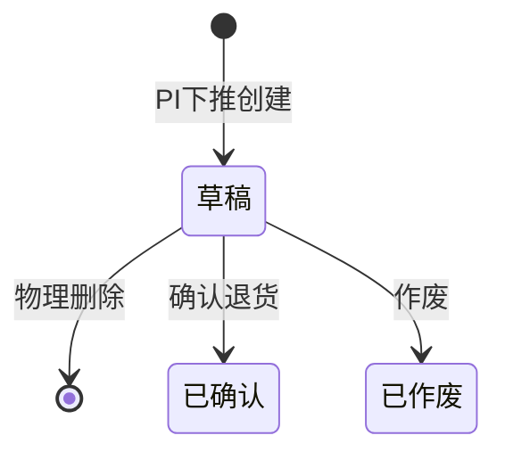

# 采购退货单主PRD

> **版本**：V1.0 | 2026-07-05
> **读者**：研发工程师、测试工程师、产品复核
> **课件依据**：进销存第2讲 §3.10 退货链路设计；一期范围边界已确认

---

### 1. 业务背景

采购退货单是采购退货链路的**发起层单据**，解决"已入库的货出现质量问题或规格不符，仓管/采购员如何正式向供应商提出退货申请"的问题。

没有统一的采购退货单：
- 退货靠口头或微信沟通，供应商不认账
- 退货数量无法与入库记录对应，财务无法准确冲减应付
- 退货流程与出库脱节，仓库实物已退回但账上库存未减

采购退货单基于已确认的采购入库单(PI)下推创建，确认后关键字段锁定，作为采购退货出库单(PRO)的执行依据。

---

### 2. 功能范围

**In Scope**：
- 基于已确认的采购入库单(PI)下推创建退货单
- 草稿态支持编辑退货数量、退货原因、行备注
- 草稿态支持物理删除和作废
- 确认后锁定全部字段，不可编辑/删除/作废
- 确认后可下推生成采购退货出库单(PRO)

**Out of Scope**：
- 无单退货（一期不支持，必须基于PI发起）
- 仅退款不退货流程（必须退货出库）
- 供应商在线确认退货（属于SRM模块）

---

### 3. 单据定位

| 项目 | 内容 |
| :--- | :--- |
| 单据层级 | **第2层——退货发起层（意图）** |
| 核心职责 | 记录"针对哪批入库、退什么商品、退多少、什么原因" |
| 单据来源 | 由已确认的采购入库单(PI)手动下推创建 |
| 下游单据 | 采购退货出库单(PRO) |
| 实体关系 | 一张入库单可被多张退货单引用(1:N)，分批退货 |

#### 系统链路

---

### 4. 业务场景

| 场景ID | 场景 | 类型 | 说明 |
| :--- | :--- | :--- | :--- |
| S01 | 全量退货 | 主流程 | 入库商品全部有问题，下推退货单(退货量=入库量)，确认后生成PRO |
| S02 | 部分退货 | 主流程 | 入库商品部分有问题，按实际问题量退货 |
| S03 | 分批退货 | 主流程 | 同一批入库分多次退货，多张PR对应一张PI |
| S04 | 草稿删除/作废 | 支线 | 创建错误可删除或作废 |

---

### 5. 状态机

#### 5.1 单据状态

| 状态 | 含义 | 终态 |
| :--- | :--- | :---: |
| 草稿 DRAFT | 可编辑退货量和原因 | 否 |
| 已确认 CONFIRMED | 退货申请生效，可下推PRO | **是** |
| 已作废 VOIDED | 单据失效 | **是** |

#### 5.2 状态机图

#### 5.3 动作能力矩阵

| 动作 | 草稿 | 已确认 | 已作废 |
| :--- | :---: | :---: | :---: |
| 查看 | ✅ | ✅ | ✅ |
| 编辑 | ✅ | ❌ | ❌ |
| 删除 | ✅ | ❌ | ❌ |
| 作废 | ✅ | ❌ | ❌ |
| 确认退货 | ✅ | ❌ | ❌ |
| 下推退货出库 | ❌ | ✅ | ❌ |

---

### 6. 核心业务规则

| 规则ID | 规则 |
| :--- | :--- |
| R01 | 必须基于已确认的PI创建，不可无来源新建 |
| R02 | 供应商、仓库、商品明细继承自PI，不可修改 |
| R03 | 退货数量 ≤ PI已入库数量，超出阻断 |
| R04 | 确认退货后锁定全部字段 |
| R05 | 已确认的PR不可作废，须通过PRO取消流程逆向 |
| R06 | 退货原因必填（0-200字），用于供应商沟通留痕 |

---

### 7. 验收重点

| # | 验收项 | 预期结果 |
| :--- | :--- | :--- |
| V01 | 超量退货阻断 | 退货数>PI入库数时阻断，标红提示 |
| V02 | 确认后锁定 | 已确认PR无编辑/删除/作废按钮 |
| V03 | 下推PRO | 已确认PR可下推生成PRO |
| V04 | 草稿删除 | 物理删除后列表不显示 |

---

### 修订记录

| 日期 | 变更 |
| :--- | :--- |
| 2026-07-05 | V1.0 初版 |
