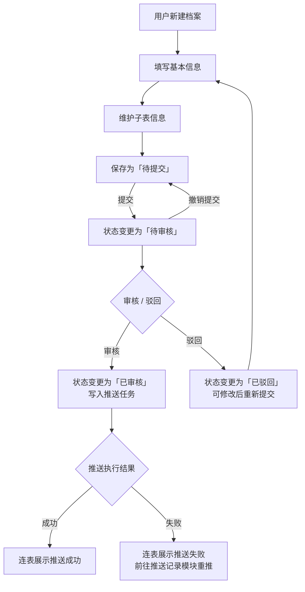
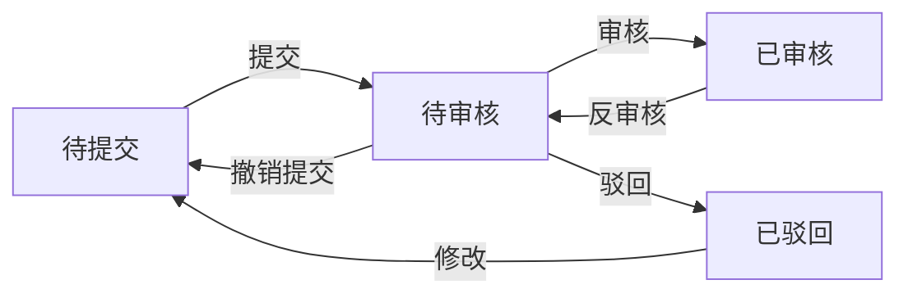

# 主数据管理类功能 PRD 模板

> **模板定位**：适用于有审核流、需要与外部系统同步、涉及多组织权限管控的主数据管理类功能（如客户、供应商、物料、员工档案等）。使用前请先确认适用场景（见文末）。
>
> ⚠️ **第 4 节演示说明**：本模板为重型主数据模板，不适用于第 4 节「全流程预览课」的轻量演示场景。第 4 节演示的采购入库单 PRD 使用 `业务单据PRD模板.md`。本模板仅供学员课后参考或实际企业项目使用。

---

## 文档基础信息

### 文档属性

| 属性 | 内容 |
|---|---|
| 文档标题 | |
| 版本号 | V1.0 |
| 作者 | |
| 评审人 | |
| 状态 | 草稿（待评审）|
| 创建日期 | |
| 最后更新 | |

### 变更记录

| 版本号 | 变更日期 | 变更内容 | 变更人 |
|---|---|---|---|
| V1.0 | | 初稿创建 | |

### 关联链接

| 类型 | 链接 / 说明 |
|---|---|
| 需求来源 | |
| 字段清单 | [字段清单.md]() — **字段级唯一权威源**（必填、枚举、校验、推送备注等） |
| 前端规范 | [前端规范PRD.md]() — **页面与控件级唯一权威源** |
| 依赖模块 | |
| 外部系统集成 | |

### 文档分工与权威源

| 信息类型 | 权威文档 | 本 PRD 中的写法 |
|---|---|---|
| 字段定义、校验、枚举、导入导出 | 《字段清单》 | 仅索引与规则引用，不重复字段表 |
| 列表 / 表单布局、控件类型、交互细节 | 《前端规范PRD》 | 仅业务向交互（状态机按钮、跳转等），不重复控件规格 |
| 业务目标、范围、状态机、业务规则、权限、验收 | **本文** | 完整保留 |

**冲突处理原则**：若本文与字段清单或前端规范 PRD 表述不一致，以上游权威源为准，并回写修正本文索引句。

---

## 需求概述

### 需求背景

#### 现状与痛点

> 说明当前业务的痛点，建议按痛点编号逐一描述，每个痛点对应一个问题场景。

**痛点1：**

**痛点2：**

**痛点3：**

#### 触发原因

> 说明本次需求的直接触发事件（如某个上游项目的依赖、业务方的明确诉求等）。

---

### 需求目标

> 用编号列出本次需求要达成的业务目标，通常 3～5 条。每条应是可验证的结果，而非功能描述。

1.
2.
3.

---

### 需求范围

#### 本期要做（In Scope）

> 按功能点逐条列出，边界模糊的地方要写清楚"到哪里为止"。

1.
2.
3.

#### 本期不做（Out of Scope）

> 必须显式列出。未列出的功能默认研发侧认为需要实现。

1. ~~功能A~~：原因说明
2. ~~功能B~~：原因说明

---

### 影响范围与兼容性

#### 涉及角色与组织范围

| 角色 | 组织 | 影响说明 |
|---|---|---|
| | | |

#### 影响模块

| 影响模块 | 影响说明 |
|---|---|
| | |

---

### 用户和使用场景

> 按典型场景逐一描述，每个场景包含触发条件、操作流程、预期结果。建议覆盖：正常新建场景、编辑已审核数据的场景、外部系统同步场景（如有）。

#### 场景1：【正常新建】

**触发条件**：

**操作流程**：

**预期结果**：

#### 场景2：【修改已审核数据】

**触发条件**：

**操作流程**：

**预期结果**：

#### 场景3：【外部系统同步建档】（如涉及）

**触发条件**：

**操作流程**：

**预期结果**：

---

### 范围拆分与功能清单

#### 功能结构

```
[模块名]
├── 档案创建
│   ├── 单据头：基本信息
│   └── 子结构：[子表1]、[子表2]
├── 「状态」流转（审批）
│   ├── 提交 / 撤销提交
│   ├── 审核 / 驳回
│   └── 反审核
├── 编辑（仅特定状态可编辑）
├── 使用状态（启用 ↔ 禁用）
├── 列表查询（含组织隔离）
└── 外部系统同步（经[推送记录模块]）
    ├── 审核通过后写入推送任务并执行
    └── 列表/详情连表展示推送结果
```

#### 功能清单

| 模块 | 功能点 | 功能描述 | 优先级 |
|---|---|---|---|
| 档案管理 | 新建 | | P0 |
| 档案管理 | 编辑 | | P0 |
| 档案管理 | 查看详情 | | P0 |
| 档案管理 | 列表查询 | | P0 |
| 档案管理 | 使用状态切换 | | P0 |
| 状态流转 | 提交 | | P0 |
| 状态流转 | 撤销提交 | | P0 |
| 状态流转 | 审核 | | P0 |
| 状态流转 | 驳回 | | P0 |
| 状态流转 | 反审核 | | P0 |
| 外部系统同步 | 推送任务生成 | | P0 |
| 外部系统同步 | 推送结果展示 | | P0 |

---

## 业务流程与规则

### 业务流程

#### 主流程图



#### 状态流转说明（字段名「状态」）

各状态下允许的操作：

| 状态 | 允许操作 |
|---|---|
| 待提交 | 提交、修改 |
| 待审核 | 撤销提交、审核、驳回 |
| 已审核 | 反审核 |
| 已驳回 | 修改 |



#### 使用状态（与「状态」独立）

| 使用状态 | 允许操作 |
|---|---|
| 启用 | 禁用 |
| 禁用 | 启用 |

---

## 业务规则与约束

### 核心业务规则

#### R001：「状态」与业务引用约束

| 规则编号 | 规则描述 | 优先级 |
|---|---|---|
| R001-1 | 仅「已审核」且使用状态「启用」的记录，可在下游业务单据中引用 | P0 |
| R001-2 | 「待提交/待审核/已驳回」状态的记录，在业务单据选择器中不可选 | P0 |
| R001-3 | 「已审核」但使用状态「禁用」的记录，在业务单据选择器中不可选 | P0 |
| R001-4 | 已被引用的在途单据，若记录被禁用，处理规则为：【待补充】 | P0 |

#### R002：编码与防重规则

| 规则编号 | 规则描述 | 优先级 |
|---|---|---|
| R002-1 | 主编码生成规则：【系统自动生成 / 手动填写】，格式为：【待补充】 | P0 |
| R002-2 | 名称是否允许重复：【待补充】 | P0 |
| R002-3 | 唯一性校验字段：【待补充字段名】，校验范围：【全局 / 组织内】 | P0 |

#### R003：外部编码规则（如涉及外部系统集成）

| 规则编号 | 规则描述 | 优先级 |
|---|---|---|
| R003-1 | 由外部接口写入的编码，系统只读保存，界面不支持手工修改 | P0 |
| R003-2 | 用户手动新建时，外部编码允许选填、允许编辑 | P0 |
| R003-3 | 外部编码与系统自身编码共存，均须满足唯一性约束 | P0 |

#### R004：外部系统推送规则

> 推送架构说明：凡需同步至外部系统的数据，统一由「[推送记录模块]」登记推送任务与执行结果。本模块不以本地冗余字段作为推送结果的权威来源；列表、详情中的推送状态为**连表读取**推送记录的结果。重推、失败重试在「[推送记录模块]」操作，本模块不提供手动重推能力。

| 规则编号 | 规则描述 | 优先级 |
|---|---|---|
| R004-1 | 状态变为「已审核」且满足推送条件时，由统一机制生成推送任务并执行；推送目标由【所属组织/主体】决定 | P0 |
| R004-2 | 推送失败时，记录「状态」仍为「已审核」，不因推送失败回滚；失败体现在连表展示的推送状态中 | P0 |
| R004-3 | 推送时机（定时任务频率）：【待补充，需明确业务 SLA】 | P0 |
| R004-4 | 字段映射与拼接规则（如涉及）：见《字段清单》§推送规则 | P0 |
| R004-5 | 列表/详情/导出的推送状态展示，均以连表关联查询为准（取最新一条或按产品约定聚合） | P0 |

#### R005：外部系统向本系统同步建档的边界（如涉及）

| 规则编号 | 规则描述 | 优先级 |
|---|---|---|
| R005-1 | 仅首次初始化：外部推送仅用于本系统**尚不存在**匹配记录时的一次性建档 | P0 |
| R005-2 | 已存在则须失败：本系统已存在匹配记录时，外部推送须失败/拒绝，不得覆盖已有主数据；匹配维度：【待补充，建议写明默认维度】 | P0 |
| R005-3 | 更新唯一入口在本系统：初始化后的任意信息变更，仅允许在本系统内按状态机维护，不支持外部系统反复推送更新 | P0 |

#### R006：操作日志规则（勿遗漏）

| 规则编号 | 规则描述 | 优先级 |
|---|---|---|
| R006-1 | 需记录日志的操作范围：新建、编辑（记录变更前后值）、所有状态流转操作、使用状态变更 | P0 |
| R006-2 | 日志记录内容：操作人、操作时间、操作类型、变更字段及前后值 | P0 |
| R006-3 | 日志展示位置：详情页内嵌 / 独立日志 Tab | P0 |
| R006-4 | 日志保留时长：【待补充】 | P1 |

### 校验规则

> 字段级校验（必填性、格式、枚举来源、错误提示）以《字段清单》为准，不在本文重复列表。
>
> 与状态机强相关的校验见 R001；与外部系统推送相关的数据形态见 R004；外部系统向本系统同步的边界见 R005。

---

## 产品方案与详细设计

### 页面清单

| 页面名称 | 功能说明 | 访问角色 |
|---|---|---|
| 列表页 | 查看和筛选所有档案 | |
| 新建/编辑页 | 创建或编辑档案 | |
| 详情页 | 查看完整信息；连表展示推送状态 | |

### 页面交互说明

| 交互元素 | 交互说明 | 确认提示文案 |
|---|---|---|
| 提交 | 校验通过后弹窗确认，状态→「待审核」 | 确认提交？提交后需撤销提交方可再编辑 |
| 撤销提交 | 状态回到「待提交」 | 确认撤销提交？撤销后可重新编辑 |
| 审核 | 状态→「已审核」，写入推送任务 | 确认审核通过？ |
| 驳回 | 状态→「已驳回」，可修改后重新提交 | 确认驳回？ |
| 反审核 | 状态→「待审核」，不直接可编辑 | 确认反审核？反审核后须撤销提交方可编辑 |
| 修改 | 仅「待提交」「已驳回」下进入可编辑态 | - |
| 启用 / 禁用 | 使用状态切换，与「状态」独立，切换前二次确认 | 确认变更使用状态？ |
| 删除 | 【是否支持？不支持需在 Out of Scope 显式说明】 | - |
| 推送失败处理 | 不在本页提供重推；提供跳转至推送记录模块的入口 | 推送失败请至「[推送记录模块]」处理 |
| 并发编辑冲突 | 【待补充：乐观锁提示 / 后保存者覆盖 / 其他策略】 | - |

### 页面与字段信息（索引）

#### 列表页
- **筛选维度**：见字段清单「可筛选」列
- **默认列与顺序**：与字段清单「列表展示=是」一致
- **操作列**：与状态机及本文《页面交互说明》一致
- **分页规则**：每页默认【N】条；【是/否】支持自定义条数
- **批量操作**：【支持批量启用/禁用 / 本期不支持批量操作】

#### 新建 / 编辑页
- **分组骨架**：基本信息 → 财务信息（如有）→ 子表结构
- **控件类型与布局**：以《前端规范PRD》为准

#### 外部系统集成与字段映射
- **字段映射关系**：以字段清单「推送备注」及附录为准，本文不附对照大表
- **跨字段推送规则**（如地址拼接等）：见 R004 及字段清单 §推送规则

---

### 权限与数据范围

#### 操作权限矩阵

| 操作 | 角色A | 角色B | 角色C |
|---|---|---|---|
| 新建 | ✓ | ✓ | ✓ |
| 编辑 | ✓ | ✓ | ✓ |
| 提交/撤销提交 | ✓ | ✓ | ✓ |
| 审核/驳回 | ✓ | ✓ | — |
| 反审核 | ✓ | ✓ | — |
| 启用/禁用 | ✓ | ✓ | — |
| 查看列表/详情 | ✓ | ✓ | ✓ |
| 删除 | — | — | — |

> **权限说明**：【本期是否做细粒度权限管控？如不做，需说明"凡具备菜单入口的用户均可执行上表操作"】

#### 数据范围（组织隔离）

> 说明"哪些组织/角色可以看到哪些数据"的规则，尤其是多组织/多主体场景下的隔离逻辑。
> 建议写明：默认分配规则（如逐级分配：自己及下一级有权限）、特殊组织的精细管控规则（如国际集团精确到主体级）。

---

## 待确认事项

| # | 问题 | 当前假设 | 需确认对象 | Deadline |
|---|---|---|---|---|
| 1 | | | | |
| 2 | | | | |

> **注意**：P0 级待确认项未关闭前，验收标准中不应出现"实施确认后验收"的表述，否则验收条件实际处于悬空状态。

---

## 验收与上线

### 验收标准

| 验收项 | 验收标准 |
|---|---|
| 字段与表单 | 与《字段清单》及《前端规范PRD》一致 |
| 状态流转 | 提交/撤销提交/审核/驳回/反审核与状态机一致 |
| 编辑权限 | 仅「待提交」「已驳回」可直接编辑；「已审核」须反审核→撤销提交后方可编辑 |
| 使用状态控制 | 「禁用」状态下在下游单据选择器中不可选 |
| 业务单据引用控制 | 仅「已审核」且「启用」可在下游单据中选用 |
| 推送任务生成 | 「已审核」后生成推送任务并执行；客户侧连表展示的推送状态与记录一致 |
| 推送失败展示 | 失败状态正确展示；不在本模块提供重推按钮 |
| 跳转重推入口 | 推送失败时可跳转至推送记录模块定位到对应任务 |
| 操作日志 | 新建/编辑/状态流转/使用状态变更均有日志记录；编辑记录变更前后值 |
| 外部系统同步边界（如有） | 首次同步可建档；已存在时须失败/拒绝且不覆盖；成功后变更仅通过本系统维护 |
| 并发编辑 | 并发冲突按约定策略处理，不出现静默覆盖 |
| 不支持删除 | 全链路不提供删除入口（如本期不支持删除） |

---

## 附录

### 术语表

| 术语 | 解释 |
|---|---|
| 状态 | 档案在审核流程中的取值（待提交/待审核/已审核/已驳回）；与「使用状态」相互独立 |
| 使用状态 | 启用/禁用，控制记录是否允许被业务单据引用；与「状态」相互独立 |
| 逐级分配 | 默认数据使用范围规则：所属组织自身及其直接下一级组织有权引用；超过两级的规则需显式补充 |
| [推送记录模块] | 统一承载需同步外部系统的推送任务与结果的模块；本模块仅消费其查询结果，不重复定义推送细节 |

---

## 适用场景与不适用场景

### ✅ 适用场景

**核心判断标准：同时满足以下三条时，优先使用本模板。**

1. **有主数据属性**：数据是其他业务单据的"被引用方"（如客户被销售订单引用、供应商被采购订单引用、物料被出入库单引用），需要通过"已审核+启用"双重状态控制引用资格
2. **有审批流**：数据创建或变更需要经过提交→审核的流转，不能直接生效
3. **有外部系统同步需求**：数据需要推送至 ERP、财务系统、WMS 等外部系统，且存在推送失败的处理场景

**典型适用对象**：客户档案、供应商档案、物料主数据、员工档案、门店主数据、账户主数据

---

### ❌ 不适用场景

**遇到以下任意一条，说明本模板需要大幅裁剪或更换**：

| 不适用场景 | 原因 | 建议改用 |
|---|---|---|
| **轻量配置类功能**（数据字典、枚举维护、系统参数配置） | 通常无审批流、无外部推送，状态机章节会产生大量空内容 | 简化版配置类 PRD 模板 |
| **业务单据类功能**（采购订单、销售订单、出入库单） | 单据有更复杂的行级结构、金额计算、业务流转逻辑，状态机含义与主数据完全不同 | 业务单据类 PRD 模板 |
| **报表与数据看板类功能** | 无写操作、无状态机、核心在于数据口径和展示规则 | 报表类 PRD 模板 |
| **审批流引擎本身**（流程配置、节点管理） | 本模板假设审批流是固定的简单线性流转，不适合描述可配置的多级审批 | 流程引擎类 PRD 模板 |
| **C 端 / 用户侧功能**（注册、个人中心、消费行为） | 无组织隔离、无外部系统推送、无审批流，本模板的核心章节全部失效 | C 端功能 PRD 模板 |
| **纯接口 / 集成类需求**（无前端页面） | 无页面交互章节，权威源分工方式不适用 | 接口规格文档模板 |

---

*模板版本：V1.0 | 提取自：客户管理模块 PRD V1.10*