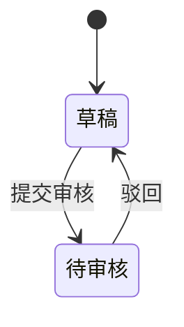

# 业务单据 PRD 模板

> 适用于：采购订单、采购入库单、销售订单、销售出库单、调拨单、盘点单等所有业务单据类 PRD。
>
> 本模板从「采购订单主PRD」的实际结构中提取，是经过真实项目验证的章节标准。
> AI 生成 PRD 时，**必须严格按照本章节顺序和每个章节内的子结构输出**。

---

### 前置说明

每个 PRD 文件头部必须包含：

```markdown
# [单据名称]主PRD

> **版本**：V1.0 | YYYY-MM-DD
> **读者**：研发工程师、测试工程师、产品复核
```

---

### 1. 业务背景

**写法要求**：一段话讲清「这个单据解决什么问题、没有它会怎样」，然后列出 3-5 条没有统一管理时的具体痛点。

**参考示例**（采购订单）：

> 采购订单是采购链路的起点控制单据，解决"原本计划买什么、买多少、向谁买、审核之后才能执行"的问题。
>
> 没有统一的采购订单：
> - 采购量靠经验判断，不透明，无法事后追溯
> - 向哪个供应商买、买什么价格，靠人记，无凭证
> - 到底买了多少、还有多少没到货，无法追踪
> - 财务无法对应口径核对应付账款

---

### 2. 功能范围

**写法要求**：用两段列表分别列出 In Scope 和 Out of Scope，每条一句话。Out of Scope 要写清楚"为什么不做"或"属于哪个模块"。

```markdown
**In Scope**：
- 功能点 1
- 功能点 2

**Out of Scope**：
- 功能点 X（原因说明，如"属于 XX 模块"或"一期不支持"）
```

---

### 3. 单据定位

#### 3.1 在系统中的位置

| 项目 | 内容 |
| :--- | :--- |
| 单据层级 | 第1层——业务订单层（意图/计划）或 第2层——业务执行层 |
| 核心职责 | 一句话说明这个单据的核心使命 |
| 单据来源 | 手动创建 / 由 XX 单据下推生成 / 系统自动生成 |
| 下游单据 | 列出这个单据会触发或关联哪些下游单据 |
| 实体关系 | 关键的数量关系，如「一张采购订单可对应多张采购入库单（1:N）」 |

#### 3.2 系统链路图

用 Mermaid flowchart 画出该单据在整体链路中的位置，包含：上游数据来源 → 本单据 → 下游单据 → 最终影响（库存/应付/应收）。


#### 3.3 实体关系说明

| 关系 | 说明 |
| :--- | :--- |
| 本单据 : 上游单据 | **N:1** 或 **1:N**，附一句话解释 |
| 本单据 : 下游单据 | 同上 |
| 本单据 : 关联档案 | 同上 |

---

### 4. 业务场景

**写法要求**：用表格列出至少 4-7 个场景，标注每个场景的类型（主流程/支线/异常）。场景 ID 统一用 S01-SXX 编号。

| 场景ID | 场景 | 类型 | 说明 |
| :--- | :--- | :--- | :--- |
| S01 | 场景名称 | **主流程** | 正常路径的简要描述 |
| S02 | 场景名称 | **支线** | 分支路径的描述 |
| S03 | 场景名称 | **异常** | 异常情况的描述 |

场景覆盖要求：
- 至少 1 个全量完成的正常路径
- 至少 1 个分步/分次执行的主流程
- 至少 2 个支线或异常场景

---

### 5. 状态机

#### 5.1 单据状态

| 状态 | 含义 | 是否终态 |
| :--- | :--- | :---: |
| [状态名] | 一句话描述 | 是 / 否 |

#### 5.2 状态机图

用 Mermaid stateDiagram-v2 画出完整状态流转。



#### 5.3 状态流转表

> 这是状态机最核心的交付物。每行 = 一个状态 + 动作 + 前置条件 + 结果 + 后置影响。

| 当前状态 | 动作 | 前置条件 | 结果状态 | 二次确认 | 后置影响 | 失败处理 |
| :--- | :--- | :--- | :--- | :--- | :--- | :--- |
| 草稿 | 提交审核 | 必填字段完整 | 待审核 | 无 | 无 | Toast：「提交失败，{字段}不满足条件」 |
| | | | | | | |

列说明：
- **前置条件**：必须全部满足才允许触发
- **后置影响**：除状态变更外，所有级联影响都要写明（锁定字段、回写上游、触发下游、更新计数等）
- **失败处理**：前置条件不满足时的用户提示文案

#### 5.4 动作能力矩阵

| 动作 | [状态A] | [状态B] | [状态C] | ... |
| :--- | :----: | :----: | :----: | :----: |
| 查看 | ✅ | ✅ | ✅ | |
| 编辑 | ✅ | ❌ | ❌ | |
| ... | | | | |

✅ = 允许  ❌ = 不允许（不展示入口）  ✅（条件）= 允许但有限制

---

### 6. 核心业务规则

按主题分组，每条规则给一个唯一 ID（R01-RXX）。规则写「判断逻辑」，不写「实现方式」。

#### 6.1 创建与提交规则
#### 6.2 审核与字段锁定规则（如本单据存在审核流，否则跳过此节）
#### 6.3 执行/入库/出库规则
#### 6.4 作废/取消规则
#### 6.5 关闭/完结规则
#### 6.6 数量与金额计算规则

| 规则ID | 规则 |
| :--- | :--- |
| R01 | 规则内容 |
| R02 | 规则内容 |

---

### 7. 权限设计

#### 7.1 数据可见范围

| 角色 | 可见数据范围 | 说明 |
| :--- | :--- | :--- |

#### 7.2 操作权限矩阵

| 操作 | 角色A | 角色B | 角色C |
| :--- | :---: | :---: | :---: |
| 新增 | ✅ | ❌ | ✅ |

---

### 8. 边界与异常处理

#### 8.1 并发控制
#### 8.2 幂等操作约束
#### 8.3 数量边界约束
#### 8.4 单据状态与下游不一致时的处理

| 场景 | 处理方式 |
| :--- | :--- |

---

### 9. 验收重点

验收标准写「输入条件 → 预期结果」格式。每条给唯一编号 V01-VXX。

| # | 验收项 | 输入条件 | 预期结果 |
| :--- | :--- | :--- | :--- |
| V01 | 验收项名称 | 具体输入条件 | 预期的系统行为 |

覆盖要求：
- 状态机的每个转移路径至少 1 条验收项
- 关键阻断规则（超收阻断、作废阻断）必须有验收项
- 并发保护必须有验收项

---

### 10. 修订记录

| 日期 | 变更摘要 |
| :--- | :--- |
| YYYY-MM-DD | 变更说明 |
