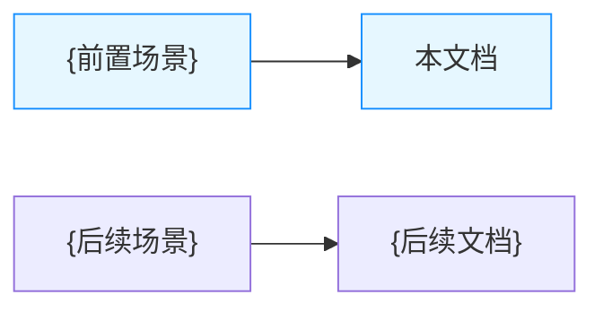
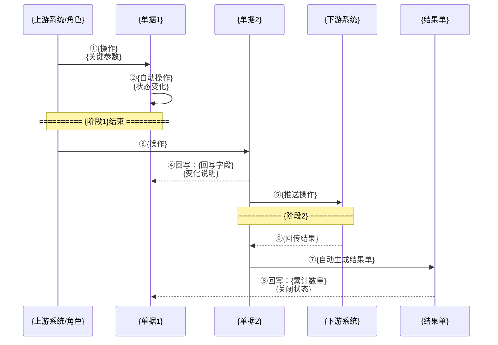
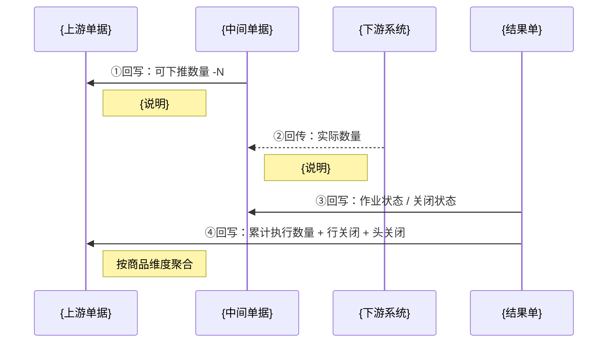

# 业务流程推演模板

> **定位**：业务流程推演文档是**业务流程的动态演练说明书**，让研发、测试和新成员能快速理解每个环节的数据流转和状态变化
>
> **蓝本来源**：从 3 篇实战流程推演文档中提取通用结构，已脱敏处理
>
> **与 PRD 的区别**：
> - PRD 侧重"规则定义"（静态），流程推演侧重"运行演示"（动态）
> - PRD 面向"怎么做"，流程推演面向"做完之后数据长什么样"
> - PRD 是规则手册，流程推演是沙盘推演

---

## 使用说明

### 按复杂度裁剪模板

本模板按**最复杂场景**（三层单据链 + 跨系统）编写。实际使用时，根据业务复杂度裁剪：

| 复杂度 | 典型场景 | 保留章节 | 可省略 |
| :--- | :--- | :--- | :--- |
| **单据内流转** | 采购订单从草稿到完成；无下游单据 | §一（简化为状态流转图）、§二、§三、§五、§七 | §四（无回写）、§六（无跨单据一致性） |
| **两单联动** | 采购订单 → 入库单；入库回写订单 | §一~§七 全保留，但 §四 只有1条回写链路 | §二 中"中间单据"相关步骤 |
| **三层链路** | 订单 → 通知单 → 结果单；逐级回写 | §一~§七 全保留 | 无 |
| **跨系统链路** | 以上 + 外部系统推送/回传 | §一~§七 全保留 + JSON 示例 | 无 |

**关于模板中的单据角色术语**：

模板中出现的 `{上游单据}` `{中间单据}` `{结果单}` 是**角色占位符**，不是固定的三层结构。根据实际情况灵活对应：

- **只有1张单据**：没有"上下游"概念，§二 的步骤模板直接聚焦这张单据的状态变化即可，把"回写"相关内容全部删掉
- **只有2张单据**：第一张是`{上游单据}`，第二张是`{结果单}`，没有`{中间单据}`——删掉所有标注"中间单据"的行
- **3张及以上**：直接对应使用

### 通用填写规则

1. 复制本模板，替换 `{占位符}` 为实际内容
2. 标注 `<!-- 可选 -->` 的子节按需保留，不适用就整段删除
3. 每一步的数据快照表必须用**真实示例数据**（如编号、金额、数量），不要写"XXX"
4. `<!-- 提示 -->` 标记的内容是写作指导，填写后删除

---

# {流程名称} 流程推演

> **覆盖场景**：{场景A} / {场景B} / {取消与关闭流程}
> **不展开范围**：{不在本文推演的内容及原因}
> **参考文档**：《{相关PRD}》《{字段清单}》《{全局背景}》
> **版本**：V1.0 | {YYYY-MM-DD}

---

## 一、业务流程概述

### 1.1 业务特点说明

<!-- 提示：用3-5个要点概括这个流程的核心特征和约束。用 ✅ 标注正面特征，用 ⚠️ 标注限制条件。 -->

**{流程名称}特点**：

- ✅ 特点1：{核心特征，如"谁驱动谁被动"}
- ✅ 特点2：{数据流转方向}
- ✅ 特点3：{下游系统是什么}
- ⚠️ 约束1：{限制条件，如"不支持分批收货"}
- ⚠️ 约束2：{时序约束}

### 1.2 本场景在全局中的位置

<!-- 可选：当业务流程存在上下游串联关系时（如"先采购入仓，再从仓库配货到门店"），画一张位置图帮助读者定位。 -->



### 1.3 完整流程图

<!-- 提示：用 Mermaid 时序图展示完整的系统交互和单据流转。 -->

**绘制规则**：
- 参与者按从左到右排列（上游系统 → 单据1 → 单据2 → 下游系统 → 结果单）
- 步骤编号用 ①②③，与后续详细步骤一一对应
- 用 `Note over` 添加阶段分隔线
- 正向用实线 `->>` ，回写用虚线 `-->>` ，状态变化写在箭头说明上



<!-- 可选：如果存在多种业务场景（如铺货/购销/跨组织），为差异较大的场景分别画流程图。差异较小时，画一张图 + 文字说明差异即可。 -->

> **关键里程碑**：
>
> - 🏁 里程碑1：{第一个关键节点}
> - 🏁 里程碑2：{第二个关键节点}
> - 🏁 里程碑3：{流程闭环}

---

## 二、详细步骤推演

<!-- 提示：
- 每个步骤必须包含4个部分：操作描述 + 数据快照表 + 状态变化表 + 关键点说明
- 用真实示例数据（编号、金额、数量），不要用 XXX 占位
- 用 **加粗** 标注本步骤新产生或变化的字段值
-->

### 步骤 ①：{步骤名称}

**操作**：{谁做了什么}

**{单据名称}创建/更新**：

| 字段 | 值 | 说明 |
| :--- | :--- | :--- |
| 单据编号 | **{XXDD20260228-0001}** | 系统自动生成 |
| 单据来源 | {来源说明} | {说明} |
| 单据状态 | **{待审核}** | 初始状态 |
| 可下推数量 | {总数量} | 初始 = 单据总数量 |
| 关闭状态 | 未关闭 | 初始状态 |

**商品明细**：

| 商品编码 | 数量 | 累计执行数量 | 行关闭状态 |
| :--- | :--- | :--- | :--- |
| SKU-001 | 100 | 0 | 未关闭 |
| SKU-002 | 50 | 0 | 未关闭 |

**关键点**：

- ✅ {重要设计说明}
- ⚠️ {注意事项}

---

### 步骤 ②：{状态变化类步骤}

**操作**：{操作描述}

**状态变化**：

| 字段 | 变更前 | 变更后 | 说明 |
| :--- | :--- | :--- | :--- |
| 单据状态 | {待审核} | **{已审核}** | {触发原因} |
| 可下推数量 | {0} | **{150}** | {计算逻辑} |

**关键点**：

- ✅ {为什么这样设计}

---

### 步骤 ③：{回写类步骤}

**操作**：{操作描述}

<!-- 提示：当回写涉及行级计算逻辑时，用伪代码说明判断逻辑，让研发一目了然。 -->

**判断逻辑**：

```
// 行级：对应行可下推数量减少
FOR EACH 下游行 DO
    上游行.可下推数量 -= 该行的数量
END FOR

// 头部：汇总所有行
单据头.可下推数量 = SUM(所有行.可下推数量)
```

**商品行变化**：

| 商品编码 | 字段 | 变更前 | 变更后 |
| :--- | :--- | :--- | :--- |
| SKU-001 | 可下推数量 | 100 | **0** |
| SKU-002 | 可下推数量 | 50 | **0** |

---

### 步骤 ④：{跨系统推送类步骤}

<!-- 可选：当涉及跨系统数据传递时，给出 JSON 示例，帮助研发理解接口报文。 -->

**操作**：{操作描述}

**推送内容示例**：

```json
{
  "通知单号": "{XXTZ20260228-0001}",
  "目标仓库": "{仓库编码}",
  "商品明细": [
    { "商品编码": "SKU-001", "通知数量": 100 },
    { "商品编码": "SKU-002", "通知数量": 50 }
  ]
}
```

---

### 步骤 ⑤：{下游回传类步骤}

**操作**：{下游系统完成作业后回传结果}

<!-- 提示：如果存在正常/异常两种回传场景（如全量收货 vs 缺收），分别给出数据示例。 -->

**回传数据示例 A：正常场景**：

```json
{
  "通知单号": "{XXTZ20260228-0001}",
  "明细": [
    { "商品编码": "SKU-001", "实际数量": 100 },
    { "商品编码": "SKU-002", "实际数量": 50 }
  ]
}
```

**回传数据示例 B：异常场景（如缺收）**：

```json
{
  "通知单号": "{XXTZ20260228-0001}",
  "明细": [
    { "商品编码": "SKU-001", "实际数量": 80 },
    { "商品编码": "SKU-002", "实际数量": 50 }
  ]
}
```

> {异常场景下的业务处理规则说明}

---

### 步骤 ⑥：{结果单生成 + 回写上游}

**操作**：{结果单自动生成，同时回写上游单据}

**{结果单}创建**：

| 字段 | 值 | 说明 |
| :--- | :--- | :--- |
| 单据编号 | **{XXRK20260228-0001}** | 系统自动生成 |
| 上游单据号 | {XXTZ20260228-0001} | 关联上游 |
| 单据状态 | **已审核** | 直接已审核 |

<!-- 可选：如果结果单会产生库存变动，用表格明确展示。 -->

**库存影响**：

| 仓库 | SKU-001 | SKU-002 |
| :--- | :--- | :--- |
| {仓库名} | **+100** | **+50** |

**回写上游单据**：

| 层级 | 商品编码 | 累计执行数量（前） | 累计执行数量（后） | 行关闭状态（前） | 行关闭状态（后） |
| :--- | :--- | :--- | :--- | :--- | :--- |
| 商品行 | SKU-001 | 0 | **100** | 未关闭 | **已关闭** |
| 商品行 | SKU-002 | 0 | **50** | 未关闭 | **已关闭** |
| **单据头** | — | — | — | 未关闭 | **已关闭** |

**关闭状态判断逻辑**：

```
// 行级关闭判定
FOR EACH 商品行 DO
    IF 累计执行数量 >= 商品总数量 THEN
        行关闭状态 = "已关闭"
    END IF
END FOR

// 头级关闭判定（汇总）
IF 所有商品行关闭状态 = "已关闭" THEN
    单据头关闭状态 = "已关闭"
END IF
```

> [!IMPORTANT]
> **软封存 vs 硬封存**：
>
> - **软封存**（如上游订单）：关闭后仍可接收下游迟到的回写数据，不拒绝
> - **硬封存**（如执行通知单）：关闭后拒绝任何回传，下游再推数据应被拒绝

---

### 多场景差异说明

<!-- 可选：如果存在多种业务场景（如有价格/无价格、跨组织/非跨组织），与其重复写全部步骤，不如列差异表。 -->

**{场景B}与{场景A}的差异**：

| 字段 | 场景A | 场景B |
| :--- | :--- | :--- |
| 业务类型 | {类型A} | {类型B} |
| 是否有价格 | 无 | 有 |
| 提交校验 | 基础必填即可 | 需价格非空 |

**{场景B}商品明细示例数据**：

| 商品编码 | 数量 | 含税单价 | 税率 | 金额 | 税额 | 价税合计 |
| :--- | :--- | :--- | :--- | :--- | :--- | :--- |
| SKU-001 | 100 | 113.00 | 13% | 10,000.00 | 1,300.00 | 11,300.00 |
| **合计** | **100** | — | — | **10,000.00** | **1,300.00** | **11,300.00** |

---

## 三、完整状态变化汇总表

<!-- 提示：为流程中涉及的每个单据各建一张状态演变表，用 **加粗** 标注本步骤变化的字段。 -->

### 3.1 {上游单据}状态演变

| 步骤 | 单据状态 | 可下推数量 | 关闭状态 | 累计执行（SKU-001） | 触发动作 |
| :--- | :--- | :--- | :--- | :--- | :--- |
| ① 创建 | {待审核} | {总数量} | 未关闭 | 0 | {触发动作} |
| ② 审核 | **{已审核}** | {总数量} | 未关闭 | 0 | {触发动作} |
| ③ 回写 | {已审核} | **{0}** | 未关闭 | 0 | {下游创建} |
| ⑥ 回写 | {已审核} | {0} | **{已关闭}** | **{100}** | {结果单回写} |

### 3.2 {中间单据}状态演变

| 步骤 | 单据状态 | 推送下游状态 | 作业状态 | 关闭状态 | 触发动作 |
| :--- | :--- | :--- | :--- | :--- | :--- |
| ③ 创建 | {待审核} | 未推送 | {未执行} | 未关闭 | {触发动作} |
| ④ 推送 | **{已审核}** | **推送成功** | {未执行} | 未关闭 | {触发动作} |
| ⑤ 回传 | {已审核} | 推送成功 | **{全部完成}** | **{已关闭}** | {下游回传} |

### 3.3 库存变动汇总

<!-- 可选：如果流程涉及库存变动（入库/出库/调拨），汇总展示。 -->

| 库存主体 | 仓库 | SKU-001 变动 | SKU-002 变动 | 触发单据 |
| :--- | :--- | :--- | :--- | :--- |
| {主体} | {仓库} | **+100** | **+50** | {结果单}（步骤⑥） |

**状态流转规律**：

- {总结规律，如"关闭状态是自下而上汇总的，出库单→通知单→订单，不可跳级"}
- {总结规律，如"作业状态由下游系统驱动，单向流转，不可逆"}

---

## 四、数据回写规则总结

### 4.1 回写方向图



### 4.2 回写规则表

| 序号 | 触发来源 | 目标单据（头/行） | 回写字段 | 触发时机 | 回写逻辑 |
| :--- | :--- | :--- | :--- | :--- | :--- |
| ① | {中间单据} | {上游单据}（头） | 可下推数量 | {中间单据}创建成功 | 按本次数量扣减，汇总所有行 |
| ② | {中间单据} | {上游单据}（行） | 行可下推数量 | {中间单据}创建成功 | 对应行减 N |
| ③ | {下游系统} | {中间单据}（行） | 实际执行数量 | {下游系统}回传数据 | 直接更新 |
| ④ | {下游系统} | {中间单据}（行） | 行关闭状态 | {下游系统}回传数据 | 根据实际数量计算 |
| ⑤ | {下游系统} | {中间单据}（头） | 头关闭状态 | {下游系统}回传数据 | 汇总所有行关闭状态 |
| ⑥ | {结果单} | {上游单据}（行） | 累计执行数量 | {结果单}审核 | SUM(该SKU所有结果单) |
| ⑦ | {结果单} | {上游单据}（行） | 行关闭状态 | {结果单}审核 | 累计执行 ≥ 总数量 → 已关闭 |
| ⑧ | {上游单据}行汇总 | {上游单据}（头） | 头关闭状态 | 行状态变化时 | 所有行已关闭 → 头关闭 |

> [!IMPORTANT]
> **回写关键点**：
>
> 1. {结果单}生成时，须**同时更新**行累计数量、行关闭状态、头关闭状态
> 2. 头关闭状态不直接回写，而是由所有行状态**汇总计算**得出
> 3. 上游单据关闭后处于**软封存**状态，可继续接收下游迟回传的数据

---

## 五、关键注意事项

### 5.1 与其他流程的差异

<!-- 提示：用对比表突出本流程与标准/参考流程的不同。 -->

| 差异点 | {参考/标准流程} | {本流程} | 说明 |
| :--- | :--- | :--- | :--- |
| {差异1} | {标准做法} | **{本流程做法}** | {为什么不同} |
| {差异2} | {标准做法} | **{本流程做法}** | {为什么不同} |

<!-- 可选：如果本文档覆盖多种业务场景（如有价格/无价格/跨组织），用对比表展示差异。 -->

### 5.2 异常场景处理

| 异常场景 | 影响 | 处理方式 |
| :--- | :--- | :--- |
| {上游推送失败} | {中间单据未创建} | {重试+幂等} |
| {下游系统推送失败} | {作业未触发} | {重试机制，超时告警} |
| {下游回传数据异常} | {实际数量不准} | {拦截超额，告警人工确认} |
| {回写上游失败} | {状态不一致} | {补偿任务修正} |

### 5.3 取消、关闭、红冲场景

| 操作 | 适用单据层级 | 触发条件 | 状态变化 | 数据影响 |
| :--- | :--- | :--- | :--- | :--- |
| **取消** | {上游单据}（未执行态） | 无在途下游 | 单据状态 → 已取消 | 释放可下推数量，不影响库存 |
| **取消** | {上游单据}（已审核态） | 下游无在途作业 | 单据状态 → 已取消 | 有在途时拦截提示人工处理 |
| **关闭** | {上游单据}（已审核） | 手动关闭剩余 | 关闭状态 → 已关闭 | 强制关闭所有未关闭行 |
| **红冲** | {结果单} | 已执行需要冲销 | 新增红字单据 | 库存反向冲销 |

<!-- 可选：如果取消流程有多级判断，展开推演步骤。 -->

---

## 六、数据一致性保证

### 6.1 数据流转图


### 6.2 一致性校验公式

**数量一致性**：

$$
{中间单据}.通知数量 \leq {上游单据}.商品总数量（对应行）
$$

$$
{结果单}.数量 = {中间单据}.实际数量
$$

$$
{上游单据}.累计执行数量 = \sum(该SKU所有结果单.数量)
$$

**金额一致性**（有价格的场景）：

$$
不含税单价 = 含税单价 \div (1 + 税率)
$$

$$
金额 = 不含税单价 \times 数量
$$

$$
税额 = 金额 \times 税率
$$

$$
价税合计 = 金额 + 税额 \quad (允许 \pm 0.01 尾差)
$$

<!-- 可选：如果涉及项目分摊，补充分摊一致性公式。 -->

**分摊一致性**（有项目分摊的场景）：

$$
\sum(SKU下所有项目比例) = 100\%
$$

$$
SKU行数量 = \sum(该SKU所有项目数量)
$$

### 6.3 校验规则清单

- ✅ 校验点1：{中间单据}通知数量 ≤ {上游单据}对应行数量
- ✅ 校验点2：{结果单}数量 = {中间单据}实际执行数量
- ✅ 校验点3：{上游单据}累计执行数量 = 所有{结果单}之和（按SKU）
- ✅ 校验点4：价税合计 = 金额 + 税额（允许±0.01尾差）

<!-- 可选：补充其他业务特有的校验点。 -->

---

## 七、总结

### 7.1 核心流程要点

<!-- 提示：用4-5个要点总结流程核心逻辑。 -->

1. **{驱动模式}**：{如"整个流程由XX驱动，XX被动接收"}
2. **{审核模式}**：{如"全自动审核 / 人工审核"}
3. **{回写逻辑}**：{如"XX回写YY状态，ZZ回写累计数量"}
4. **{数据闭环}**：{如"系统A → 系统B → 系统C → 系统A，形成完整数据闭环"}

### 7.2 各场景差异对比

<!-- 可选：如果本文档覆盖多种场景，用对比表总结差异。 -->

| 维度 | {场景A} | {场景B} | {场景C} |
| :--- | :--- | :--- | :--- |
| 有无价格 | ❌ 无 | ✅ 有 | ✅ 有 |
| 下游系统 | {系统X} | {系统X} | {系统X + 系统Y} |
| 结算方式 | {方式A} | {方式B} | {方式C} |

### 7.3 异常处理重点

> [!CAUTION]
> **必须监控的异常**：
>
> 1. **{异常1}**：{后果和处理方式}
> 2. **{异常2}**：{后果和处理方式}
> 3. **{异常3}**：{后果和处理方式}

---

## 质量检查清单

- [ ] **§一**：业务特点是否用 ✅⚠️ 标注？流程图是否有阶段分隔？步骤编号是否与 §二 一一对应？
- [ ] **§二**：每个步骤是否都有 操作描述 + 数据快照 + 状态变化 + 关键点？数据是否用真实示例？
- [ ] **§三**：每个单据是否都有完整的状态演变表？是否用加粗标注变化字段？
- [ ] **§四**：是否有回写方向图？是否有回写规则表覆盖所有回写关系？
- [ ] **§五**：是否有差异对比表？是否覆盖异常场景？取消/关闭/红冲是否覆盖？
- [ ] **§六**：是否有数据流转图？是否有一致性校验公式？金额和分摊公式是否覆盖？
- [ ] **§七**：是否有核心要点总结？多场景差异是否有对比表？异常处理重点是否有 CAUTION 提示？

---

## 附：编写技巧

### 数据快照表的原则

- **完整性**：包含所有关键字段（单据号、状态、数量等）
- **真实性**：用真实的示例数据（如 CGDD20260114-00001），不用 XXX 占位
- **对比性**：用 **加粗** 标注本步骤新产生或变化的字段值

### 关键点说明的标记

- ✅ 标注正确做法 / 设计意图
- ⚠️ 标注注意事项 / 约束条件
- ❌ 标注禁止做法

### 伪代码的使用时机

当步骤涉及条件判断或循环计算（如关闭状态汇总、可下推数量扣减）时，用伪代码说明逻辑，比纯文字描述更精确：

```
IF 条件 THEN
    操作
ELSE
    操作
END IF
```

### JSON 示例的使用时机

当步骤涉及跨系统数据传递（推送/回传）时，给出 JSON 示例帮助研发理解报文结构。如果存在正常/异常两种场景，分别给出示例。
