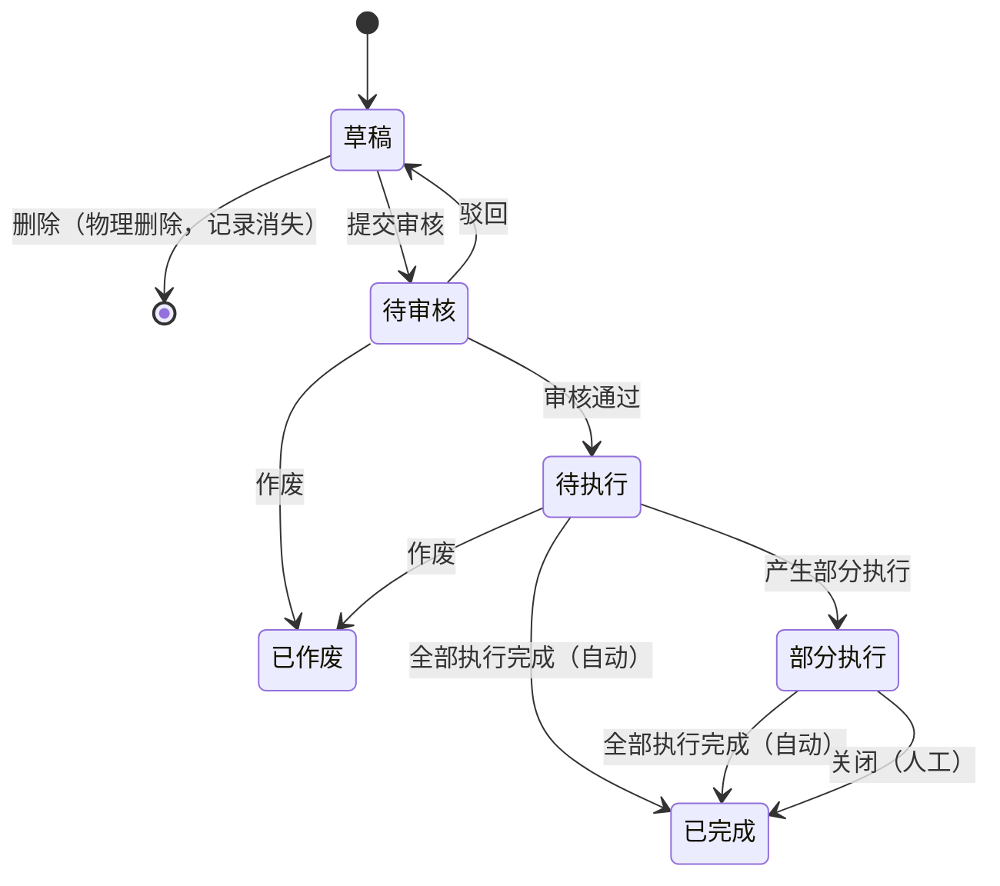

# 状态机设计模板

> 适用于：所有业务单据的状态机设计。本模板与 `单据状态与流转设计规范.md` 配套使用——规范文件定义的是**原则**，本模板定义的是**输出格式**。
>
> ⚠️ **重要**：下面 §一~§四 的示例是**订单层单据**的默认状态链路（草稿→审核→执行→完成）。**执行层单据**（如入库单、出库单）的状态机应更简洁——通常不需要审核流，核心状态为"草稿→已确认"或"待执行→已执行"。请根据单据的实际业务层级裁剪，不要直接套用。

---

## 一、状态定义

| 状态 | 枚举值 | 含义 | 是否终态 | 进入条件 | 离开条件 |
| :--- | :--- | :--- | :---: | :--- | :--- |
| 草稿 | `DRAFT` | 创建后尚未提交，可自由编辑和删除 | 否 | 创建单据时 | 提交审核 或 物理删除 |
| 待审核 | `PENDING_AUDIT` | 已提交等待审核确认 | 否 | 提交审核成功 | 审核通过 / 驳回 / 作废 |
| 待执行 | `PENDING_EXEC` | 审核通过，等待首次业务执行 | 否 | 审核通过 | 首次执行触发 / 作废 |
| 部分执行 | `PARTIAL_EXEC` | 已产生至少一次执行记录但未全量完成 | 否 | 首次执行确认 | 全部执行完成 / 人工关闭 |
| 已完成 | `COMPLETED` | 全部执行完毕或人工关单 | **是** | 全量执行完 或 人工关闭 | — |
| 已作废 | `VOIDED` | 单据失效不可恢复 | **是** | 作废操作确认 | — |

**设计原则**（详见 `单据状态与流转设计规范.md`）：
- 先少后多：一期用够用的状态，不为显得专业而拆过细
- 状态名必须是业务语言（如「待入库」），不能是系统语言（如 `WAITING`）
- 每个状态必须能回答：现在处于什么阶段？允许做什么？不能做什么？

---

## 二、状态流转图

**Mermaid 绘制规则**：
- 终态指向 `[*]`（物理删除）或仅作为终止节点（已完成/已作废）
- 系统自动触发的转移标注"（自动）"
- 人工操作的转移不额外标注
- 条件性转移在线上标注条件（如 `审核通过`）

---

## 三、状态流转表

> 这是状态机交付物中**最核心的一张表**。每行 = 一个状态 + 一个动作 = 一条可编程的规则。

| 当前状态 | 动作 | 前置条件 | 结果状态 | 二次确认 | 后置影响 | 失败处理 |
| :--- | :--- | :--- | :--- | :--- | :--- | :--- |
| 草稿 | 提交审核 | 必填字段完整（列出具体字段） | 待审核 | 无 | 无 | Toast：「提交失败，{字段名}不满足条件」 |
| 草稿 | 删除 | 无限制 | 物理消失 | 「删除后不可恢复，确认删除？」 | 记录从系统彻底移除 | — |
| 待审核 | 驳回 | — | 草稿 | 无 | 单据可重新编辑 | — |
| 待审核 | 审核通过 | — | 待执行 | 无 | 关键字段锁定不可修改（列出锁定的字段） | — |
| 待审核 | 作废 | 无下游执行记录已确认 | 已作废 | 「作废后不可恢复，确认作废？」 | 单据进入只读状态 | — |

**列填写规范**：

| 列名 | 填写要求 |
| :--- | :--- |
| **前置条件** | 触发动作之前必须满足的所有条件。写具体字段和判断逻辑，不要写"数据完整"这种模糊表述 |
| **结果状态** | 动作执行后的目标状态。系统自动触发的转移标注"系统自动，无需确认" |
| **二次确认** | 是否需要弹窗确认。如需弹窗，写弹窗标题和内容文案 |
| **后置影响** | 除状态变更外所有级联影响：锁定字段、回写上游计数器、触发下游单据生成、更新关联数据 |
| **失败处理** | 前置条件不满足时，用户看到什么。写具体的 Toast 或阻断文案 |

---

## 四、动作能力矩阵

> ✅ = 允许  ❌ = 不允许且不展示入口  ✅（条件）= 允许但有限制（在§五规则中说明）

| 动作 | 草稿 | 待审核 | 待执行 | 部分执行 | 已完成 | 已作废 |
| :--- | :----: | :----: | :----: | :----: | :----: | :----: |
| 查看 | ✅ | ✅ | ✅ | ✅ | ✅ | ✅ |
| 编辑 | ✅ | ❌ | ❌ | ❌ | ❌ | ❌ |
| 删除（物理） | ✅ | ❌ | ❌ | ❌ | ❌ | ❌ |
| 提交审核 | ✅ | ❌ | ❌ | ❌ | ❌ | ❌ |
| 驳回 | ❌ | ✅ | ❌ | ❌ | ❌ | ❌ |
| 审核通过 | ❌ | ✅ | ❌ | ❌ | ❌ | ❌ |
| 作废 | ❌ | ✅ | ✅ | ❌ | ❌ | ❌ |
| 创建下游单据 | ❌ | ❌ | ✅ | ✅ | ❌ | ❌ |
| 关闭（人工） | ❌ | ❌ | ❌ | ✅（条件） | ❌ | ❌ |
| 导出 | ✅ | ✅ | ✅ | ✅ | ✅ | ✅ |

---

## 五、特殊动作对比表（作废 vs 关闭）

> 当存在两个容易混淆的终态动作时，必须添加此对比表。

| 维度 | 作废 | 关闭（缺量完结） |
| :--- | :--- | :--- |
| **含义** | 撤销未实际发生的业务意图，全部放弃 | 终止剩余流程，封存现状，已执行的保留 |
| **适用状态** | 待审核、待执行（无已确认执行记录） | 部分执行（已有确认执行记录但存在剩余量） |
| **状态变化** | → 已作废（终态，仍可查询） | → 已完成（终态） |
| **对已有执行记录的影响** | 无（此时还没有） | 已确认的不受影响；草稿的被阻断 |
| **后续回写** | 不接收 | 不接收 |
| **弹窗文案差异** | 「作废后不可恢复」 | 「关闭后剩余数量不再接收」 |

---

## 六、设计自检清单

- [ ] 是否存在永远到不了的状态？（检查每个状态的进入条件是否有对应的上游转移）
- [ ] 是否存在进去就出不来的死状态？（检查非终态是否都有至少一条离开路径）
- [ ] 是否存在两个名字不同但含义相同的状态？
- [ ] 每个动作是否在所有状态下都定义了允许/不允许行为？（动作能力矩阵不能有空格）
- [ ] 终态是否还有可执行操作？（终态应该只有「查看」+「导出」）
- [ ] 状态变更是否都通过动作按钮触发？（不能在表单中直接修改状态字段——违反全局设计原则）
- [ ] 物理删除和作废的路径是否区分清楚？（前者记录消失，后者记录保留）
- [ ] 自动完成和人工关闭两条路径是否都覆盖？（两条路径都应该到达已完成）
